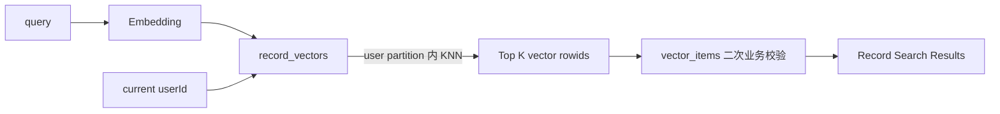
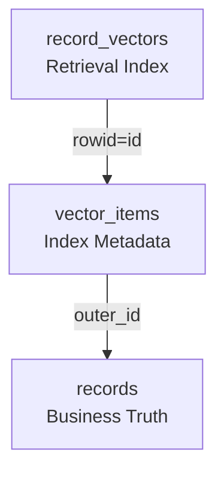
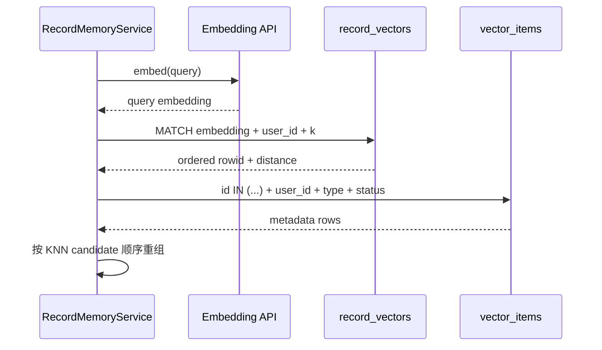
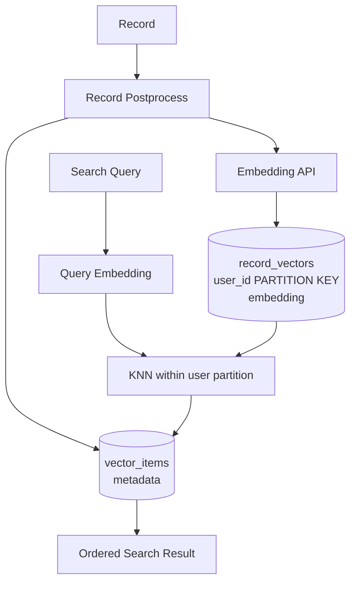

# Fanto User-Scoped Vector Retrieval 改造设计

## 1. 背景

当前 Fanto 已经具备 Record 向量化能力：

- Record 创建 / 更新后异步生成 embedding；
- 向量存储在 `record_vectors`；
- 向量元数据存储在 `vector_items`；
- `RecordMemoryService.search(userId, query, limit)` 已支持语义检索；
- Embedding dimension 固定为 1536；
- 当前使用 `sqlite-vec v0.1.9`。

当前查询逻辑是：

```text
全局 record_vectors
      ↓ KNN
取 limit * 4 个候选
      ↓
vector_items
      ↓ user_id / type / status 过滤
当前用户结果
      ↓
slice(limit)
```

对应代码：

```ts
SELECT rowid AS id, distance
FROM record_vectors
WHERE embedding MATCH ?
  AND k = limit * 4
```

之后才在 `vector_items` 中：

```text
user_id = currentUser
type = record
status = indexed
```

这属于 post-filter。

---

## 2. 当前问题

### 2.1 召回率问题

假设查询需要返回当前用户 Top 10。

全局向量中可能存在大量其他用户的高相似结果：

```text
Global Top 40:

u2
u3
u4
u5
...
u1
u1
u1
```

当前实现先取全局 Top 40，再过滤：

```text
Global KNN Top 40
       ↓
filter user_id=u1
       ↓
只剩 3 条
```

即使当前用户实际上存在 10 条相关 Record，其中另外 7 条也可能因为没有进入全局 Top 40 而永久丢失。

因此：

> `limit * 4` 不是可靠的 user isolation 策略，只是对 post-filter 的概率性补偿。

当用户数和向量数量增长时，这个问题会越来越明显。

### 2.2 性能边界不合理

Fanto 是天然的多用户个人数据系统。

Record Search 的搜索空间本应是：

```text
当前用户的 Record
```

而不是：

```text
所有用户的 Record
```

用户隔离应该发生在 KNN candidate generation 之前，而不是之后。

### 2.3 rebuild 当前不是多用户正确的

当前：

```text
scripts/rebuild-vector-index.ts
```

只执行：

```ts
recordRepo.findByUserId("default-user", { limit: 10_000 })
```

因此当前 `pnpm vector:rebuild`：

- 只覆盖 `default-user`；
- 不能正确重建所有用户；
- 不适合作为本次 schema 调整后的正式 rebuild 工具。

本轮一起修正。

---

## 3. 目标

本轮只解决：

> Record Vector Retrieval 必须在当前用户范围内执行 KNN。

目标链路：



核心原则：

1. `user_id` 在向量搜索层就是一等隔离条件；
2. 不再依赖 oversampling 解决用户过滤；
3. `vector_items` 仍保留 userId 二次校验；
4. 不重构整个 Memory 模型；
5. 不提前引入独立向量数据库；
6. 保持当前 SQLite + sqlite-vec MVP 架构。

---

## 4. 技术结论：使用 sqlite-vec partition key

当前项目安装版本：

```text
sqlite-vec v0.1.9
```

已在当前项目 Node / better-sqlite3 环境中实际验证：

```sql
CREATE VIRTUAL TABLE v USING vec0(
  user_id text partition key,
  embedding float[2]
);
```

支持：

```sql
SELECT rowid, user_id, distance
FROM v
WHERE embedding MATCH ?
  AND user_id = ?
  AND k = ?
ORDER BY distance;
```

实测数据：

```text
u1: [1, 0]
u1: [0.9, 0.1]

u2: [1, 0.01]
u2: [0, 1]
```

查询：

```text
query = [1, 0]
user_id = u1
```

只返回：

```text
u1 distance=0
u1 distance≈0.1414
```

虽然：

```text
u2 [1, 0.01]
```

距离约为 `0.01`，比 u1 第二条更近，但不会进入 u1 查询结果。

因此确认：

> `user_id TEXT PARTITION KEY` 可以直接满足 Fanto 的 user-scoped KNN。

---

## 5. Schema 改造

### 当前

```sql
CREATE VIRTUAL TABLE record_vectors USING vec0(
  embedding float[1536]
);
```

### 改造后

```sql
CREATE VIRTUAL TABLE record_vectors USING vec0(
  user_id text partition key,
  embedding float[1536]
);
```

职责：

```text
record_vectors
├── rowid
├── user_id       partition key
└── embedding
```

`vector_items` 保持现状：

```text
vector_items
├── id
├── user_id
├── type
├── outer_id
├── content
├── content_hash
├── status
├── error_code
├── indexed_at
└── created_at
```

两张表仍通过：

```text
record_vectors.rowid = vector_items.id
```

关联。

---

## 6. 为什么不把所有 metadata 都搬入 vec0

本轮不建议把：

- `outer_id`
- `content`
- `status`
- `indexed_at`

全部复制到 `record_vectors`。

原因：

### record_vectors

只承担：

```text
user partition
+
vector KNN
```

### vector_items

继续承担：

```text
业务 ID 映射
内容
索引状态
类型
索引生命周期
```

这样边界最简单：



向量表是可重建索引，不成为业务真相源。

---

## 7. Index 写入改造

当前：

```ts
INSERT INTO record_vectors(embedding)
VALUES (?)
```

改为：

```ts
INSERT INTO record_vectors(user_id, embedding)
VALUES (?, ?)
```

伪代码：

```ts
await sql`
  INSERT INTO record_vectors(user_id, embedding)
  VALUES (
    ${task.userId},
    ${JSON.stringify(embedding)}
  )
`.execute(this.db);

const vector = await sql<{ id: number }>`
  SELECT last_insert_rowid() AS id
`.execute(this.db);

const id = Number(vector.rows[0]?.id);

await this.db
  .insertInto("vector_items")
  .values({
    id,
    user_id: task.userId,
    type: "record",
    outer_id: task.recordId,
    ...
  })
  .execute();
```

保持当前 rowid / metadata ID 对齐机制。

---

## 8. Search 改造

### 当前

```ts
SELECT rowid AS id, distance
FROM record_vectors
WHERE embedding MATCH ?
  AND k = limit * 4
```

### 改造后

```ts
SELECT rowid AS id, distance
FROM record_vectors
WHERE embedding MATCH ?
  AND user_id = ?
  AND k = ?
ORDER BY distance
```

即：

```text
k = limit
```

不再：

```text
k = limit * 4
```

搜索过程：



---

## 9. 为什么 vector_items 仍然保留 user_id 校验

即使 `record_vectors` 已按：

```sql
user_id = ?
```

进行 partition KNN，后续仍保留：

```sql
vector_items.user_id = ?
```

原因不是性能，而是业务防御。

目标：

```text
Retrieval Scope
    ↓
record_vectors partition

Business Ownership
    ↓
vector_items user_id
```

形成两层边界。

如果未来发生：

- vector rowid 写错；
- metadata 映射错误；
- rebuild bug；

业务层仍不会因为单一索引错误直接跨用户返回数据。

---

## 10. Delete / Replace

当前 replace：

```text
find vector_items by
user_id + type + outer_id
     ↓
delete record_vectors by rowid
     ↓
delete vector_items
     ↓
re-index
```

这一逻辑可以保持。

删除向量仍然使用：

```sql
DELETE FROM record_vectors
WHERE rowid = ?
```

不需要额外通过 partition key 删除。

但查询待删除 ID 时仍必须：

```text
user_id = task.userId
type = record
outer_id = recordId
```

---

## 11. metadata filtering 的后续边界

sqlite-vec 还支持 metadata columns。

未来如果真的需要：

```text
Record Search
+ 时间范围
+ memory type
+ 可搜索状态
```

可以考虑：

```sql
CREATE VIRTUAL TABLE ... USING vec0(
  user_id text partition key,
  memory_type text,
  event_at integer,
  embedding float[1536]
);
```

查询：

```sql
WHERE embedding MATCH ?
  AND user_id = ?
  AND memory_type = 'record'
  AND event_at >= ?
  AND k = ?
```

但是本轮不做。

目前只有：

```text
user_id
```

属于必须进入 KNN 前置范围的条件。

---

## 12. 不采用的方案

### 12.1 全局 KNN + limit * N + user filter

不采用。

原因：

- 召回不确定；
- 用户越多越差；
- N 无法合理确定；
- 无法形成清晰的数据隔离语义。

### 12.2 先查询当前用户 vector ID，再使用 SQL IN 做 KNN

不作为主方案。

原因：

- ID 列表可能很大；
- 查询复杂；
- 失去 vec0 partition 能力；
- user partition 已原生解决该问题。

### 12.3 每个用户一张 vector table

不采用。

原因：

- schema 管理复杂；
- 用户数动态增长；
- table lifecycle 复杂；
- 当前完全没有必要。

### 12.4 本轮迁移独立向量数据库

不采用。

例如：

- Qdrant
- Milvus
- pgvector
- Elasticsearch

当前 Fanto MVP 数据规模和部署方式下，SQLite + sqlite-vec 已足够。

先把检索正确性做好。

---

## 13. Migration / Rebuild 策略

项目当前约定：

> migration 只维护当前空库 schema，不提供旧 SQLite schema 的正式升级链。

因此：

### 13.1 migration baseline

修改：

```text
apps/server/src/migrations/create_current_schema.ts
```

把：

```sql
record_vectors(embedding float[1536])
```

调整为：

```sql
record_vectors(
  user_id text partition key,
  embedding float[1536]
)
```

### 13.2 本地已有数据库

因为：

```text
record_vectors
vector_items
```

都属于可重建索引数据，不是 Record 业务真相，因此优先采用：

```text
reset vector index
+
rebuild from records
```

而不是为旧 vector schema 建复杂兼容迁移。

可以提供一次性开发重建路径：

```text
1. 清空 vector_items
2. drop record_vectors
3. 以新 schema recreate record_vectors
4. 从 records 全量 rebuild
```

注意：

业务 `records` 不应因为向量 schema 调整而丢失。

---

## 14. vector:rebuild 改造

当前脚本只处理：

```text
default-user
```

这必须修正。

目标：

```text
所有已有 Records
    ↓
按 record.userId
    ↓
重新 index
```

不应：

```text
硬编码 default-user
```

建议 rebuild 分为两个阶段：

### Phase A：reset index

```text
clear vector_items
recreate record_vectors
```

### Phase B：re-index

遍历所有 Record：

```text
for record in all records:
    memory.index({
      userId: record.userId,
      recordId: record.id,
      operation: "upsert"
    })
```

需要一个明确的全量 Record 读取方式。

可以：

- 新增 repository 内部全量遍历能力；
- 或 rebuild script 直接通过 DB 查询 Records。

因为这是运维脚本，不需要为了它增加对外 HTTP API。

### 分页 / 批处理

不要默认一次加载无限 Record。

即使 MVP 当前数据量较小，也建议按稳定批次处理，例如：

```text
500 / batch
```

避免未来真实数据量增长后脚本一次性加载全部数据。

---

## 15. 一致性规则

向量索引是衍生数据。

业务真相顺序：

```text
records
   ↓
vector_items
   ↓
record_vectors
```

任何情况下：

- Record 存在、Vector 缺失：允许，可重新生成；
- Vector 存在、Record 不存在：属于脏数据，应清理；
- vector_items 与 record_vectors 不一致：允许通过 rebuild 修复。

不为了向量索引引入业务强事务绑定。

当前异步后置处理模式保持。

---

## 16. Search 返回顺序

KNN 返回：

```text
rowid + distance
```

随后从 `vector_items`：

```text
WHERE id IN (...)
```

读取 metadata。

SQL `IN` 查询不保证 KNN 顺序。

因此继续：

```text
1. 保存 candidates 原始顺序
2. vector_items → Map<id, metadata>
3. candidates.flatMap(...)
```

不要直接返回 metadata 查询顺序。

---

## 17. distance 的产品边界

本轮内部仍可以保留：

```text
distance
```

用于：

- 调试；
- 排序验证；
- 测试。

但不要把它直接解释成：

```text
confidence
相关概率
记忆置信度
```

因为 vector distance 不是用户可解释的概率。

对 Agent HTTP API 是否暴露 distance，应由上层 API 设计决定；向量层不承担产品语义。

---

## 18. 测试设计

### 18.1 partition 基础测试

构造：

```text
u1:
A = [1, 0]
B = [0.9, 0.1]

u2:
C = [1, 0.01]
D = [0, 1]
```

查询：

```text
user=u1
query=[1,0]
```

预期：

```text
A
B
```

不能返回：

```text
C
```

即使 C 比 B 更近。

### 18.2 多用户候选污染回归

构造：

```text
u1 有 10 条相关向量
u2 有大量更相似向量
```

查询：

```text
user=u1
limit=10
```

必须返回：

```text
u1 Top 10
```

而不是因为 u2 占据全局候选导致结果不足。

### 18.3 user isolation

必须验证：

```text
search("u1") 不返回 u2 vector_items
```

### 18.4 replace

Record 更新后：

```text
旧 vector 删除
新 vector user_id partition 正确
vector_items id 对齐
```

### 18.5 rebuild

准备多个用户：

```text
default-user
u1
u2
```

执行 rebuild 后：

- 三个用户记录都有 vector；
- 每个 vector partition user_id 正确；
- 每个 vector_items user_id 正确；
- search 各自只返回自己的记录。

---

## 19. 性能验证

本轮不需要大型 benchmark，但至少验证：

```text
single user
multi user
```

两种数据下：

- 查询结果稳定；
- `k=limit` 返回足够结果；
- 不再依赖 `limit * 4`。

如果需要简单数据集：

```text
10 users
每用户 1,000 vectors
1536 dim
```

重点看：

- correctness；
- latency 是否随其他用户数据增长明显恶化。

本轮 correctness 优先于微优化。

---

## 20. 代码改动范围

预计涉及：

```text
apps/server/src/migrations/create_current_schema.ts
apps/server/src/domain/memory/record-index.ts
apps/server/src/domain/records/sqlite-repository.test.ts
scripts/rebuild-vector-index.ts
docs/domain/records.md
docs/operations/local-development.md
```

如新增独立 memory test，可拆为：

```text
apps/server/src/domain/memory/record-index.test.ts
```

更推荐把向量检索测试独立到 memory domain，避免继续膨胀 Record repository test。

---

## 21. 本轮不做

- 不统一 Record / Creation 向量；
- 不建立 `memory_vectors`；
- 不增加 rerank；
- 不增加 hybrid search；
- 不增加 BM25；
- 不更换 Embedding Model；
- 不调整 embedding dimension；
- 不加入复杂时间 /状态过滤；
- 不更换向量数据库；
- 不设计长期 Memory Entity。

---

## 22. Definition of Done

完成条件：

- [ ] `record_vectors` 包含 `user_id TEXT PARTITION KEY`
- [ ] index 时写入 userId
- [ ] search 时 KNN 查询包含 `user_id = currentUser`
- [ ] search 使用 `k = limit`
- [ ] 不再依赖 `limit * 4` 做 user filter 补偿
- [ ] `vector_items.user_id` 二次业务校验保留
- [ ] 多用户候选污染测试通过
- [ ] replace / remove 行为正确
- [ ] vector rebuild 不再硬编码 `default-user`
- [ ] rebuild 可覆盖所有用户
- [ ] migration baseline 与文档同步
- [ ] Server typecheck / test 通过
- [ ] rebuild 后真实 Record Search 验证通过

---

## 23. 最终架构



最终原则：

> Fanto 的向量检索从一开始就在当前用户的数据范围内寻找“最相关”，而不是先从所有人的数据里寻找“最相关”再过滤。
