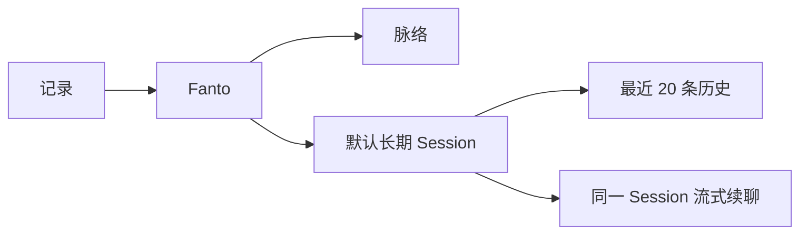
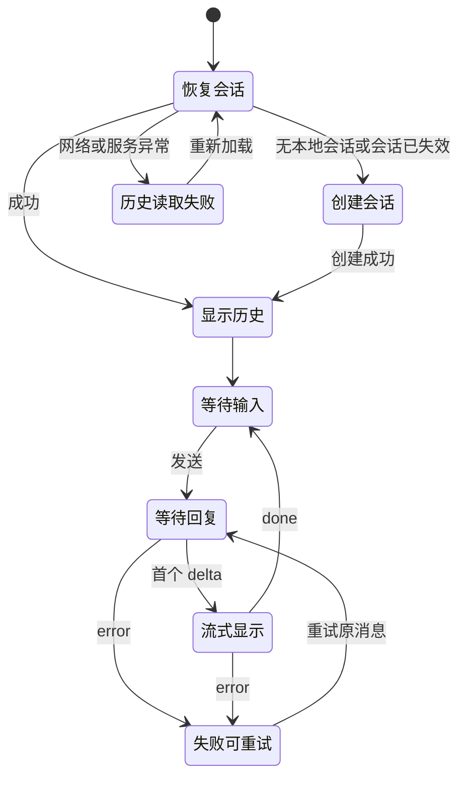
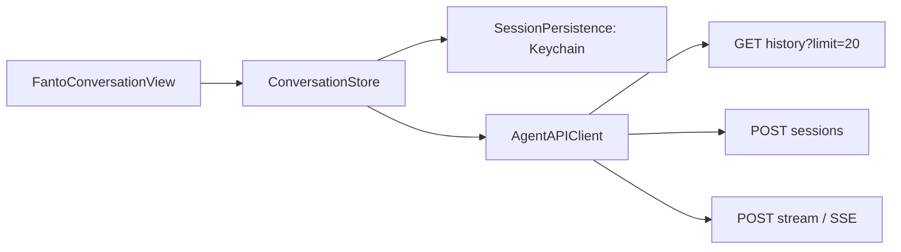

# iOS Agent 多轮对话 MVP 方案

日期：2026-09-19  
状态：待实施

## 目标与边界

本版本只验证一件事：**iOS ↔ Agent Runtime 的多轮会话基础是否稳定，能否作为后续 Fanto 产品能力的对话底座。**

在 iOS 的底部导航中新增并置中 Fanto：`记录 / Fanto / 脉络`。本期只做文本多轮对话，不验证 Record、Memory、Creation 或长期记忆效果。

本期只实现文本多轮对话：

- 同一用户只使用一个默认长期会话，不提供会话切换或“开始新话题”。
- 进入 Fanto 后恢复该会话最近的少量历史，再继续在同一会话中发送消息。
- 对话使用 Agent Runtime 的流式接口，逐步显示回复和可理解的进行状态。
- 保持 Fanto 的克制定位：它是记录与脉络之外的主动交流出口，不打断记录流程。

本期明确不做：Record / Memory 检索、Agent Tools 产品效果、Creation / Proposal、来源引用与反馈纠错、主动任务 / heartbeat、异步 Task 产品入口、多 Agent 切换、会话列表、历史全文翻页、跨设备会话发现、会话重命名/删除、语音和图片输入、Agent 媒体资源渲染、正式用户认证。

当前阶段允许继续使用开发态固定测试用户与测试 Agent Token 完成链路验证；正式 Auth 单独进入下一阶段。

## 已确认的运行事实

- iOS 当前已有 `记录` 与 `脉络` 两个原生 SwiftUI Tab，真实业务数据通过 ECS Server 读取。
- Agent Runtime 已提供：创建 Session、读取 Session 历史、同一 Session 的 SSE 流式对话。
- 流式事件包含 `start`、`turn_start`、`tool_start`、`tool_end`、`delta`、`done` 与 `error`；同一 Session 同时只能执行一轮回复。本期只验证文本流与会话连续性，Tool 事件只需安全忽略或映射为通用处理中状态。
- Agent Runtime 通过 `Authorization: Bearer …` 和 `X-User-Id` 识别请求。当前产品尚没有正式登录身份，iOS 使用的用户标识仍是演示用户。

## 信息架构与入口



根 Tab 的顺序改为：

1. 记录
2. Fanto（中间）
3. 脉络

Fanto 使用系统消息图标和文字标签，不额外在页面顶部重复放置大标题。首屏以内容区和输入框作为识别，不再增加“创建会话”等管理型入口。

## 默认长期会话

### MVP 的会话归属

iOS 以 `用户标识 + agentId(main)` 作为本地映射键，在 Keychain 保存默认 `sessionId`。进入 Fanto 时：

1. 若本地存在 `sessionId`，先读取该会话最近历史。
2. 若不存在，调用创建 Session 接口，将返回的 ID 保存后再进入空白对话状态。
3. 若历史接口明确返回 Session 不存在或无权访问，删除本地 ID，并只重建一次 Session。
4. 网络失败、服务端 5xx 或解析失败时保留本地 ID，展示重试，不创建第二个 Session。

这能满足当前演示身份下“一个用户一个长期会话”的 MVP 行为。由于现有 Agent API 尚不能按用户查询默认 Session，卸载 App、清除 Keychain 或跨设备时无法找回既有会话。正式登录或跨设备支持前，应由服务端增加幂等的“获取或创建默认 Session”能力；本期不把它误称为跨设备一致性。

### 历史恢复

每次进入 Fanto 仅请求最近 `20` 条历史。接口返回按最新在前的数据时，客户端在展示前反转为自然的时间正序。不会提供“更早历史”按钮，避免在 MVP 中把长期会话变成历史浏览器。

## 对话状态与交互



界面状态如下：

| 状态 | 内容区 | 输入区 |
| --- | --- | --- |
| 恢复历史 / 创建会话 | 简洁加载状态，不显示空白结论 | 暂不可发送 |
| 首次空会话 | 简短欢迎语与自然提问提示 | 可直接输入 |
| 等待首段回复 | 立即显示用户消息，助手消息显示“正在想…” | 发送按钮改为停止；禁止并发发送 |
| 工具读取中 | 在助手消息内以“正在回忆你的记录…”等人话提示 | 仍可停止 |
| 流式回复 | 按 `delta` 增量追加，轻微插入光标 | 仍可停止 |
| 已完成 | 保留完整回复 | 恢复发送 |
| 失败 | 保留用户消息，显示可重试的失败提示 | 可重试原消息或继续输入 |

`tool_start` / `tool_end` 不是本期验收目标，只需安全忽略或显示统一“处理中”状态，不向用户暴露工具名、服务地址、Session ID 或内部参数。

停止操作取消本次网络流，不删除已经收到的文字，并以“已停止生成”作为该助手消息的结束状态。

## 页面视觉与可用性

- 使用系统 `TabView`、`NavigationStack`、`ScrollView` 与系统输入控件，保持与记录、脉络同一套原生层级。
- 对话列表以时间正序排列：用户消息靠右，使用低饱和品牌强调色；Fanto 消息靠左，使用轻量系统表面色。避免过重的聊天气泡和装饰性背景。
- 本轮不投入复杂 Markdown 渲染，优先保证长文本、换行和流式追加稳定。
- 输入框支持多行、随键盘避让，发送按钮在无文本时不可用。用户位于列表底部时自动跟随流式内容；若已向上阅读历史，不强制抢回滚动位置。
- 支持 Dynamic Type、VoiceOver 标签、较大点击区域和“减少动态效果”设置。流式文本、状态提示和滚动不依赖颜色作为唯一信息。

## 客户端数据与网络职责

建议新增独立的对话模块，避免把短暂的聊天状态混进现有记录/脉络 Store：



- `SessionPersistence`：只管理默认 `sessionId` 的读、写和失效清除。
- `AgentAPIClient`：集中处理 Agent Base URL、`Authorization`、`X-User-Id`、`X-Trace-Id`、HTTP 错误、SSE 解析与取消。
- `ConversationStore`：唯一的 UI 状态来源，管理历史、临时流式助手消息、发送互斥、停止和重试。
- `FantoConversationView`：只渲染状态并把用户意图交给 Store，不自行创建 Session 或解析事件。

Agent 服务地址必须作为一个独立配置项确认后接入，不能假定它与业务 Server 共用端口。每个请求生成新的 trace ID，便于排查但不显示给用户。

本次测试版允许固定 Agent Token 与演示用户。实施时仅放入 Agent 客户端配置，不写入日志、错误页或文档示例；它不能成为发布版认证方案，也不应阻塞本轮多轮对话验证。

## 接口契约

| 目的 | 方法与路径 | 客户端行为 |
| --- | --- | --- |
| 无本地会话时创建 | `POST /api/agent/sessions` | body 为 `agentId: main`；保存返回的 `sessionId` |
| 恢复最近历史 | `GET /api/agent/sessions/{id}/history?limit=20` | 转换为时间正序消息；只在确认失效时移除本地 ID |
| 继续对话 | `POST /api/agent/stream` | body 含 `agentId`、`sessionId`、`message`；逐条解析 SSE |

三类请求均携带 Bearer Token、`X-User-Id` 与 `X-Trace-Id`。流式请求不做自动重放，避免用户无感重复发送；重试必须由用户明确触发。

## 验收标准

1. 根导航稳定显示 `记录 / Fanto / 脉络`，Fanto 位于正中。
2. 首次进入只创建一次默认 Session；后续进入不再创建，而是恢复最近 20 条消息。
3. 同一 Session 连续完成至少 **10 轮**文本对话；中间切 Tab、App 前后台切换后上下文仍正常。
4. 退出 Fanto 再进入或冷启动后，可恢复最近历史并继续同一 Session。
5. 新建独立测试 Session 后，不应带入旧 Session 中只存在于会话里的临时上下文。
6. SSE 回复不重复、不乱序，所有 `delta` 只追加到当前助手消息。
7. 断网、5xx、SSE error 不丢失已显示历史、不重复创建 Session，并能手动重试。
8. 用户停止生成后保留已收到内容，下一轮仍可继续。
9. 同一 Session 回复进行中禁止并发发送。
10. 本轮验收不依赖 Record、Memory、Creation、Agent Tool 或正式 Auth。

## 固定多轮测试脚本

至少准备一组 10+ 轮测试：前两轮告诉 Agent 一个只存在于当前会话的临时事实或约束，中间穿插多个不同主题问题，在第 8～10+ 轮再次追问前文信息。随后创建第二个 Session，用相似问题验证旧 Session 的临时上下文不会泄漏。

这里验证的是 Agent Session 上下文连续性，不验证长期 Memory。

## 下一阶段

```text
Agent 多轮对话稳定
  -> 正式 User / Identity / Auth
  -> Record 创建与媒体闭环
  -> Memory / Record Tools
  -> Fanto 长期记忆产品体验
```

