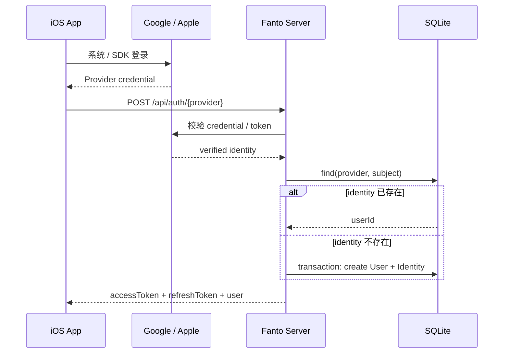
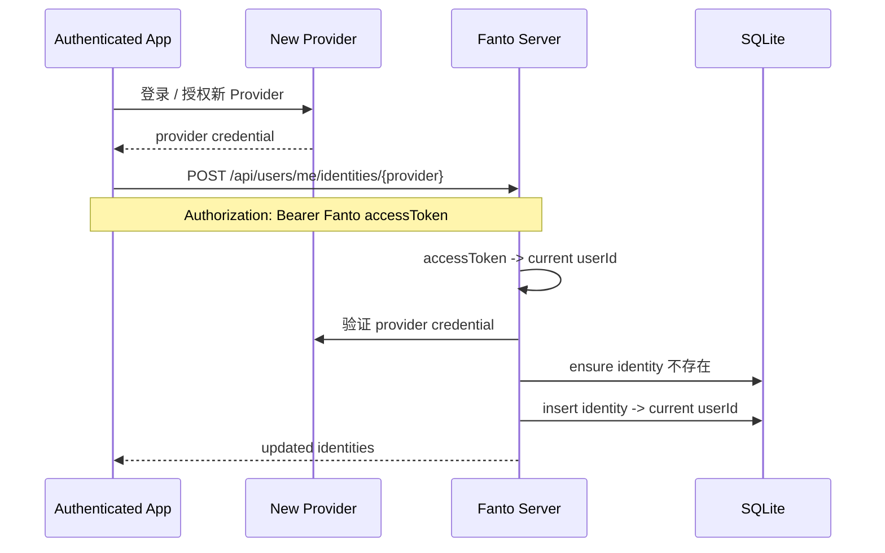
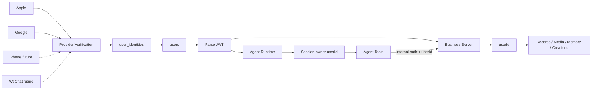

# Fanto MVP 用户与认证模块执行方案

> 日期：2026-09-19  
> 状态：待执行  
> 目标：在现有 Fanto MVP 上建立正式的 User / Identity + 无状态 JWT 认证体系，首批支持 Google、Apple 登录，并允许用户在登录后主动绑定其他 Identity；手机号与微信按同一 Provider 边界后续接入。  
> 非目标：本阶段不处理误建双账号、自动账号合并、匿名用户迁移、密码登录、RBAC / 组织体系。

## 1. 当前状态

已验证的当前实现：

- Business Server：Hono + SQLite + Kysely。
- 当前 `users` 只有 `user_id / wx_openid / created_at`，服务启动时会写入 `default-user`。
- 除 `/health` 外，Business Server 仅校验客户端传入的 `x-user-id`；它是开发期用户隔离，不是真实认证。
- Records / Media / Memory / Creations 已普遍以 `user_id` 作为数据隔离边界。
- Agent Runtime 独立部署、独立 SQLite；Session owner 已固定绑定 `userId`，但外部调用仍使用 `AGENT_TOKEN + X-User-Id`。
- iOS 的 API Client 仍硬编码 HTTP Server 地址和演示 `userID`。
- 当前 migration 策略只维护“空数据库的当前 schema”，不提供旧 SQLite 原地升级链。

因此本次改造的核心不是重做业务模型，而是把：

```text
Client supplied x-user-id
```

替换为：

```text
Provider credential
  -> Fanto Identity
  -> Fanto User
  -> Fanto JWT
  -> authenticated userId
```

并保持现有 Record / Memory / Creation 等领域继续只依赖稳定的内部 `userId`。

---

## 2. 核心原则

1. **User 是永久内部身份，Identity 只是登录凭证。**
2. 业务领域只能依赖 `userId`，不能依赖 Google subject、Apple subject、手机号或微信 openid。
3. Identity 绑定只允许两种确定性路径：
   - 已存在的 `provider + providerSubject` 直接解析到已有 User；
   - 用户已经登录 Fanto 后，主动完成另一个 Provider 的认证并绑定到当前 User。
4. 本阶段不根据 email、昵称、头像等信息自动推断两个 Identity 属于同一 User。
5. 本阶段不做 User Merge。若同一自然人因不同登录方式产生两个 User，暂不自动处理。
6. Provider Token 只用于一次登录/绑定认证；Fanto 业务请求统一使用自己的 Access Token。
7. 用户边界必须由服务端认证结果产生，客户端不能继续通过 `x-user-id` 指定身份。
8. 登录认证保持无状态：服务端不维护登录 Session，不保存 Access / Refresh Token，不做 token blacklist 或单设备 session 管理；只通过用户级 `auth_version` 提供整体失效能力。
9. 原生 App 使用 `Authorization: Bearer <JWT>` 传递凭证，不引入 Cookie；未来 Web 如有需要，可在不改变 User / Identity 模型的情况下改用 HttpOnly Cookie 传递 JWT。
10. 保持当前架构简单：普通 CRUD Route 直接调用 Repository；Provider 校验属于 infrastructure adapter；不引入 Auth0 / Firebase Auth / Clerk 等新的核心身份平台。

---

## 3. 目标数据模型

### 3.1 users

将现有 `users` 收敛为 Fanto 内部账户实体：

```text
users
- id                 integer PK
- user_id            text UNIQUE NOT NULL
- status             text NOT NULL       // active | deleted
- auth_version       integer NOT NULL DEFAULT 1
- locale             text NULL
- timezone           text NULL
- created_at         text NOT NULL
- updated_at         text NOT NULL
- deleted_at         text NULL
```

说明：

- `user_id` 继续作为所有业务表的稳定用户主键，建议生成不可推断随机 ID，例如 `usr_<uuid/ulid>`。
- `auth_version` 是用户级认证版本号，用于在不引入登录 Session 表的前提下使旧 Refresh Token 整体失效。
- 不再保存 `wx_openid`。
- locale / timezone 是账户级默认上下文，不作为认证字段。

### 3.2 user_identities

新增：

```text
user_identities
- id                 integer PK
- identity_id        text UNIQUE NOT NULL
- user_id            text NOT NULL
- provider           text NOT NULL
- provider_subject   text NOT NULL
- email              text NULL
- email_verified     integer NOT NULL DEFAULT 0
- phone              text NULL
- phone_verified     integer NOT NULL DEFAULT 0
- metadata           text NULL
- created_at         text NOT NULL
- updated_at         text NOT NULL
- last_login_at      text NOT NULL

UNIQUE(provider, provider_subject)
INDEX(user_id)
```

首批 provider：

```text
google
apple
```

预留但本阶段不实现：

```text
phone
wechat
```

约束：

- `provider_subject` 保存 Provider 官方稳定用户 ID：
  - Google：OIDC `sub`；
  - Apple：Sign in with Apple credential / ID Token 的 `sub`。
- email 仅是 Identity 附加信息，不作为 User 唯一键，不用于自动合并。
- metadata 只保存必要、非敏感的 Provider 展示信息，不保存 Provider access token / refresh token。

### 3.3 无状态 Token

本阶段不新增 `user_sessions` 表。

采用两类 Fanto 自签 JWT：

- Access Token：短期 JWT，建议 1 小时；
- Refresh Token：长期 JWT，建议 180 天；
- 两者都不入库；
- 普通业务请求只验 Access Token；
- refresh 时验 Refresh Token，并额外确认 `users.status = active` 且 Token 中的 `ver` 与当前 `users.auth_version` 一致；
- refresh 成功后同时签发新的 Access Token 和新的 180 天 Refresh Token，采用滑动过期；
- 用户只要在 180 天内至少成功 refresh 一次，就可以持续保持登录。

Access Token 最小 claims：

```json
{
  "sub": "<userId>",
  "type": "access",
  "ver": 1,
  "iat": 0,
  "exp": 0,
  "iss": "fanto"
}
```

Refresh Token 最小 claims：

```json
{
  "sub": "<userId>",
  "type": "refresh",
  "ver": 1,
  "iat": 0,
  "exp": 0,
  "iss": "fanto"
}
```

不要把 email、provider 等身份信息塞入业务认证 Token。

客户端普通 logout 只删除本地 Access / Refresh Token，不需要服务端 logout API。

当需要强制所有旧登录凭证失效时（例如账户删除、用户主动“退出所有设备”、怀疑 Refresh Token 泄漏），服务端只需：

```text
users.auth_version += 1
```

之后所有旧 Refresh Token 都会在下一次 refresh 时因 `ver` 不匹配而失效。已经签发的 Access Token 仍可存活到自身过期，因此 Access Token 必须保持短周期；建议 1 小时。这个模型提供“长期登录 + 可控失效”，但不提供单设备级 revoke。

---

## 4. Server 模块结构

在现有 Server 结构内新增：

```text
apps/server/src/
├── domain/
│   └── users/
│       ├── model.ts
│       ├── user-repository.ts
│       └── identity-repository.ts
├── infrastructure/
│   ├── auth/
│   │   ├── access-token.ts
│   │   └── refresh-token.ts
│   └── clients/
│       ├── google-identity-client.ts
│       └── apple-identity-client.ts
├── routes/
│   ├── auth.ts
│   ├── users.ts
│   └── request-user.ts
└── ...
```

不额外建立只做 Repository 转发的 `UserService`。

但登录 / 绑定属于跨 User、Identity 的原子操作，可以在 users domain 中保留一个很薄的业务操作模块，例如：

```text
domain/users/auth-operations.ts
```

职责只包括：

- resolve identity；
- 创建 User + Identity；
- link identity；
- 签发 / refresh Fanto JWT。

Provider credential 验证必须由 `infrastructure/clients/*` 完成，Domain 只接收统一结果：

```ts
type VerifiedIdentity = {
  provider: "google" | "apple" | "phone" | "wechat";
  subject: string;
  email?: string;
  emailVerified?: boolean;
  phone?: string;
  phoneVerified?: boolean;
  metadata?: Record<string, unknown>;
};
```

---

## 5. 登录链路

### 5.1 Google / Apple 首次登录



规则：

- identity 已存在：更新 `last_login_at`，返回关联 User。
- identity 不存在：一个事务内创建 User、Identity。
- 不根据 email 尝试寻找已有 User。

### 5.2 后续登录

唯一解析键：

```text
(provider, provider_subject)
```

命中后直接得到 `user_id`。

### 5.3 登录后主动绑定另一个 Identity



本阶段唯一允许的绑定语义：

> “当前已经认证为 User A，同时再次证明自己持有 Identity B”，因此把 B 绑定到 A。

不做后台猜测。

---

## 6. HTTP API

### 6.1 公共认证 API

```text
POST /api/auth/google
POST /api/auth/apple
POST /api/auth/refresh
```

建议请求：

```json
POST /api/auth/google
{
  "idToken": "..."
}
```

```json
POST /api/auth/apple
{
  "identityToken": "...",
  "authorizationCode": "..."
}
```

具体 Apple 字段以客户端 SDK 和服务端实际验证方式为准，执行时不得为了统一形式虚构不需要的字段。

统一成功响应：

```json
{
  "success": true,
  "result": {
    "accessToken": "...",
    "refreshToken": "...",
    "expiresIn": 3600,
    "user": {
      "userId": "usr_xxx"
    }
  },
  "errorCode": null,
  "errorMsg": null
}
```

refresh：

```json
POST /api/auth/refresh
{
  "refreshToken": "..."
}
```

成功响应必须同时返回新的 Access Token 和新的 Refresh Token：

```json
{
  "success": true,
  "result": {
    "accessToken": "...",
    "refreshToken": "...",
    "expiresIn": 3600
  }
}
```

refresh 处理：

```text
verify refresh JWT
  -> sub = userId
  -> ver = token auth version
  -> SELECT users WHERE user_id = sub
  -> require status = active
  -> require users.auth_version = ver
  -> sign new access JWT
  -> sign new 180-day refresh JWT
```

普通 logout 不提供服务端 API。客户端删除本地 Token 即完成退出。

### 6.2 当前用户 API

```text
GET    /api/users/me
GET    /api/users/me/identities
POST   /api/users/me/identities/google
POST   /api/users/me/identities/apple
DELETE /api/users/me/identities/:identityId
DELETE /api/users/me
```

Identity 删除规则：

- 至少保留一种可登录 Identity；
- 当前 MVP 不做复杂 recovery。
- 删除前检查 identity 属于当前 user。

账户删除：

`DELETE /api/users/me` 在 MVP 中至少需要完成业务上的“不可继续登录 + 不再对用户返回数据”。真正物理删除 Record / Media / Memory / OSS / Agent Session 的完整生命周期属于独立实现项；执行本方案时必须先确认当前各模块可删除能力，再决定同步删除或异步清理，不能只删除 users 行后声称账号已彻底删除。

---

## 7. 认证中间件替换

当前：

```text
x-user-id
  -> validUserId()
  -> Route
```

目标：

```text
Authorization: Bearer <Fanto access token>
  -> verify signature / exp / iss
  -> verify type = access
  -> AuthContext { userId }
  -> Route
```

建议给 Hono context 设置：

```ts
type AuthContext = {
  userId: string;
};
```

`request-user.ts` 改为读取认证中间件注入的 context，而不是客户端 header。

业务 Route 继续保持：

```text
requireUserId(...)
```

或改为更明确的：

```text
currentUserId(c)
```

但所有 userId 都必须来自已经验签的 Access Token。

### 公共路径

仅：

```text
GET  /health
POST /api/auth/google
POST /api/auth/apple
POST /api/auth/refresh
```

不要求 Access Token。

其它所有 `/api/*` 默认要求认证，避免逐 Route 漏挂 middleware。

---

## 8. Agent Runtime 的身份链路

当前 Agent Runtime 面向调用方暴露：

```text
Authorization: Bearer <AGENT_TOKEN>
X-User-Id: <userId>
```

这不适合作为正式 App 的客户端认证，因为客户端可以伪造 `X-User-Id`，且不能把 `AGENT_TOKEN` 下发给 App。

目标：

```text
iOS
  -> Fanto Access Token
  -> Agent Runtime verifies same user token
  -> token.sub -> userId
  -> Session owner / Run Context
  -> FantoServerClient
```

即 Agent Runtime 对面向用户的 HTTP API 也接受：

```text
Authorization: Bearer <Fanto access token>
```

并停止从外部 `X-User-Id` 获取用户身份。

### 8.1 Agent 对外接口统一认证

以下所有面向 App 的 Agent API：

```text
POST /api/agent/sessions
POST /api/agent/stream
GET  /api/agent/sessions/:sessionId/history
POST /api/agent/tasks
GET  /api/agent/tasks/:taskId
```

统一只接受：

```text
Authorization: Bearer <Fanto Access JWT>
```

不再接受客户端提供的：

```text
X-User-Id
```

Agent Runtime 的认证 middleware 与 Business Server 使用同一 Access Token 语义：

```text
Bearer token
  -> verify signature
  -> require iss = fanto
  -> require type = access
  -> require exp valid
  -> sub -> currentUserId
```

Agent Runtime 普通请求不读取 Business Server 数据库，也不调用 Business Server 检查 `auth_version`。已经签发的 Access JWT 最多继续存活到自身过期，和 Business Server 保持相同安全语义。

### 8.2 Agent Session owner 必须来自 JWT

这里的 Agent Session 是“对话 / 运行 Session”，不是登录 Session，必须继续保留。

创建 Session：

```text
POST /api/agent/sessions
Authorization: Bearer <Fanto Access JWT>
  -> token.sub = U1
  -> create Agent Session S1
  -> S1.owner = U1
```

后续所有带 `sessionId` 的请求必须再次校验：

```text
currentUserId == session.ownerUserId
```

例如：

```text
POST /api/agent/stream
GET  /api/agent/sessions/:sessionId/history
POST /api/agent/tasks
```

如果 Session 不属于当前用户，对外统一按资源不可见处理，优先返回 `404`，避免暴露其他用户 Session 是否存在。

### 8.3 Task 归属

Task 仍然必须同时绑定：

```text
taskId
sessionId
userId
```

创建 Task 时：

```text
JWT.sub = currentUserId
  -> require session.owner = currentUserId
  -> create task(userId = currentUserId, sessionId)
```

查询 Task 时：

```text
GET /api/agent/tasks/:taskId
  -> require task.userId = currentUserId
```

不能只依赖随机 taskId 作为访问控制。

### 8.4 Run Context 的 userId 来源

当前 Agent Tool 的用户边界设计继续保持：

```text
Access JWT
  -> currentUserId
  -> Agent Session owner
  -> Run Context.userId
  -> Tool execution context
```

LLM 可见 Tool schema 仍然不能包含 `userId` 参数。

正确：

```text
record_search(query)
record_list(limit, cursor)
record_get(recordId)
```

禁止：

```text
record_search(userId, query)
```

这样模型无法通过构造参数切换到其他用户。

为了避免 Business Server 与 Agent Runtime 各自维护不同的 Token 规则，认证验证逻辑应放到共享 package 或一个非常小的共享模块中，至少共享：

- JWT claims schema；
- issuer / algorithm 约束；
- verify helper；
- auth error semantics。

**不要让 Agent Runtime 查询 Business Server 数据库来验证用户。**

Agent -> Business Server 的内部调用是另一条信任边界。本阶段建议保留 `x-user-id` 作为内部 user propagation，但必须增加 service-to-service credential：

```text
Agent Runtime
  -> Authorization: Bearer <SERVER_INTERNAL_TOKEN>
  -> X-User-Id: <authenticated session owner>
  -> Business Server
```

Business Server 区分：

1. 外部用户请求：Fanto user access token；
2. 可信内部 Agent 请求：internal service token + x-user-id。

不能让外部调用仅凭 `x-user-id` 进入业务 API。

### 8.5 Agent -> Business Server 不转发用户 Access Token

Agent Runtime 不应把原始 Fanto Access JWT 当作 Business Server 的内部调用凭证继续透传。

原因：

- Agent Runtime 已经完成用户认证，内部需要的是可信用户上下文，而不是再次依赖客户端 Token；
- Agent Task 可能持续到用户 Access Token 过期之后；
- 后续主动任务、heartbeat、异步任务等也不一定有可用的用户 Access Token；
- 内部服务调用和用户请求应属于两个不同的信任边界。

因此内部调用固定为：

```text
Agent Runtime
  -> Authorization: Bearer <INTERNAL_SERVICE_TOKEN>
  -> X-User-Id: <Run Context.userId>
  -> X-Trace-Id: <optional>
  -> Business Server
```

`X-User-Id` 在这里是允许的，因为它只能和可信的 `INTERNAL_SERVICE_TOKEN` 一起生效，并且值来自已经认证的 Agent Session owner，而不是直接来自外部客户端。

Business Server 的认证入口因此需要明确区分：

```text
External user request:
  Authorization: Bearer <Fanto Access JWT>

Internal Agent request:
  Authorization: Bearer <INTERNAL_SERVICE_TOKEN>
  X-User-Id: <trusted propagated userId>
```

两种认证分支不能混用：

- user JWT 不能携带 `X-User-Id` 覆盖 `sub`；
- internal token 缺少 `X-User-Id` 时拒绝；
- 外部请求即使伪造 `X-User-Id` 也不能进入 internal auth 分支。

### 8.6 Shared Auth 模块

Business Server 与 Agent Runtime 不应各自实现一套 JWT claims / verify 逻辑。

优先复用现有 `@fanto/shared`，新增最小共享模块：

```text
packages/shared/src/auth/
├── claims.ts
├── verify-access-token.ts
└── errors.ts
```

至少共享：

```ts
type AccessTokenClaims = {
  sub: string;
  type: "access";
  ver: number;
  iss: "fanto";
  iat: number;
  exp: number;
};
```

以及：

```text
verifyAccessToken(token)
```

Token 签发职责只属于 Business Server。Agent Runtime 只负责 verify。

MVP 可以继续使用共享 HMAC secret；后续如果提升服务权限隔离，再切换为非对称签名：

```text
Business Server -> private key
Agent Runtime   -> public key
```

这样 Agent Runtime 即使被攻破，也不能签发新的用户 Token。

如果实现时发现把同一路由同时支持两类认证明显增加复杂度，可优先增加专用 internal auth middleware，但不要复制 Record API。

---

## 9. iOS 改造

### 9.1 Auth 状态

新增最小 Auth Store：

```text
AuthState
- unauthenticated
- authenticating
- authenticated(user)
```

保存：

- Access Token：内存为主；
- Refresh Token：Keychain；
- User ID：可缓存，但不能作为服务端认证依据。

启动：

```text
App launch
  -> Keychain refreshToken?
  -> /api/auth/refresh
  -> success: replace stored refreshToken + authenticated
  -> failure: login
```

### 9.2 登录页

MVP：

```text
Continue with Apple
Continue with Google
```

地区化登录入口后续通过 Server config / remote capability 再做，本阶段不先实现 provider 动态下发。

### 9.3 网络层

删除：

```text
x-user-id: creation-demo-user
```

改为：

```text
Authorization: Bearer <accessToken>
```

所有 API Client 复用统一 authenticated request 层。

收到 `401`：

```text
refresh once
  -> replace Keychain refreshToken
  -> retry original request once
  -> still 401 => clear auth state / return login
```

必须防止并发请求同时触发多次 refresh；使用单一 refresh task / actor 串行化。

客户端不使用 Cookie：

```text
iOS / Android
  -> Authorization: Bearer <access JWT>
  -> Refresh JWT stored in Keychain / Keystore
```

未来 Web 如需要浏览器自动管理凭证，可将同一 JWT 放入 `HttpOnly + Secure + SameSite` Cookie；这是传输方式变化，不改变无状态认证模型。

### 9.4 Identity 管理

Account 页面 MVP 展示：

```text
登录方式
✓ Apple
+ Google
```

点击未绑定 Provider：

1. 调系统 Provider SDK；
2. 获得 credential；
3. 调 `POST /api/users/me/identities/{provider}`；
4. 刷新 identity list。

---

## 10. Google Provider

Server 只接受来自客户端的 Provider credential，不接受客户端声称的 email / subject。

校验至少包括：

- 签名；
- issuer；
- audience 必须是 Fanto 的 Google Client ID；
- expiry；
- subject 非空。

输出统一 `VerifiedIdentity`。

不申请 Gmail / Drive 等 scope，仅使用登录所需最小 OIDC 信息。

配置：

```text
GOOGLE_CLIENT_ID
```

如果 iOS / Android / Web 后续需要不同 audience，不提前抽象；出现实际多 client 场景后再扩展为 allowlist。

---

## 11. Apple Provider

服务端校验至少包括：

- Apple 公钥签名；
- issuer；
- audience；
- expiry；
- subject。

Apple email 可能：

- 只在首次授权时返回；
- 使用 Hide My Email relay；
- 后续不再返回。

因此 Apple `sub` 才是 Identity 唯一键，email 永远只是附属字段。

配置：

```text
APPLE_CLIENT_ID / BUNDLE_ID
```

若实际 Server 端 code exchange 需要 Team ID / Key ID / private key，则执行时按 Apple 官方流程新增，但 private key 只允许通过部署 secret 注入，不能进入仓库。

---

## 12. Phone / WeChat 后续扩展点

本方案不实现，但 Provider 边界必须保证后续只新增 Adapter。

### phone

目标 identity：

```text
provider = phone
provider_subject = canonical E.164 phone
phone = canonical E.164 phone
phone_verified = true
```

短信供应商只负责“证明本次验证码有效”，不进入业务领域。

### wechat

目标 identity：

```text
provider = wechat
provider_subject = stable provider user identifier
```

具体选择 openid / unionid 取决于届时微信移动应用与开放平台能力。正式接入前重新确认官方规则，不在当前 schema 里硬编码 `wx_openid`。

---

## 13. 数据库迁移与本地数据

当前项目约定 migration 只支持新空库基线，因此本次直接修改 `create_current_schema.ts`：

1. 重写 `users`；
2. 新建 `user_identities`；
3. 更新 Kysely `schema.ts`；
4. 删除启动时自动创建 `default-user` 的逻辑。

现有本地 SQLite：

- 不设计 schema upgrade；
- 开发环境按现有约定重建；
- 如果现有测试 / demo 数据需要保留，单独写 seed，不把 `default-user` 重新变成生产语义。

### 演示 / 测试用户

测试应通过 fixture 直接创建：

```text
User + Identity / signed test access token
```

不能再依赖应用启动自动插入 `default-user`。

---

## 14. User Isolation 不变的领域

以下业务模型本次原则上不修改：

```text
records.user_id
media_assets.user_id
vector_items.user_id
record_vectors.user_id partition
creations.user_id
creation_proposals.user_id
entity_relations.user_id
Agent Session owner userId
```

变化只发生在 userId 的来源：

```text
before: untrusted x-user-id
after: authenticated user token / trusted internal propagation
```

这可以最大限度降低对 Memory、Record、Creation 的改造风险。

---

## 15. 错误语义

认证层统一：

```text
401 UNAUTHORIZED
- Access Token 缺失
- Token 无效 / 过期

409 IDENTITY_ALREADY_BOUND
- 新 identity 已绑定到任意 User

400 INVALID_AUTH_CREDENTIAL
- Provider credential 格式错误

401 PROVIDER_AUTH_FAILED
- Provider credential 无法验证
```

MVP 不向客户端暴露“这个 identity 绑定在哪个 user”等信息。

Provider 外部错误不要原样透传，避免泄漏内部验证信息。

---

## 16. 安全约束

必须落实：

- JWT signing secret / private key 只来自环境变量或 secret manager。
- Refresh Token 必须带 `auth_version`，refresh 时必须读取 User 并校验版本；不能只做纯 JWT 验签。
- `auth_version` 只能由明确的安全事件修改，普通 refresh 不递增版本，否则会破坏多设备长期登录。
- 日志现有 token redaction 继续保留，并补充对 `idToken / identityToken / authorizationCode / refreshToken` 的覆盖测试。
- Provider token、Fanto token 不写入 access log requestBody。
- CORS 在正式客户端路径上不能继续无条件 `*`；Web 真正接入时再按 origin allowlist 收紧，原生 iOS 不依赖浏览器 CORS。
- 所有 identity 查询和解绑必须校验当前 `userId`。
- 删除最后一个 Identity 必须拒绝。
- internal service token 与 user JWT 必须使用不同 secret / audience 或明确不同认证分支，避免内部 credential 被误当用户 credential。
- 不把 Google / Apple private credentials 下发客户端。

---

## 17. 配置

Business Server 新增：

```text
AUTH_JWT_SECRET=<secret>
AUTH_JWT_ISSUER=fanto
AUTH_ACCESS_TOKEN_TTL_SECONDS=3600
AUTH_REFRESH_TOKEN_TTL_DAYS=180

GOOGLE_CLIENT_ID=...

APPLE_CLIENT_ID=...

INTERNAL_SERVICE_TOKEN=<secret>
```

Agent Runtime：

```text
AUTH_JWT_SECRET=<same verification secret for MVP>
AUTH_JWT_ISSUER=fanto
INTERNAL_SERVICE_TOKEN=<same internal service credential>
```

如果后续改为非对称 JWT，则 Business Server 持有签名私钥，Agent Runtime 只持公钥；MVP 可以先用共享 secret，但必须通过部署 secret 注入。

---

## 18. 实施顺序

### Phase 1 — Domain 与 Schema

修改：

- `apps/server/src/infrastructure/database/schema.ts`
- `apps/server/src/migrations/create_current_schema.ts`
- 新建 users domain repositories / operations
- 删除 `default-user` bootstrap

完成条件：

- 空库可以创建新 schema；
- User / Identity repository 单测通过；
- `(provider, provider_subject)` 唯一约束有效；
- `users.auth_version` 默认值和更新行为有效；
- 不存在任何用户登录 session 持久化表。

### Phase 2 — Fanto Token 与 Business Server Auth

实现：

- Access Token sign / verify；
- Refresh Token sign / verify；
- auth middleware；
- `POST /api/auth/refresh`；
- refresh 校验 `users.status + auth_version`；
- refresh 返回新的 Access + Refresh JWT，实现 180 天滑动过期；
- 用认证 context 替换 `x-user-id` 外部身份来源。

此阶段可先用 test provider / test identity 跑通完整认证链，不必等 Google UI。

完成条件：

```text
signed token U1 -> 只能读取 U1 数据
signed token U2 -> 只能读取 U2 数据
伪造 x-user-id -> 无效
无 token -> 401
```

### Phase 3 — Google

实现 Google identity client 和：

```text
POST /api/auth/google
POST /api/users/me/identities/google
```

完成条件：

- 首次 Google -> User + Identity + Token；
- 再次 Google -> 同一个 User；
- 已登录 U1 绑定新 Google identity -> U1；
- 已绑定 identity 再绑定 -> 409。

### Phase 4 — Apple

与 Google 相同边界，实现 Apple adapter。

完成条件同 Google，并额外覆盖 Apple email 缺失 / relay email 不影响身份解析。

### Phase 5 — Agent Runtime Auth

修改：

- 外部 Agent API 使用 Fanto Access Token；
- 删除外部 `X-User-Id` 身份来源；
- token.sub 注入 Session owner；
- Agent -> Business Server 增加 internal service auth；
- 保持 Record Tool schema 不含 userId。

完成条件：

- U1 无法访问 U2 Agent session / history / task；
- 客户端伪造 `X-User-Id` 不改变身份；
- Agent Tool 对 Business Server 的 userId 来自已认证 Session owner。

### Phase 6 — iOS

实现：

- Login screen；
- Apple / Google SDK；
- Keychain refresh token；
- access token refresh；
- authenticated request；
- 删除硬编码 `creation-demo-user`；
- Account / identities 页面和绑定动作。

完成条件：

- 冷启动可通过 refresh 恢复登录；
- refresh 成功后覆盖 Keychain 中旧 Refresh Token；
- token 过期可以自动刷新并重试一次；
- logout 后本地 Token 被清除并返回登录页；
- Google / Apple 登录后业务数据均使用真实 `userId`；
- 用户已登录后可以主动绑定另一 Identity。

### Phase 7 — Account Delete 与上线收尾

至少完成：

- `DELETE /api/users/me`；
- 删除 / 禁用账户时递增 `auth_version`；
- Identity 不再可登录；
- 明确业务数据清理策略并实现与声明一致的生命周期；
- HTTPS / 正式 base URL；
- 配置和隐私文档更新。

Phone / WeChat 不属于该 Phase 的 blocking scope。

---

## 19. 测试矩阵

### Server Auth

```text
[ ] valid access token -> 200
[ ] missing token -> 401
[ ] expired token -> 401
[ ] invalid signature -> 401
[ ] spoof x-user-id cannot switch user
[ ] access token rejects refresh-token type
[ ] refresh endpoint rejects access-token type
[ ] valid refresh token issues new access + refresh token
[ ] refreshed token gets a new 180-day expiry
[ ] wrong auth_version refresh token -> 401
[ ] increment auth_version invalidates all previous refresh tokens
[ ] deleted / inactive user cannot refresh
```

### Identity

```text
[ ] first provider login creates one User
[ ] repeated provider login resolves same User
[ ] second provider login without authenticated link creates another User
[ ] authenticated link attaches new Identity to current User
[ ] already-bound Identity cannot be rebound
[ ] same verified email does NOT auto-link
[ ] identity removal checks ownership
[ ] final identity cannot be removed
```

### Isolation

至少创建 U1 / U2：

```text
[ ] Record list/get/search isolated
[ ] Media isolated
[ ] Creation / Proposal isolated
[ ] Memory KNN isolated
[ ] Agent Session isolated
[ ] Agent Task isolated
[ ] Agent Tool request retains authenticated user
```

### iOS

```text
[ ] fresh install login
[ ] cold start restore session
[ ] refresh expiry
[ ] concurrent 401 only performs one refresh
[ ] logout clears Keychain state
[ ] login UI -> authenticated root
[ ] bind secondary Identity
```

---

## 20. 验证命令

Server：

```bash
pnpm --filter @fanto/server typecheck
pnpm --filter @fanto/server test
```

Agent：

```bash
pnpm --filter @fanto/agent typecheck
pnpm --filter @fanto/agent test
pnpm --filter @fanto/agent build
```

仓库级：

```bash
pnpm typecheck
pnpm test
```

iOS 还需要：

- Xcode build；
- 真机 Sign in with Apple；
- 真机 Google Sign-In；
- Keychain / 冷启动恢复验证。

外部 Provider 的单测只能验证 adapter 逻辑，不能替代真实 Google / Apple 登录链路。

---

## 21. Current Docs 影响

方案执行完成后需要更新 Current Docs，而不是在实现前把计划写成当前能力：

- `docs/architecture/server.md`
  - x-user-id ->正式认证 middleware；
  - User / Identity / Stateless JWT 边界；
  - internal Agent auth。
- `docs/api/http-api.md`
  - Auth / User / Identity API；
  - Authorization header；
  - 移除外部 x-user-id。
- `docs/architecture/agent-runtime.md`
  - Fanto Access Token；
  - Session owner 来源；
  - Agent -> Server internal auth。
- `docs/clients/ios.md`
  - 登录与 Keychain；
  - 移除 demo user。
- `docs/engineering/configuration.md`
  - Auth / Google / Apple / internal service 配置。
- `docs/product/current-scope.md`
  - 只有真实登录 / 绑定能力完成并接入后再增加 capability。

---

## 22. 明确不做

本轮不要顺手实现：

- 自动根据 email / phone 合并 Identity；
- User Merge；
- 未登录匿名用户及匿名数据迁移；
- 用户名 + 密码；
- 邮箱验证码登录；
- 手机号短信登录；
- 微信登录；
- Profile / 头像体系；
- 好友 / 社交关系；
- RBAC / Team / Organization；
- Auth 平台化；
- 历史数据库兼容 migration；
- 多设备管理 UI；
- “退出所有设备”UI；
- Token revoke / blacklist；
- Server-side login session；
- 单设备 revoke；
- Passkey。

这些都不影响当前 MVP 建立正确的身份基础。

---

## 23. 最终目标状态



最终应满足：

> Fanto 的所有长期数据只认识内部 User；Google、Apple、未来的手机号和微信都只是同一个 User 的不同入口。用户只有在已经登录一个 User 的情况下，才能主动把新的 Identity 绑定到该 User。本阶段不猜测、不自动合并，也不让任何客户端自行声明 userId。
