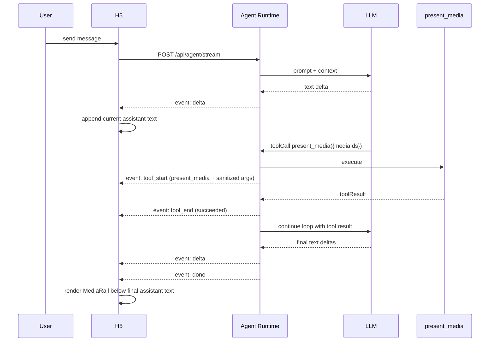

# Agent Media Presentation：原生 Tool Call 驱动的媒体展示与 H5 稳定性修复

日期：2026-09-20

## 1. 目标与结论

当前 Fanto 把图片 / 音频通过 Markdown 中的 `fanto-media://<mediaId>` 编码进最终文本。这个方式能快速工作，但已经带来三个问题：

1. 历史消息中的图片在当前回复流式更新时反复重挂载、重新 resolve URL，出现闪烁；
2. 图片真实高度变化会导致滚动区域 layout shift，滚动条明显波动；
3. 多张图片逐张纵向展示，占用屏幕过大；未来继续支持音频、短视频、Live Photo 后会更难维护。

本方案不改变 Pi Agent Loop，不要求模型输出结构化最终 Response，也不在 Runtime 组装新的“最终消息”。

核心方案：

> 新增一个普通 Agent Tool：`present_media`。模型仍正常流式输出自然语言；需要向用户展示媒体时，额外调用 `present_media({ mediaIds })`。Tool Call 与 Tool Result 按 Pi 原生结构进入 Session History。客户端只把原始 History / SSE 投影成 UI，在最终 Assistant 文本后追加一行 Media Rail。

`present_gallery` 不采用，因为它只适合图片。统一使用：

```text
present_media
```

它覆盖当前图片、音频，并为短视频、Live Photo 等未来媒体类型保留扩展空间。

---

## 2. 必须守住的边界

### 2.1 不破坏 Agent Loop

保持原始流程：

```text
User
  ↓
LLM
  ↓
record_search / record_get ...
  ↓
Tool Result
  ↓
LLM
  ↓
present_media(...)
  ↓
Tool Result
  ↓
LLM final text
```

不做：

- 不要求 LLM 输出 `{ blocks: [...] }`；
- 不新增“最终消息组装器”；
- 不把 Tool Call 改写进 Assistant text；
- 不新增重复的 presentation 表；
- 不用 custom entry 再保存一份媒体展示状态；
- 不修改 Pi Session 中原始 Message / ToolResult 的语义。

Pi Session History 仍然是唯一事实源。

### 2.2 Markdown 只承载文本表达

新生成的消息中：

- Markdown 继续负责段落、列表、代码、链接等文本富格式；
- 图片、音频和未来视频不再通过 `fanto-media://` 编码进 Markdown；
- 媒体展示意图只通过 `present_media` Tool Call 表达。

旧历史里的 `fanto-media://` 暂时保留兼容渲染，避免已有 Session 的媒体消失；新 Prompt 不再生成这种格式。

### 2.3 Tool 不控制 UI 布局

Tool schema 只表达“展示哪些媒体”：

```ts
present_media({
  mediaIds: string[]
})
```

不让模型传：

- `mediaType`
- `layout`
- `width / height`
- `columns`
- OSS URL

媒体类型和尺寸属于 Business Server 的真实 Media metadata；布局属于客户端职责。

这样未来加入 video / live-photo 时，`present_media` 协议无需变化。

---

## 3. 已验证的当前系统事实

### Agent Runtime

当前 Pi Assistant Message 的 `content` 原生支持 `toolCall` block：

```ts
{
  type: "toolCall",
  id,
  name,
  arguments
}
```

Tool Result 作为独立 `role: "toolResult"` message 存入同一个 Session。

当前 `GET /api/agent/sessions/:sessionId/history` 已直接返回 Pi Session entries，只过滤 compaction 和内部 `fanto.*` custom entries，因此不需要增加新的持久化结构。

当前 Pi `tool_start` 事件本身已经包含：

```ts
{
  toolCallId,
  toolName,
  args
}
```

但 Fanto `AgentSessionManager` 目前只向 HTTP 层转发 `toolCallId + toolName`，主动丢弃了 `args`。

### H5

当前 H5：

- `fetchAgentHistory()` 只提取 user / assistant text，Tool Call 被忽略；
- 每个流式 `delta` 都会触发 `setMessages`；
- 整个消息列表随父组件重新 render；
- `ChatMarkdown` 的 ReactMarkdown `components` 在 render 内动态创建；
- `FantoMediaImage` mount 时把 URL 置空并重新请求 `/api/media/:id/url`；
- loading 占位最小高度只有 120px，而真实图片可能高达数百像素。

这共同造成：

```text
delta
→ 历史 Message re-render
→ 媒体组件 remount
→ url=null
→ loading 120px
→ 再次 resolve signed URL
→ 图片重新出现
→ 高度变化
→ scrollbar / viewport 波动
```

### Media

当前 Business Server 支持：

- image
- audio

`GET /api/media/:id/url` 当前只返回：

```json
{ "url": "..." }
```

Media 本身已经存有：

- `mediaType`
- `mimeType`
- `extData.capture.width`
- `extData.capture.height`
- `extData.capture.durationMs`

OSS read URL 当前有效期为 300 秒。

---

## 4. `present_media` Tool

### 4.1 Schema

第一版只保留一个字段：

```ts
{
  mediaIds: string[] // 至少 1 个；限制合理最大数量
}
```

建议去重但保持顺序。

Tool：

- `executionMode: "parallel"`
- `replay: "safe"`
- 无业务写入；
- 不产生新的 Presentation 数据；
- 返回一个极简 Tool Result，使 Agent Loop 正常继续。

例如：

```json
{
  "mediaIds": ["m1", "m2", "m3"]
}
```

### 4.2 安全边界

`present_media` 本身不返回 OSS URL，也不作为媒体授权边界。

模型只能按 Prompt 使用 Record Tool 实际返回的 `mediaId`；即使模型传入错误或伪造 ID，客户端最终仍必须通过 Business Server 的 user-scoped Media API 获取 URL。

真正的数据边界继续由：

```text
GET /api/media/:id/url
+ x-user-id
+ ready 状态检查
```

保证。

因此第一版无需为了这个 UI Tool 再增加一套 Agent → Server 媒体校验请求。

### 4.3 Prompt

修改 `apps/agent/prompts/fanto.md` 的 Media 规则：

- 删除“通过 Markdown `fanto-media://` 展示新媒体”的指令；
- 当 Record Tool 返回真实 mediaId，且媒体与回答相关或用户要求查看 / 播放时，调用 `present_media`；
- 可以一次展示多个媒体；
- 不猜测、不构造 mediaId；
- Tool 调用继续对用户隐身；
- Tool 调用后最终自然语言不需要重复输出“图片链接 / 音频链接”。

`main` Agent tools 增加 `present_media`。

---

## 5. 实时链路：不影响打字机

实时文字仍使用现有 `delta`，打字机路径完全不改变。



### 5.1 SSE 只为 presentation tool 暴露参数

不能把所有内部 Tool 的 args 暴露给客户端。

现有事件保持兼容：

```json
{
  "toolCallId": "...",
  "toolName": "record_search"
}
```

只有 `present_media` 增加经过 schema 校验后的安全参数：

```json
{
  "toolCallId": "...",
  "toolName": "present_media",
  "args": {
    "mediaIds": ["m1", "m2"]
  }
}
```

实现上利用 Pi 原始 `tool_start.args`，但 Fanto Runtime 只对 `present_media` 透出；其他 Tool 继续不公开参数和结果。

### 5.2 H5 实时状态

H5 不修改 Assistant 原始 text。

当前 turn 维护一个纯 UI 状态：

```ts
pendingPresentations: Map<toolCallId, {
  mediaIds: string[]
  status: "running" | "succeeded"
}>
```

规则：

1. `tool_start(present_media)`：记录参数；
2. `tool_end(..., succeeded)`：标记成功；
3. `tool_end(..., failed)`：丢弃；
4. `done`：将本轮成功的 mediaIds 按调用顺序去重，展示在当前最终 Assistant 文本下方。

这是客户端 ViewModel，不写回 Session，不属于 Agent 消息模型。

---

## 6. 历史恢复：从原始 Session 投影，不重新解析 Markdown

历史恢复直接使用 Pi 原始 entry。

```mermaid
flowchart LR
  H[GET history: raw Entry[]]
  P[projectChatHistory]
  T[User Turn]
  A[Assistant Text]
  C[present_media toolCall]
  R[successful toolResult]
  V[ChatTurnView]
  UI[Text + MediaRail]

  H --> P
  P --> T
  T --> A
  T --> C
  T --> R
  A --> V
  C --> V
  R --> V
  V --> UI
```

### 6.1 Projection 规则

按时间正序扫描 entries，以 user message 划分 turn：

- Assistant message 的 text block → 正常可见文本；
- `toolCall.name === "present_media"` → 记录 `toolCallId + mediaIds`；
- 对应 `toolResult.isError === false` → 该 presentation 有效；
- record_search / record_get 等其他 Tool 不进入 UI；
- 一个 turn 中多个成功 `present_media` 调用按出现顺序合并；
- mediaId 去重但保持第一次出现顺序；
- 最终 MediaRail 附着在该 turn 最后的可见 Assistant 文本之后；
- 如果 turn 没有可见最终文本，可允许渲染 media-only Assistant 容器，但不人为生成文本。

这个过程只是 O(entries) 的一次轻量 projection，不做 Markdown 内媒体扫描，也不改变服务器数据。

---

## 7. Media Metadata 与 URL

为了让 `present_media` 不携带类型，同时支持 image / audio / future video，需要扩展现有：

```text
GET /api/media/:id/url
```

保持现有 `url` 字段，并增加：

```ts
{
  url: string
  expiresAt: string
  mediaType: "image" | "audio" // future: "video" | "live_photo"
  mimeType: string
  capture: {
    width?: number
    height?: number
    durationMs?: number
  }
}
```

这是 additive contract，不新增 endpoint。

客户端只使用 Server 返回的真实 `mediaType` 选择组件，不信任模型推断。

### URL Cache

H5 增加页面级 `mediaId -> resolved metadata` cache：

- URL 当前 300 秒有效；
- 缓存以 Server 返回的 `expiresAt` 为准；
- 到期前一小段时间视为失效并重新 resolve；
- 加载失败时允许清 cache 后重试一次。

目的不是长期缓存 OSS URL，而是防止同一个页面生命周期内的重复 resolve 和闪烁。

---

## 8. H5 Media Rail

统一组件建议命名：

```text
MediaRail
```

而不是 Gallery，因为它可以混排不同媒体。

### 8.1 布局

所有媒体保持单行：

```text
┌──────┐ ┌──────┐ ┌──────────────┐ ┌──────┐ →
│ img1 │ │ img2 │ │  🔊 00:18    │ │ img3 │
└──────┘ └──────┘ └──────────────┘ └──────┘
```

规则：

- 单行，不自动换行；
- `overflow-x: auto`；
- 高度固定，避免纵向占满屏幕；
- 图片使用固定缩略图槽位 + `object-fit: cover`；
- 音频使用紧凑横向卡片；
- 点击图片进入大图；
- 音频可直接播放；
- 多媒体混排保持相同 Rail 高度；
- 未识别未来类型使用稳定 fallback，不破坏整个消息。

未来：

- video：缩略图 + play badge；
- live photo：静态封面 + LIVE badge，支持后再增加交互；
- Tool schema 不需要变化。

### 8.2 首屏尺寸原则

第一版不追求复杂自适应：

- Rail 固定高度约 96–112px；
- image tile 采用固定宽高或稳定 aspect-ratio；
- audio tile 固定高度、适当更宽；
- 多张媒体始终横向滚动。

重点是“稳定且少占纵向空间”，不是照片瀑布流。

---

## 9. Bugfix：图片闪烁与滚动条波动

Presentation Tool 解决“媒体语义编码在 Markdown”这个根问题，但当前 H5 自身仍需要修掉不稳定渲染。

### 9.1 Completed Message 不随 delta 重渲染

抽出 `ChatMessageItem`，使用 `React.memo`。

目标：

```text
历史 message 1  ── 不 render
历史 message 2  ── 不 render
历史 message 3  ── 不 render
current message  ── 只更新这一条
```

Streaming delta 只修改当前 Assistant Message。

### 9.2 ReactMarkdown renderer 保持稳定 identity

把 `components={{ ... }}` 从 `ChatMarkdown` render 内移到模块级稳定定义。

旧 `fanto-media://` 兼容组件也不能因为父级刷新反复 remount。

### 9.3 Media URL 不因 render 重取

所有新 `MediaRail` 和旧兼容媒体统一走同一 media resolver/cache。

同一个 `mediaId` 在有效期内：

```text
render/remount
→ cache hit
→ 直接使用已有 metadata + url
```

不再出现：

```text
url=null
→ loading
→ resolve
→ image
```

### 9.4 预留固定几何空间

MediaRail tile 在 URL / 图片 bytes 完成前就确定高度。

对于 image：

- 优先使用 `capture.width / height` 得到比例；
- 没有 capture 时使用统一 fallback aspect ratio；
- loading、loaded、failed 三种状态都保持同一个外框尺寸。

这样第一次加载也不会造成 scrollbar 大幅变化。

### 9.5 自动滚动

流式过程中只在用户原本接近底部时跟随最新内容。

避免每个 delta 都重复启动 `smooth` scroll 动画；Streaming 跟随优先使用稳定的即时滚动，用户已经向上查看历史时不强行拉回底部。

---

## 10. 旧消息兼容

已有 Session 中已经存在：

```md

[播放语音](fanto-media://mediaId)
```

第一版不做数据迁移。

兼容策略：

- 新 Prompt 停止产生 `fanto-media://`；
- H5 暂时保留旧 Markdown media renderer；
- 旧 renderer 改为复用新的 media resolver/cache 与稳定 tile；
- 新消息只使用 `present_media` + `MediaRail`；
- 等测试环境旧 Session 不再需要后，可以单独删除 legacy renderer。

---

## 11. iOS 兼容边界

`main` Agent 是共享能力，所以启用 `present_media` 后，iOS 也会遇到带 Tool Call 的原始 History。

当前 iOS History decoder 把 `message.content` 固定解码成 `String`，而 Pi Assistant message 的 content 实际可以是数组，这本身就是已有脆弱点。

本方案 P0 至少需要：

- iOS History content 改成 tolerant decoding；
- 能提取 text block；
- 忽略未知 / presentation Tool Call，不因结构化 content 解码失败。

P0 不要求 iOS 实现 MediaRail；iOS 富媒体展示可以后续单独实现，但不能因为新 Tool 导致历史恢复失败。

---

## 12. 代码改动范围

### Agent

`apps/agent/src/config/agent-config.ts`

- Tool enum 增加 `present_media`。

`apps/agent/src/tools/`

- 新增轻量 `present-media-tool.ts`，只接受 mediaIds、去重、返回安全 result。

`apps/agent/src/tools/registry.ts`

- 注册 `present_media`。

`apps/agent/agents.yaml`

- `main.tools` 增加 `present_media`。

`apps/agent/prompts/fanto.md`

- 新消息改用 presentation tool；
- 停止生成 `fanto-media://`。

`apps/agent/src/harness/session-manager.ts`

- 从 Pi `tool_start` 接收 args；
- 仅对 `present_media` 生成安全的 presentation args；
- 其他 Tool 行为保持原样。

`apps/agent/src/http/agent-route.ts`

- `present_media` 的 `tool_start` SSE 增加 sanitized args；
- 不公开 record tools 参数和 tool result。

### Business Server

`apps/server/src/bootstrap/app.ts`

- 扩展 `GET /api/media/:id/url`：返回 mediaType / mimeType / capture / expiresAt；
- 保持 user scope + ready check 不变。

相关 server tests 更新 additive contract。

### H5

`apps/h5/src/api/agent.ts`

- History 不再只压成纯 text；
- 保留 assistant toolCall / toolResult 所需字段；
- 增加 History → ChatTurnView projection。

`apps/h5/src/pages/ChatPage.tsx`

- 当前 turn 接收 `present_media` tool_start/tool_end；
- done 后展示本轮 MediaRail；
- completed message memo 化；
- 自动滚动条件化。

`apps/h5/src/api/media.ts`

- `resolveMediaUrl` 升级为 `resolveMedia`；
- 返回 metadata + signed URL；
- 增加有 expiresAt 的页面级 cache。

`apps/h5/src/components/`

- 新增 `MediaRail`；
- image / audio renderer；
- 后续 video / live-photo renderer 从这里扩展。

`apps/h5/src/components/ChatMarkdown.tsx`

- Markdown components 提升为稳定定义；
- 旧 `fanto-media://` 只做兼容；
- 兼容路径复用统一 media resolver。

`apps/h5/src/styles/global.css`

- 单行横向 Rail；
- 固定 tile geometry；
- loading / loaded / error 尺寸一致。

### iOS

`apps/ios/fanto/fanto/Networking/AgentAPIClient.swift`

- History message content tolerant decoding；
- 当前只提取 text，忽略 Tool Call，避免新 history 结构导致恢复失败。

---

## 13. 不做的事情

本次明确不做：

- 不设计通用 Message Block Protocol；
- 不改 Pi Agent Loop；
- 不增加新的 Session / Presentation 表；
- 不把媒体 URL 存入 Agent History；
- 不让 LLM 决定 UI layout；
- 不新增 WebSocket；
- 不做媒体数据库 migration；
- 不在本次实现 video / live-photo 上传与播放能力；
- 不为了 History UI 在 Server 组装派生的“最终消息”。

---

## 14. 验证方案

### Agent 自动验证

至少覆盖：

1. `present_media` 被 Tool Registry 正确注册；
2. schema 拒绝空 mediaIds / 非法输入；
3. Tool 保持输入顺序并去重；
4. stream 中 `present_media` 可以暴露 sanitized args；
5. `record_search / record_get` 等 Tool 的 args 仍然不出现在 SSE；
6. Session History 仍保留 Pi 原始 toolCall + toolResult，不产生额外 custom entry；
7. 原有 Agent HTTP 测试全部通过。

执行：

```bash
pnpm --filter @fanto/agent typecheck
pnpm --filter @fanto/agent test
pnpm --filter @fanto/agent build
```

### Server 自动验证

覆盖：

- `/api/media/:id/url` 返回新增 metadata；
- 仍只能读取当前 user 的 ready media；
- 404 / ownership 语义不变。

执行：

```bash
pnpm --filter @fanto/server typecheck
pnpm --filter @fanto/server test
```

### H5 构建验证

```bash
pnpm --filter @fanto/h5 typecheck
pnpm --filter @fanto/h5 build
```

当前 H5 没有测试框架，本次不为这个改动单独引入新的测试框架。

### 真实链路验证

至少手工验证以下场景：

1. 普通无媒体聊天：行为完全不变，打字机正常；
2. Agent 搜到 1 张图并调用 `present_media`：最终文本下出现单行缩略图；
3. 3–6 张图：只占一行，可横向滑动；
4. 图片 + 音频：同一 MediaRail 混排；
5. 回复持续流式生成时，上方历史图片不闪烁、不重新进入 loading；
6. 用户停留在历史位置时，新 delta 不强制滚到底；
7. 刷新页面：History 能从原始 toolCall 恢复同样的 MediaRail；
8. `present_media` Tool 失败：不展示对应媒体；
9. 旧 `fanto-media://` 历史仍可查看；
10. signed URL cache 到期后可以重新 resolve；
11. iOS 历史遇到 toolCall content 不崩溃。

---

## 15. 实施顺序

### Step 1：Agent Tool 与原始事件

- 新增 `present_media`；
- 加入 main Agent；
- 修改 Prompt；
- SSE 只对该 Tool 透出安全 args；
- 先验证 Session 原始结构完全未改变。

### Step 2：History Projection

- H5 保留 raw message content；
- 实现按 user turn 的 presentation projection；
- 先用假数据验证 Tool Call → 最终 Assistant 下方媒体绑定。

### Step 3：Media metadata + MediaRail

- 扩展 `/api/media/:id/url`；
- 实现统一 media resolver/cache；
- 实现 image + audio MediaRail。

### Step 4：闪烁 / 滚动稳定性修复

- memo completed messages；
- 稳定 Markdown renderer identity；
- 固定媒体占位几何；
- 优化 near-bottom 自动滚动。

### Step 5：兼容与回归

- 保留 legacy `fanto-media://`；
- iOS tolerant history decoding；
- 完整 typecheck / test / build；
- ECS 真实 H5 + Agent + OSS 链路验证。

---

## 16. 完成标准

满足以下条件才算完成：

- Agent Session 中只有原生 user / assistant / toolResult / toolCall 等 Pi 数据，不出现 Fanto 人工组装的最终 message；
- 模型正文仍可以完整流式输出，打字机体验不受 `present_media` 影响；
- 新消息的媒体不再编码在 Markdown；
- 刷新页面后可以仅靠原始 History 还原文本 + MediaRail；
- 多媒体永远以一行紧凑 Rail 展示，不因数量增加大幅占用纵向空间；
- 当前回复 streaming 时历史媒体不重新加载、不闪烁，滚动条不因图片 loading ↔ loaded 高度变化明显跳动；
- image / audio 已可工作；
- 未来 video / live-photo 不需要修改 `present_media` Tool schema，只需要扩展 Media domain 和前端 renderer。
