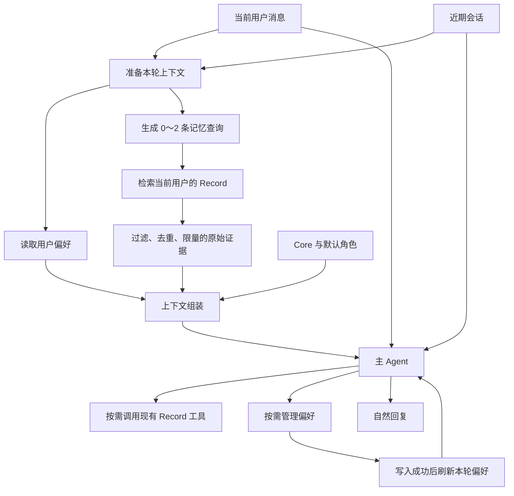

# Fanto 动态上下文综合方案

日期：2026-09-20

状态：方案已讨论确认，待实施。本文不代表当前已上线能力。

核对基线：HEAD `17d7dc1` 与当时工作区。工作区已有未提交的 Memory eventAt 改动，实施时复核最终状态，不覆盖或重复实施。

## 1. 决策与范围

统一考虑角色、偏好与相关记忆，在 Agent Runtime 内建设独立 `context/` 模块，负责本轮内容准备、组装与预算。保持进程内模块，不拆服务，不建立通用 Provider 注册中心、依赖调度框架或另一套会话存储。

| 能力 | 优先级 | 首期范围 |
| --- | --- | --- |
| 明确偏好记忆 | 高，优先交付完整读写链路 | 明确长期偏好的保存、应用、查看、修改和删除 |
| 自动记忆召回 | 高，长期关系感的重要来源 | 查询改写、Record 检索、原始证据限量注入 |
| 默认角色 | 基础能力，与上下文入口一起整理 | 复用现有人格，抽离 natural Profile，5～8 条高质量示例 |
| 多角色产品 | 后移 | 本期不做角色选择、设置存储、多套角色和首次问候机制 |

不增加用户画像、关系阶段、后台记忆抽取、历史回扫、聊天经历存档、向量化偏好、示例检索或跨轮动态缓存。自动召回仅搜索现有 Record，不意味着所有历史聊天都能跨会话回忆。

### 1.1 与原方案的关系

原始讨论材料保留：

- [相关记忆注入策略](../2026-09-20-ambient-memory-retrieval.md)
- [角色设定卡](../2026-09-20-character-card.md)
- [明确偏好记忆](../2026-09-20-user-preferences-mvp/design.md)

实施以本文及 [任务清单](tasks.md) 为综合入口。冲突时采用本文：角色缩减为单个默认 Profile；偏好方案“不做自动检索”仅是原独立任务范围，本综合方案同时接入自动召回；原 Ambient 命名统一替换为自动记忆召回。

### 1.2 命名

`ambient memory` 是描述性用语，强调无需 Agent 显式查询就提供背景记忆；有项目采用，但本次调研不足以将其视为行业共识。它描述触发方式，不是新的记忆数据类型。

- 产品与文档：自动记忆召回。
- 模块目录：`context/memory-retrieval/`。
- 本轮字段：`relevantMemories`。
- 模型数据区：`relevant_memory`。

参考：[Bob 的项目实践](https://timetobuildbob.com/blog/ambient-memory-what-your-agent-should-remember-without-asking/) 使用了 Ambient Memory；[LangMem 官方说明](https://www.langchain.com/blog/langmem-sdk-launch) 则区分 semantic / episodic / procedural 等类型，并单独讨论召回触发方式。这里不引入这些分类对应的新存储体系。

## 2. 已验证的现状

| 位置 | 当前事实 | 目标变化 |
| --- | --- | --- |
| `apps/agent/prompts/fanto.md` | 已有身份、表达、真实性与工具规则 | 分离公共 Core 和默认 Profile，更新有效记忆来源规则 |
| `harness/session-manager.ts` | stream / task 共用 prompt，Session 有执行保护 | 在执行保护内准备上下文，继续复用原 lane |
| `harness/run-context.ts` | 携带 userId、traceId、taskId | 增加可信来源及本轮上下文状态 |
| `harness/harness-factory.ts` | 使用静态 definition.systemPrompt | 接入动态组装，回调不做网络 I/O |
| 已安装 Pi 类型声明 | `systemPrompt` 支持带 Context 的函数，存在 transform_context hook | 实施时验证工具后刷新与 compaction 实际路径 |
| Server Memory 工作区 | MemoryDocument、MemoryIndexHit 与索引 metadata 已含 eventAt | 复核现有改动，继续透传到 SearchResult、HTTP 与 Agent |
| SearchResult / Agent search schema | 尚未含 eventAt | 增加时间字段；保留来源与媒体标识 |
| 偏好 | 尚无业务表、管理工具和加载链路 | 新增独立业务域，保持用户隔离 |

代码与当前文档决定事实；本方案不提前更新 Current Docs 或推进 docs/.checkpoint。

## 3. 整体上下文与主流程

| 分区 | 作用 | 来源与生命周期 |
| --- | --- | --- |
| Core | 真实性、行为边界、工具权限与使用规则 | 官方静态配置 |
| Character | 默认表达与反应方式 | 官方静态 Profile，本轮固定 |
| Preferences | 用户明确的长期偏好与适用条件 | Server 每轮读取，写入成功后刷新 |
| Relevant Memory | 本轮相关的历史依据 | Record 自动召回，本轮固定 |
| Conversation | 当前话题、指代、会话连续性 | Pi 历史与会话摘要 |
| Current Message | 用户当前明确要求 | 当前真实输入 |

保留讨论中确认的主流程图：



偏好读取与记忆准备并行。Planner 不依赖角色示例或偏好读取结果。现有 Record Tool 和 present_media 保留，自动召回不限制后续工具决策。

### 3.1 使用规则

- 表达方式：当前明确要求 > 适用的长期偏好 > 角色默认风格；真实性和权限边界始终生效。
- 历史事实按来源、时间、主体、原文条件及当前纠正理解，不建立“旧记录永远正确”的机械优先级。
- Record 是来源材料，不意味着所有描述客观属实或仍然有效；图片描述、转写也保留来源类型。
- 偏好和历史证据是数据，不能提升权限；角色示例是虚构示范，不能充当真实用户历史。
- 仅在相关场景使用偏好与记忆，不强制表现“我记得”。

### 3.2 运行案例

默认角色自然、直接，不强行建议。已保存偏好：“聊心情时先听我说，不要马上给方法”。Record 中有两条：9 月 2 日“下班练琴最难的是开始”；9 月 11 日“先弹十分钟比较容易开始”。

近期对话已经明确在聊练琴，用户说：“今天加班到九点，又不想练了。”

1. Planner 基于近期对话消解“练”，生成关于下班后练琴动力与开始困难的查询。
2. Server 在当前用户范围内召回两条记录，返回时间、原文片段和真实 ID。
3. 并行读取偏好，知道此时先回应情绪。
4. 主模型可回复：“都加班到九点了，今晚不想碰琴也挺正常。你之前也说过，最难的是下班后开始那一下。”
5. 用户继续说“这次直接给我一个办法”，当前要求覆盖偏好，可使用十分钟记录给出建议，但不修改长期偏好。
6. 只有用户明确表达长期变化时才管理偏好，成功写入后再确认。

若近期对话没有说明“练”是什么，Planner 不得凭空确定为练琴；可以宽泛检索，主模型按证据充分程度判断或确认。

## 4. 工程模块与依赖边界

```text
apps/agent/src/context/
├── types.ts
├── prepare-context.ts
├── compose-prompt.ts
├── context-budget.ts
├── character.ts
├── preferences.ts
└── memory-retrieval/
    ├── query-planner.ts
    └── retrieve.ts
```

模型供应商访问放在现有 `clients/` 风格的适配器中。官方角色内容建议放在 `apps/agent/characters/natural.yaml`；Core 继续使用现有 Prompt 文件入口，避免重复维护身份。

| 模块 | 职责与边界 |
| --- | --- |
| SessionManager | 会话归属、执行保护、取消、调用准备入口、启动 lane；不处理检索细节 |
| context/ | 准备、组装、预算与降级；不持久化业务数据 |
| RunContext | 携带可信身份、来源与本轮状态，不充当跨会话缓存 |
| HarnessFactory / harness 接入层 | 接入动态提示词，适配 Pi 请求类型与近期会话视图 |
| Preference Tool | 校验当前原话依据，调用 Server，更新本轮偏好，不拼 Prompt |
| FantoServerClient | HTTP、身份 Header、取消、超时、校验与错误映射 |
| Business Server | 偏好存储、Record 检索、用户隔离，不理解角色或 Pi Session 格式 |

`context/` 不依赖 Pi 内部 entry 格式；harness 层将近期可见对话转换为有长度限制的输入视图。业务身份只能来自 Session，不由模型填写。

### 4.1 两阶段接口

`prepareContext` 为异步编排：接收可信身份与来源、当前输入、近期会话、已加载角色、配置和 AbortSignal；通过注入的客户端准备数据，返回本轮状态与诊断指标。

`composePrompt` 为同步纯函数：读取 Core、角色、当前偏好快照和召回证据，按确定顺序生成字符串与分区长度信息。不读数据库，不访问网络，不调用模型，不修改状态。

正常请求固定顺序为 Core → 角色与示例 → 偏好数据 → 相关记忆数据。历史、当前消息及 Tool Result 仍由 Pi 管理，不复制一套 messages，不把所有内容合并成可持久化的“综合记忆”。

### 4.2 本轮状态

- 可信来源：userId、sessionId、runId、traceId/taskId、当前用户输入定位、当前时间。本轮固定。
- 角色：ID、revision、内容。本轮固定。
- 偏好：ready / unavailable / skipped 与 ready 下的完整列表。本轮可通过小型替换方法更新快照。
- 相关记忆：ready / unavailable / skipped 与 ready 下的证据列表。准备完成后固定。

`ready + []` 才表示成功加载但为空。每个 run 创建独立状态，不修改共享 Agent definition。工具成功后替换偏好快照，主模型下一次请求读取新值；不在每个工具步骤重新 GET 或重新执行自动召回。其他已经运行的 Session 保持其快照，下一轮刷新。

runId 由 Runtime 生成，来源关联保存为内部 Session custom entry；实现时验证 Pi 持久化顺序，确保定位到真实用户输入，不能假定客户端已有 messageId。

### 4.3 Pi 接入与执行生命周期

优先通过动态 systemPrompt 回调调用 composePrompt。必须先用接入测试确认工具后回调刷新与 compaction 路径，不仅依据类型声明推断行为。

准备流程处于 Session 执行保护和请求取消范围内。对话请求取消时取消所有准备请求，不降级后继续生成。偏好与召回普通失败则分别降级，保留另一分支成功结果；日志区分 unavailable 和空结果。

压缩请求不注入动态偏好与相关记忆块；若默认回调无法区分用途，在 harness 接入层用已验证的请求钩子适配。动态内容不作为普通消息写入历史。压缩后的下一轮重新获取偏好，不依靠旧摘要恢复当前状态。

## 5. 角色与明确偏好

### 5.1 默认角色

复用现有身份和行为规则，Profile 仅保存 personality、behavior、speech_style、examples。启动时校验并加载，内容参与 Agent revision；每轮不读文件。准备 5～8 条代表性示例，覆盖闲聊、情绪、技术讨论、不确定、不同意见、带依据回忆；回忆示例附带虚构示例证据。

### 5.2 偏好业务数据

新增 `user_preferences`：preference_id、user_id、category、content、source_session_id、source_run_id、source_quote、version、created_at、updated_at。

类别为 communication / scenario / lifestyle。适用条件保留在 content；只保存当前用户明确表达且有后续适用性的偏好，不保存临时指令、阶段状态、普通经历或模型推断。不从 Record、旧聊天、角色示例、助手消息中再次提取。

每用户最多 20 条；content 最多 120 个 Unicode 字符；quote 最多 300 字符。完整加载，不悄悄隐藏已保存条目。容量满时明确拒绝新增，仍允许查看、修改和删除。

同用户同类别规范化完全相同内容做确定性去重，事务保障容量和并发；语义近似由主模型参考列表判断。更新与删除同时校验用户、ID、expectedVersion，冲突返回 409。不存在的删除在用户作用域内幂等，不泄露其他用户记录存在性。

### 5.3 API 与工具

复用 Server 现有 envelope 和身份 Header：

| API | 行为 |
| --- | --- |
| GET /api/preferences | 稳定排序返回完整列表 |
| POST /api/preferences | 创建，完全相同条目返回已有结果 |
| PATCH /api/preferences/:id | 校验版本，更新并递增版本 |
| DELETE /api/preferences/:id | 校验版本后物理删除；不存在按幂等处理 |

模型工具 `preference_manage` 提供 list / create / update / delete。模型不能填写 userId、sessionId、runId；create/update 仅提供 sourceQuote，Agent 校验它是当前用户原始消息的连续片段，再补齐来源。引用匹配不等于语义正确，语义行为另做真实模型验收。delete 必须基于当前明确管理请求。

仅 main 开启工具与偏好加载，coding 无此权限。初始读取失败时管理动作先 list 重试；未取得有效列表不执行依赖列表的写入。写入失败不更新快照；超时结果未知时读取核对；版本冲突刷新后重新判断，不强行覆盖。来源真实性在 Agent 边界校验，Server 校验结构与用户归属，不读取 Agent SQLite。

偏好数据区只带 ID、version、category、content，来源通过 list 查看。普通 SSE 不公开偏好详情；新偏好路由日志排除请求/响应正文与 quote。Client 扩展 PATCH/DELETE，修正通用 404 文案。

删除表示移除已保存偏好并停止作为长期偏好使用，不删除原聊天或 Record。不得从旧摘要、工具结果或 Record 自动重建；用户未来重新明确表达可再保存，不承诺永久禁记或所有历史物理抹除。

## 6. 自动记忆召回

1. Planner 使用独立可配置的低延迟模型，输入当前消息和最近 2～4 轮可见对话，设总输入上限；输出校验为 0～2 条完整语义查询，允许空数组。
2. 不做字符串长度、关键词或 emoji 的硬编码 Search Gate。消解指代时不得创造人物或关系。
3. 查询并行调用现有 POST /api/records/search，每条初始 limit=8，仍经 FantoServerClient 与 Server 的用户隔离检索。
4. 召回后仅确定性处理：相关度阈值、原子来源去重、distance 排序和限量。不同 query 同一来源合并；同一 Record 的不同媒体证据不无条件丢弃。使用 sourceType + recordId + mediaId 等可恢复原子身份的字段去重。
5. 最终 0～3 条，设置总长度上限，保留 recordId、sourceType、mediaId、eventAt、snippet 和相关度元数据；不进行 LLM 摘要、合并事实或偏好生成。
6. raw distance 不代表校准置信度，阈值集中配置，先用真实样本校准；不照搬其他项目阈值。
7. Planner、搜索和总准备均有 deadline，不重试；数值以部署环境实际 p95 确定。多查询中保留已成功返回的有效结果，单个失败不清空全部结果；异常无有效结果则降级。

eventAt 从现有工作区索引改动继续透传至 SearchResult、HTTP、Client 和 record_search。读取原始片段时保留时间和主体，不把历史状态直接当当前状态。

更新现有 Prompt 的有效记忆来源规则，纳入自动召回和有效偏好。present_media 可以使用自动召回返回的真实 mediaId，仍经过 Server 校验归属与 ready 状态；模型不可构造 ID。

## 7. 预算、维护与观测

策略集中为类型化配置：Planner 模型、近期对话长度、查询数、topK、注入数、阈值、超时与各分区预算。只把部署确需调整的项暴露为环境变量。

Core、角色、偏好、记忆分别记录长度。对正常请求给历史、工具返回、输出及压缩留余量；初期可用保守字符上限加真实 usage 校准，不宣称字符等于 token。先按完整证据条目减少相关记忆，再减少角色示例，不截掉证据来源或静默漏掉偏好。静态配置及偏好容量上限要能在目标模型预算下容纳；整体仍超限时走明确压缩/错误路径，不暗中截断强约束。

数据区稳定序列化并安全转义分隔符，明确为非指令材料；这不替代实际工具权限和服务端数据隔离。

记录角色 revision、上下文策略版本、Planner 配置、准备阶段耗时、召回与注入数、距离分布、分区长度、降级原因、首字延迟增量和工具调用情况。常规日志不保存查询、偏好或证据正文。静态角色可缓存，偏好每轮读取，召回不做跨轮缓存。

## 8. 验证与交付

确定性验证覆盖：纯函数稳定组装、预算与转义、run / Session 隔离、coding 不加载、工具后快照刷新、compaction 与历史不累积、用户作用域、偏好 CRUD/容量/来源/并发/幂等、失败与未知结果、eventAt 透传、多 query 合并、超时和取消、SSE/日志边界及现有媒体工具回归。

真实模型场景覆盖：长期与临时偏好、场景适用、非本人引用、偏好修改删除、新会话及压缩后不恢复、隐式关联、指代不足、无关近邻、时间冲突、缺乏证据、当前要求覆盖角色与偏好、角色示例不变成用户事实。

对比当前版本、加入偏好、再加入自动召回，记录自然度、历史使用准确性、错误记忆与误写偏好、延迟及 token 增量。不会以“接口成功”代替模型行为验收。

实现完成运行 pnpm typecheck、pnpm test、Agent build，以及 Business Server + Agent 真实 smoke。本次仅落 plan，不运行应用测试。

实施时更新 docs/architecture/agent-runtime.md、docs/domain/memory.md、偏好领域文档、docs/api/http-api.md、docs/engineering/configuration.md、docs/product/current-scope.md、Agent README 与 Agent/Server AGENTS；必要时检查根 README。未做完整 Documentation Impact Review 不推进 docs/.checkpoint。

数据库沿用当前空库基线约束。修改基线不等于升级已有数据；先用独立测试库验证，保留已有数据的部署必须明确升级步骤，不隐含删除或重建用户数据库。
