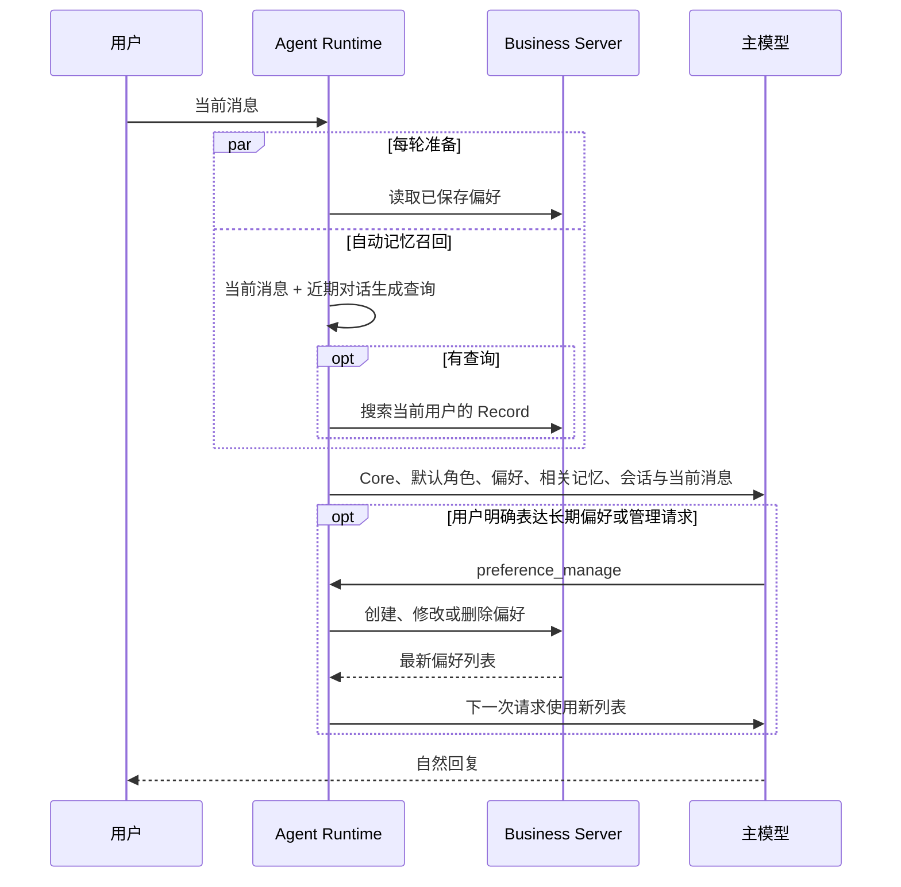

# 动态上下文实施要点

日期：2026-09-21。本文只固定会影响产品行为和数据正确性的决定；局部函数、DTO 字段名和测试写法跟随现有代码风格确定。

## 1. 三个关键节点



### 每轮准备

每次用户发来消息，在主模型首次请求前做两件互不依赖的事：读取这个用户的完整偏好列表，并进行一次自动记忆召回。

偏好读不到时，按普通对话继续，不能把“读取失败”当成“没有偏好”。记忆召回失败也按普通对话继续。用户取消请求时，应一起取消尚未完成的准备请求，不再开始模型生成。

主模型看到的顺序固定为：Core → 默认角色 → 已保存偏好 → 相关记忆。Pi 自己继续管理历史、当前消息、工具结果和会话压缩；动态数据不写成聊天消息。

```ts
async function runTurn(session, message, signal) {
  const recentTurns = readRecentTurns(session, 4);
  const [preferences, relevantRecords] = await Promise.all([
    preferenceClient.list(session.userId, signal),
    retrieveRelevantRecords({ message, recentTurns, userId: session.userId, signal }),
  ]);

  const state = { preferences, relevantRecords, currentMessage: message };
  return lane.prompt(message, undefined, createRunContext(session, state));
}

function buildSystemPrompt(core, character, state) {
  return joinNonEmpty([
    core,
    renderCharacter(character),
    renderPreferences(state.preferences),
    renderRelevantRecords(state.relevantRecords),
  ]);
}
```

`retrieveRelevantRecords` 内部是：Planner 生成查询 → 空查询直接返回空列表 → 搜索 Record → 过滤、去重、保留最多 3 条。`preference_manage` 成功后只做 `state.preferences = returnedList`；Pi 下一次模型请求会重新调用 `buildSystemPrompt`。

### 自动记忆召回

自动记忆召回每轮都会被尝试，但不代表每轮都会搜索：

1. Planner 只看当前消息和最近 2～4 轮对话，输出 0～2 条完整的语义查询。
2. `queries=[]` 时，本轮不检索。
3. 有查询时，并行调用已有 `POST /api/records/search`；仍由 Server 按当前用户隔离。
4. 结果只做确定性处理：去掉明显不相关项、按原子来源去重、按距离排序，最终最多放入 3 条。
5. 注入原始片段、发生时间和 Record ID；不在召回后让模型摘要、合并或创造新事实。

Planner 应消解已由近期对话明确的指代，例如“她又这么说了”。近期对话无法确定“她”是谁时，不得补造身份；可以生成较宽泛的查询，也可以不查询。主模型仍可按需调用现有 `record_search`、`record_get` 和 `present_media`。

第一版只保留三个简单限制：近期对话最多 4 轮、每条查询取 8 个候选、最终最多 3 条记忆。片段沿用现有检索截断，必要时给整个记忆区设置一个宽松上限。预算调优、分区 token 分配和复杂裁剪规则不在第一版建设；通过真实请求的输入量和延迟再决定是否需要。

### 偏好何时生成或更新

偏好每轮都注入；新偏好不是每轮都生成，而是由主模型结合当前用户表达判断是否调用 `preference_manage`。

| 当前表达 | 本轮行为 | 是否保存 |
| --- | --- | --- |
| “这次简短点” | 这次回答简短 | 否 |
| “以后闲聊简短点” | 当前和以后适用 | 创建 |
| “技术方案以后详细讲” | 技术场景详细 | 创建或更新带条件的条目 |
| “以后不用那么简短了” | 改变已有长期要求 | 更新 |
| “忘掉简短回复这个偏好” | 移除该长期要求 | 删除 |
| 普通聊天、历史 Record、模型推测 | 正常回答 | 否 |

代码负责确定边界：身份只能来自 Session；写入依据必须是当前用户消息中的原话；更新和删除使用实际条目 ID 与 version；所有写入由 Server 再次按用户隔离。模型只判断“这是不是明确且长期适用的偏好”，不能自己提供用户身份、Session 或条目 ID。

写入成功后，用 Server 返回的最新完整列表替换本轮快照，因此同一轮后续模型请求会使用新偏好。写入明确失败时不声称“已经记住”。写入超时则读取一次当前列表：能够确认当前状态符合目标时，如实说明已处于该状态；否则说明暂时无法确认，不在本轮自动重试。

## 2. 必要的数据与接口

`user_preferences` 使用项目既有双标识习惯：

```text
id                    integer 自增主键，仅数据库内部使用
preference_id         UUID，唯一业务 ID，对 API 和工具使用
user_id               用户归属
category              communication | scenario | lifestyle
content               偏好和必要适用条件
source_session_id     最近一次来源
source_message_id     当前用户消息的内部定位
source_quote          当前用户消息中的直接依据
version               乐观并发版本
created_at/updated_at Server 时间
```

每用户最多 20 条；一条 content 最多 120 字符；同一用户、类别和内容完全相同则复用已有条目。删除采用物理删除。更新与删除按 `user_id + preference_id + version` 校验，避免旧会话覆盖新修改。

Server 提供四个接口：

| 接口 | 用途 |
| --- | --- |
| `GET /api/preferences` | 返回当前用户完整列表，稳定排序 |
| `POST /api/preferences` | 创建偏好；完全相同则返回已有条目 |
| `PATCH /api/preferences/:id` | 使用 expectedVersion 更新 |
| `DELETE /api/preferences/:id` | 使用 expectedVersion 删除；不存在按已删除处理 |

所有响应继续使用现有 JSON envelope。偏好正文和来源原话不得进入访问日志或 SSE 事件。

当前 Memory 索引已经保存 `eventAt`；实施时把它继续透传到 SearchResult、Record Search HTTP 返回和 Agent Tool 结果，让自动召回与手动检索都能看到时间。

## 3. 工程结构

独立 `context/` 模块，但保持很小：

```text
apps/agent/src/context/
├── prepare-context.ts      每轮读取偏好并调用自动召回
├── compose-prompt.ts       纯函数：把动态数据接在 Core 后
├── preferences.ts          偏好快照和刷新
└── memory-retrieval.ts     Planner + 搜索 + 去重
```

`SessionManager` 只负责在运行保护内调用 `prepareContext`，并启动 Pi lane。`HarnessFactory` 的动态 systemPrompt 回调只调用 `composePrompt`，不发网络请求。`RunContext` 保存本轮状态；工具写入成功后更新其中的偏好快照。Server 继续保存偏好和执行用户隔离，Agent 不直连业务数据库。

默认角色先使用单个 `natural` Profile；Core 继续来自现有 Fanto Prompt。多角色选择、角色设置和示例检索后置。

## 4. 已验证的运行前提

Pi 0.85.1 的动态 systemPrompt 会在一次工具调用后的下一次模型请求重新执行，因此本轮刷新偏好可行。Pi 的 compaction 使用独立摘要路径，动态偏好和记忆不会被作为动态提示词再次注入。用户消息在工具执行前已被持久化，可保存其内部定位作为来源依据。

具体探针结果见 [验证记录](verification.md)。升级 Pi 时重跑探针。

## 5. 验收重点

- 当前明确要求能覆盖长期偏好；角色默认风格排在最后。
- 只有明确且可长期适用的用户表达才写入偏好；临时要求、推测和 Record 内容不写入。
- 自动召回可自然利用相关 Record；指代不明确不编造；旧状态不当作当前事实。
- 偏好和检索全程用户隔离；写入失败不假成功；删除后下一轮不再注入该条目。
- 自动召回失败不影响聊天；用户取消时不继续请求模型。
- 运行 Agent/Server 检查，并用真实环境测试 Planner、阈值和延迟。

实施完成后再按实际改动更新 Current Docs、模块 AGENTS 和 docs/.checkpoint。
