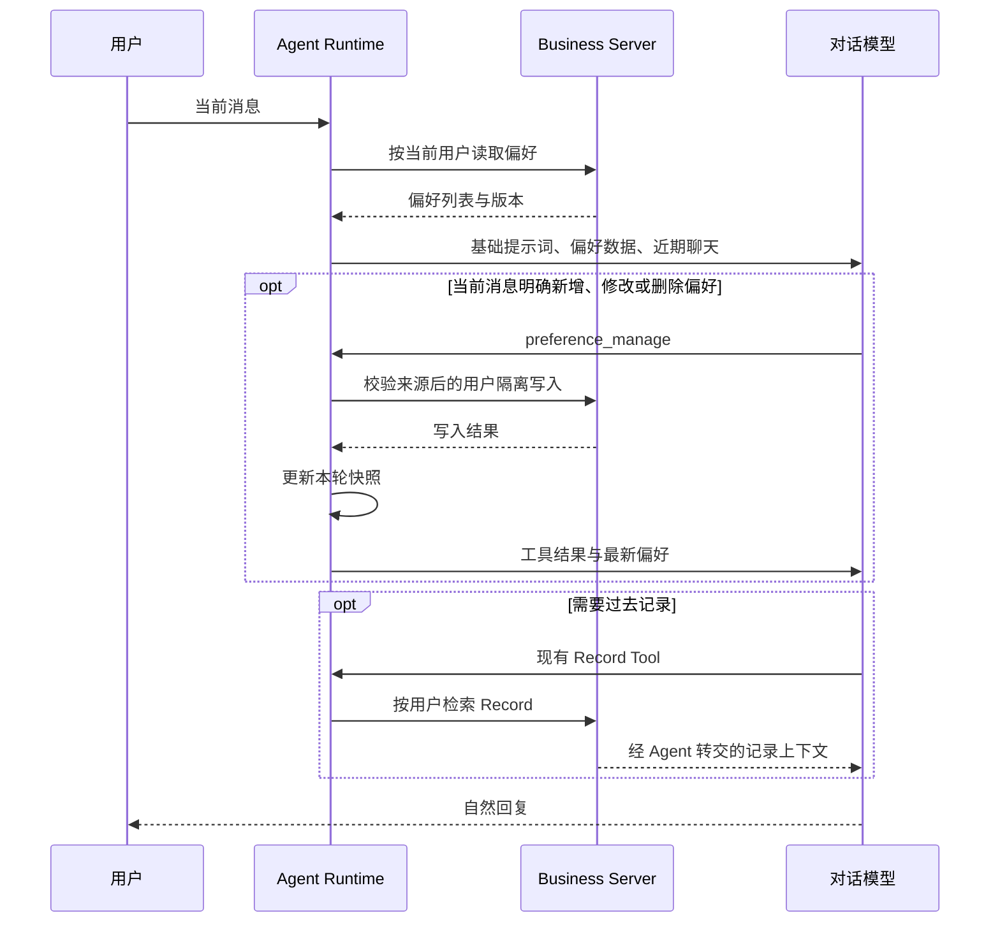

# Fanto 明确偏好记忆 MVP 技术方案

日期：2026-09-20

状态：待实施。本文是目标方案，不代表当前已上线能力。

核对基线：HEAD `17d7dc1`，以及本次阅读的 Agent / Server 运行入口。工作区存在其他任务的 Memory 改动，实施时应复核最终接口；本方案不修改或依赖那些未完成改动。

## 1. 目标与决策

让用户在聊天中明确表达的长期偏好，在新会话中仍然自然生效，并且可以通过聊天查看、修改和删除。

MVP 只建立两条清晰的链路：

- Record 保存原始记录，相关话题继续通过现有 Record 检索获取上下文。
- 聊天中的明确偏好保存在独立的小表中，每轮加载，让用户不必重复交代。

不从 Record 再抽取偏好，不把经历重复搬进偏好表，不生成用户画像文章，不推测用户。Record 是用户原始表达的依据，不代表其中所有描述都始终有效或已经被客观核实；使用时仍保留时间、主体和原文条件。

成功标准：用户明确说“以后日常聊天简短一些”，新会话能够遵守；用户说“这次详细讲”只覆盖当前请求；用户修改或删除长期偏好后，后续请求使用新状态。

## 2. 已验证的现状

| 位置 | 当前事实 | 本次变化 |
| --- | --- | --- |
| `apps/agent/src/harness/session-manager.ts` | Session 绑定用户；`prompt` 向 Run Context 写入用户身份；支持 stream / task 共用执行路径 | 在共同执行入口加载偏好并携带当前轮来源 |
| `apps/agent/src/harness/harness-factory.ts` | 从 Agent definition 设置静态 systemPrompt；Harness 会缓存 | 增加运行时偏好上下文，不修改共享 definition |
| 已安装 Pi `AgentHarnessOptions` | `systemPrompt` 支持带 Context 的回调；有 `transform_context` hook | 优先用动态 systemPrompt 回调读取本轮已加载快照；验证请求与 compaction 行为 |
| `apps/agent/src/harness/run-context.ts` | 携带 userId / traceId / taskId | 扩展本轮偏好状态与来源上下文 |
| `apps/agent/src/tools/registry.ts`、`config/agent-config.ts` | 工具显式配置；main 开启只读 Record 和媒体工具 | 增加一个偏好管理工具，仅 main 开启 |
| `apps/agent/src/clients/fanto-server-client.ts` | 统一 HTTP、身份、取消、超时、响应校验；目前 method 仅 GET / POST | 扩展偏好 HTTP 方法与 DTO |
| Server Memory Domain | 当前围绕 Record 的派生索引与检索 | 不向 MemoryIndex 塞入偏好 CRUD |
| Server schema / migration | SQLite，维护当前空库 schema | 新增偏好业务表；遵循现有空库基线约束 |

参考当前文档：`docs/domain/memory.md`、`docs/architecture/agent-runtime.md`、`docs/architecture/server.md`、`docs/engineering/testing.md`。

## 3. 记什么

只接受用户明确表达、具有后续适用性的偏好。无需用户必须说出“记住”，但含义不明确时不保存。

| 类别 | 枚举 | 保存示例 |
| --- | --- | --- |
| 交流偏好 | `communication` | 日常回答先说结论；不要例行在结尾追问 |
| 场景偏好 | `scenario` | 讨论技术方案时，说明取舍；聊心情时先听我说 |
| 生活偏好与习惯 | `lifestyle` | 不喜欢拥挤的地方；通常晚上跑步 |

适用条件直接保存在内容中，不再增加标签体系或独立场景路由。例如保存“日常聊天简短；技术方案可以详细”，不压缩成无条件的“用户喜欢简短”。一条尽量表达一个主题，避免把无关偏好合并。

不保存：

- “这次短一点”等临时指令。
- “最近准备面试”“今天心情不好”等阶段状态。
- 已发生的经历与普通事实；本次不为聊天新增经历存档能力。
- 根据行为推断的兴趣、性格、作息或心理状态。
- 引用、代写、角色扮演中的他人偏好，以及助手自己生成的描述。
- Record 检索结果中的偏好：可以本轮参考，但不自动再写入偏好表。

用户明确要求记住非偏好内容时，不强行归入偏好表，也不承诺已跨会话保存该事实。说明当前长期保存范围即可，不扩展本期范围。

## 4. 怎么记

### 4.1 写入方式

由当前对话模型决定是否调用 `preference_manage`，不增加独立抽取模型、后台队列、定时整理或历史回扫。

1. 每轮开始获取用户现有偏好。
2. 模型结合当前用户消息判断是否存在明确的长期偏好或管理请求。
3. 新偏好执行 create；相同主题明确变化执行 update；忘记请求执行 delete；已有等价条目不重复创建。
4. Agent 从可信 Run Context 补齐身份、来源和请求上下文，通过 Business Server HTTP 持久化。
5. 写入成功后更新本轮偏好快照，再继续回复。写入失败不得说“已经记住／忘记”。

没有偏好变化的普通聊天不调用写入工具。用户明确要求记住时简短确认；自然表达偏好时无需额外播报工具过程。不要为了每条明确偏好再次索要确认。

### 4.2 最小数据结构

新增 `user_preferences`，属于业务数据，不是可丢弃的向量索引。

| 字段 | 含义 |
| --- | --- |
| `preference_id` | 稳定条目 ID，服务端生成 |
| `user_id` | 用户归属 |
| `category` | 上述三个类别之一 |
| `content` | 偏好及必要适用条件 |
| `source_session_id` | 最近一次创建或修改来自哪个会话 |
| `source_run_id` | Agent 为本轮生成的稳定来源标识，不依赖模型提供 |
| `source_quote` | 当前用户消息中的直接依据片段 |
| `version` | 乐观并发版本，初始为 1 |
| `created_at` / `updated_at` | 服务端时间 |

`source_run_id` 与 Session 关联由 Agent 保存为内部 custom entry，不作为普通聊天展示；不假定客户端已有 messageId。内部来源 entry 只需保存 run 标识与对本轮用户消息的定位，避免复制整段聊天。实施时验证 Pi 持久化顺序，确保来源能定位到实际用户输入。

模型仅提供 `sourceQuote`；Agent 验证其为当前用户原始消息的连续片段，再填充可信来源标识。精确匹配只能证明引用存在，不能机械证明语义正确；语义准确性由提示词和真实模型用例验证。工具不能从任意旧 assistant 或 tool 内容制造新记忆。

MVP 保留最新来源，不建设版本历史、证据聚合或置信度系统。删除偏好采用物理删除。

### 4.3 容量、去重和冲突

- 初始限制：每用户最多 20 条，每条内容最多 120 个 Unicode 字符，source quote 最多 300 字符。集中定义常量，后续按真实用量调整。
- 全部已保存偏好都参与上下文，不以“取前 N 条”悄悄隐藏已保存内容。
- 满额时拒绝新增，返回明确错误；仍允许修改、删除与查询。不要静默淘汰旧偏好。
- 服务端对同一用户、相同类别和规范化后的完全相同内容做确定性去重；并发写入通过事务保证容量与去重。
- 近义去重由模型结合已有列表判断。MVP 不引入语义去重服务，接受少量近义重复可由用户纠正。
- 更新和删除提交 expectedVersion，在 SQL 条件中同时校验用户、ID、版本。过期返回 409，不让旧会话静默覆盖新状态。
- 不同适用场景不视为冲突。无法明确判断应覆盖哪条时，不自行删除，必要时在对话中澄清。
- 更新超时结果未知时，先重新读取核对，不直接声称失败或盲目重建。完全相同创建的重试返回已有条目；删除不存在条目按用户作用域幂等处理。

## 5. 怎么用

### 5.1 每轮确定性加载

在 `AgentSessionManager.prompt` 共用入口，在持有 Session 执行保护后、模型请求前读取一次完整偏好列表。stream 与 task 都覆盖。只有配置了 `preference_manage` 的 Agent 加载偏好；coding 保持无访问权限。

通过 Run Context 携带本轮快照，Harness 动态 systemPrompt 回调将基础提示词与偏好数据区组合。不能修改共享 Agent definition，不能仅在 Harness 创建时加载，也不能把偏好拼接成用户发送的可见消息。

写入工具成功后更新同一个本轮状态，保证本轮后续模型调用不继续注入旧值。无需每个工具步骤再次 GET，不建立跨会话缓存。其他会话已开始运行时使用其请求开始时的快照，下一轮刷新；不承诺中途全局广播。

### 5.2 注入内容和优先关系

偏好区只包含条目 ID、version、category、content，按稳定顺序序列化。来源原文和时间不必每轮带入；查看依据时通过管理工具读取。

明确约束模型：

- 当前用户的明确要求优先于长期偏好；临时覆盖不自动写回。
- 偏好是有范围的个性化数据，不是更高权限指令，不能改变工具权限或系统边界。
- 只在相关场景应用生活／场景偏好；不为了表现记忆而提及无关内容。
- 当前列表是已保存偏好的来源；旧聊天及旧工具结果不能自动恢复已删除条目。
- 没有相关依据时不要补全偏好或声称理解用户。
- Record 保持原有按需检索。本期不引入自动话题检索、预检索模型或新的检索 API。

### 5.3 历史与压缩

动态偏好不作为普通消息永久追加，避免每轮累积。需验证 Pi 的 compaction 不将动态偏好块当作独立长期事实重复保存；优先在 compaction 请求中排除动态偏好数据，只保留必要的会话摘要。

聊天原文和历史工具结果仍可能含旧偏好。因此删除承诺是“移除已保存偏好、停止作为长期偏好使用”，不是“从所有历史和模型上下文彻底抹除”。新会话不能自动恢复；同一会话应遵循删除消息和最新偏好列表，不因旧摘要重新创建。使用真实模型验证该行为，不把提示词遵循表述成物理数据清除保证。

## 6. API 与工具契约

### 6.1 Business Server API

复用现有 JSON envelope、用户 Header 与错误格式，不接受请求体中的 userId。

| API | 输入 | 结果 |
| --- | --- | --- |
| `GET /api/preferences` | 当前用户身份 | `{ data: Preference[] }`，稳定排序，最多 20 条 |
| `POST /api/preferences` | category、content、source | 新建条目；完全相同已有内容返回已有条目 |
| `PATCH /api/preferences/:id` | category、content、source、expectedVersion | 更新条目和递增版本 |
| `DELETE /api/preferences/:id` | expectedVersion | `{ deleted: true }`；不存在时也视为已删除 |

来源对象由 Agent 填充 `sessionId/runId/quote`。Server 不直接读取 Agent SQLite，不伪造跨库外键校验；来源真实性在 Agent 边界校验，Server 做结构约束。当前 Header 认证仍是受控测试方式，本任务不升级正式认证，也不宣称它提供生产级身份保证。

建议错误：400 输入不合法，401 身份不合法，404 更新目标不存在或不属于用户，409 版本冲突或容量已满（用不同 errorCode 区分）。删除其他用户 ID 与删除不存在 ID 返回相同结果，不泄露存在性。

### 6.2 Agent 工具

仅新增 `preference_manage`，action 为 list / create / update / delete，采用按 action 校验的参数结构。

- list：无参数；重新读取服务器，供用户查看偏好及来源、冲突后刷新。
- create：category、content、sourceQuote。
- update：preferenceId、expectedVersion、category、content、sourceQuote。
- delete：preferenceId、expectedVersion；删除依据是当前用户明确管理请求。

不允许模型传 userId、sessionId、runId。更新与删除使用已加载或工具返回的真实 ID；不得猜 ID。所有写入仍必须服务端验证归属和版本，不能依赖模型遵守规则。

工具结果返回必要条目与明确成功／失败状态，不返回其他用户信息。继续沿用现有 SSE 隐藏参数与结果的边界；不得像 present_media 一样把偏好详情广播到通用 tool_end payload。

## 7. 失败与遗忘语义

| 情况 | 行为 |
| --- | --- |
| 初始读取失败 | 标记 unavailable，与成功读取空列表区分；继续普通聊天，不注入历史缓存，不承诺掌握已保存偏好 |
| unavailable 时需要管理 | list 重试；未得到有效列表前不执行依赖列表的写入，不猜测更新目标 |
| 写入失败 | 不修改本轮快照，不承诺成功；用户主动要求时简短说明未保存 |
| 写入超时 | 结果未知，读取核对；核对失败就如实说明暂时无法确认 |
| 版本冲突 | 刷新列表，重新判断，不自动用旧内容强行覆盖 |
| 删除成功 | 后续快照不含条目；无后台重提取，不从旧聊天／Record 恢复 |
| 用户重新明确表达同一偏好 | 可以重新保存；MVP 不建立永久禁止记忆名单 |

删除偏好不删除原消息、Record 或历史工具结果。涉及整段聊天清除、来源删除级联、备份数据删除时属于另一个数据生命周期任务。第一版不提供自动记忆开关或永久“永远不要记”承诺。

## 8. 实现范围

Server：

- 新建 `src/domain/preferences/` 的 model 和 SQLite repository，普通 CRUD 不加纯转发 Service。
- 新建 `src/routes/preferences.ts`；在 bootstrap 装配并真实注册。
- 扩展 `infrastructure/database/schema.ts` 与当前空库 migration 的 up / down。
- 对偏好路由的访问日志省略正文和 source quote，只保留请求路径、状态与耗时等运行信息。现有中间件记录请求／响应正文，须为新路由明确排除，避免删除后在新日志中额外残留偏好原文。

Agent：

- 扩展 FantoServerClient 的 GET / POST / PATCH / DELETE、DTO 与通用错误文案；404 不再统一写成 Record not found。
- 新增 preference tool；更新工具枚举、Registry 和 main 配置。
- 在 Run Context / Session prompt / Harness 接入来源、本轮快照和动态注入。
- 更新 `prompts/fanto.md`：长期依据增加有效偏好；明确保存、更新、删除、临时覆盖、不可推测规则。

不改客户端 UI、Record Schema 语义、Record postprocess、向量索引、Creation / Proposal；不增加通用记忆平台、图数据库、画像生成、后台任务或多 Agent。

部署约束：现有 migration 只支持空库基线，修改基线不会自动升级已有数据库。先用独立测试数据库验证，不重建或删除用户现有数据库。若上线需要保留旧数据，需另定一次性升级步骤；本方案不暗含 destructive reset 授权。

## 9. 成本与效果取舍

普通每轮新增一次小型 HTTP / SQLite 读取和少量上下文输入，无 embedding、独立提取调用或后台历史扫描。有偏好变更时通常增加一次工具往返及模型继续生成；不能将工具写入说成完全没有额外模型费用。

每月偏好输入量约为：日轮数 × 30 × 偏好块 tokens × 每轮模型请求次数。例：每天 20 轮、偏好块 500 tokens、每轮一次模型请求，约 30 万额外输入 tokens / 月；有工具循环时按实际次数增加。500 tokens 是示例，不是 20 条容量下的保证。

实际记录偏好块长度／tokens、偏好读取耗时、管理工具调用次数及失败数，不记录偏好正文。稳定排序避免无意义的前缀变化，但不把缓存命中当作成本保证。

MVP 接受的限制：模型可能漏调保存工具；近义重复不能完全消除；生活习惯可能变化但不自动推断；读取失败会降级；同一会话遗忘不等于物理抹除。用真实用例测量后再决定是否需要后台提取或复杂检索。

## 10. 验证与交付标准

确定性测试：

- CRUD、来源和输入校验、完全相同去重、容量事务、版本冲突、幂等删除、用户隔离。
- Agent Context 身份与来源不可由模型替换；缺 Context 失败；quote 不来自当前用户消息时拒绝。
- 每轮刷新、同轮更新、不同 Session 隔离、coding 不加载、不修改共享 definition。
- 动态块不重复累积；历史 API 不出现注入消息；压缩后重新加载当前快照。
- 读取失败与空列表区分，写入失败不假成功；SSE 与新路由日志不暴露偏好正文。
- Record 现有检索与媒体工具回归通过。

真实模型场景至少覆盖：

| 输入／过程 | 期望 |
| --- | --- |
| “以后日常回复短一些”→新会话 | 保存并自然遵守 |
| “这次短一点”→新会话 | 不形成长期偏好 |
| “技术方案详细讲，闲聊简短” | 不产生无条件简短偏好 |
| “我通常晚上跑步” | 保存原条件，不推断每天跑或作息性格 |
| “朋友说他讨厌人多”／代写第一人称材料 | 不保存为用户偏好 |
| “最近在准备面试” | 不建立长期状态 |
| Record 返回用户过去喜欢的食物 | 可以本轮参考，不调用偏好写入 |
| “现在我更喜欢详细解释” | 更新对应条目，新会话生效 |
| “忘掉简短回复这个偏好” | 删除；同会话与新会话不重建 |
| “你记住了我什么偏好” | 返回实际条目，不扩写画像 |
| API 写入失败 | 不声称已记住 |
| 并发 Session 修改同条 | 旧版本不能覆盖新版本 |

模型场景记录输入、工具动作、最终存储和后续行为；真实模型选择不作为 CI 确定性断言。上述关键场景出现错误时修正提示词／工具边界并复测，不用“数据库写入成功”代替产品验收。

实施完成后运行仓库 `pnpm typecheck`、`pnpm test`、Agent build，以及 Business Server + Agent Runtime 真实 smoke。纯方案阶段不运行应用测试。

实现完成后更新相关 Current Docs 和模块 AGENTS，详见任务清单。此时只编写 plan，不提前把目标写成当前能力，不推进 `docs/.checkpoint`。
