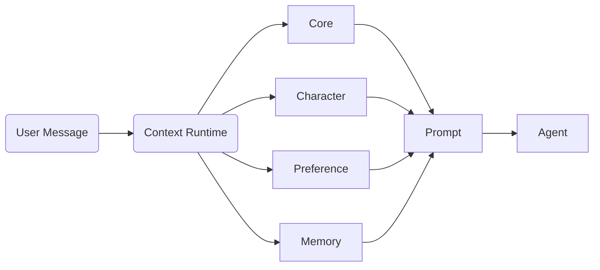

# Fanto Context Runtime

日期：2026-09-21
状态：设计阶段

## 1. 定位

Fanto 的核心能力不是 Agent Loop，而是 Context Runtime。

Agent Loop 负责模型执行、Tool 调用和消息循环；Context Runtime 负责在模型执行前构建用户上下文。

目标：让模型理解：

- Fanto 应该如何表达（Core）
- 当前表达风格（Character）
- 用户长期偏好（User Preference）
- 与当前问题相关的历史事实（Relevant Memory）

不负责 Agent 推理、Tool 执行和业务数据存储。

---

## 2. 当前项目约束

当前已有：

- `apps/agent/prompts/fanto.md`：Fanto 核心 System Prompt
- pi-agent Agent Runtime
- Server Record Domain
- Server Memory Domain

Memory 已存在：

```
apps/server/src/domain/memory

memory-service.ts
memory-index.ts
sqlite-vec-memory-index.ts
record-memory.ts
```

因此：

- 不新增 memory server API
- 不重复建设 Memory Search
- Context Runtime 只消费已有能力

---

## 3. Context Provider

所有上下文来源统一抽象：

```ts
interface ContextProvider {
  name: string
  build(input: ContextInput): Promise<ContextFragment>
}
```

输入：

```ts
interface ContextInput {
 userId:string
 sessionId:string
 message:string
 recentMessages:Message[]
}
```

首期 Provider：

```
CoreProvider
CharacterProvider
PreferenceProvider
MemoryProvider
```

未来扩展：

```
HabitProvider
GoalProvider
RelationshipProvider
```

不修改 Agent Loop。

---

## 4. Context Build

流程：



伪代码：

```ts
async function buildContext(input){
 const fragments = await Promise.all([
   coreProvider.build(input),
   characterProvider.build(input),
   preferenceProvider.build(input),
   memoryProvider.build(input)
 ])

 return composePrompt(fragments)
}
```

---

## 5. Dynamic System Prompt

保持现有 Agent 配置方式，不修改 `agents.yaml` 增加额外 context 配置。

当前配置：

```
agents.yaml
    |
    v
systemPromptFile: prompts/fanto.md
```

Context Runtime 直接处理 `systemPromptFile` 对应的 Markdown 文件。

流程：

```
读取 fanto.md

        |
        v

替换动态插槽

        |
        v

生成本次 Agent Run 的 System Prompt
```

示例：

```md
# Fanto

现有固定 Prompt 内容...

## Character

{{character}}

## User Preference

{{user_preferences}}

## Relevant Memory

{{relevant_memory}}
```

Core 不拆分，直接复用现有 Prompt。

Context Build 只在 Agent Run 开始前执行一次，不参与 Agent Loop。

---

## 5.1 Agent Runtime Integration

执行流程：

```
User Message

    |
    v

Context Builder

    |
    v

生成 System Prompt

    |
    v

Pi Agent Loop

    |
    +-- Model
    +-- Tool
    +-- Model

```

Context Runtime 不处理：

- tool call
- tool result
- agent iteration
- system prompt 动态刷新

---

## 6. Character Provider

当前阶段不设计角色数据库。

只保留 Provider。

默认：

```
natural

自然、直接、有判断力。
避免客服腔和模板化表达。
```

未来需要角色系统时再扩展。

---

## 7. Preference Provider

Preference 是长期用户偏好，不属于 Memory。

Server 新增独立 domain：

```
apps/server/src/domain/preferences

model.ts
service.ts
repository.ts
sqlite-repository.ts
```

数据库：

```
user_preferences

id
preference_id
user_id
category
content
source_session_id
source_message_id
source_quote
version
created_at
updated_at
```

category：

```
communication
scenario
lifestyle
```

生成方式：

由主模型 Agent Loop 判断，通过 Tool 写入。

流程：

```
User Message
 -> Agent
 -> preference_manage Tool
 -> Preference Service
 -> Database
```

不增加独立抽取模型。

---

## 8. Memory Provider

Memory 只作为上下文证据。

不新增 Memory API，直接复用 Server Memory Domain。

流程：


### Query Rewrite

用户表达通常不是检索语言。

例如：

用户：

```
那个方案后来怎么样了？
```

结合最近上下文：

```
讨论装修方案
```

生成查询：

```
装修方案最终决定
装修预算讨论
```

再执行向量搜索。

---

## 9. Memory 注入格式

直接告诉模型真实 recordId。

不增加 Runtime 映射。

原因：Agent 已经拥有 `record_get` Tool。

示例：

```
[Relevant Memory]

Memory 1:

recordId: 9da8...
时间: 2026-09-18
内容:
用户之前讨论 Agent Harness 设计，希望高扩展性和易维护。

如果需要完整上下文，可以调用 record_get。
```

模型需要详情时直接：

```json
{
 "recordId":"9da8..."
}
```

不注入：

- mediaId
- embedding score
- 数据库字段
- 中间映射 ID

---

## 10. 工程结构

Agent：

```
apps/agent/src/context/

builder.ts
composer.ts
types.ts

providers/
 core.ts
 character.ts
 preference.ts
 memory.ts
```

Server：

```
domain/preferences
```

Memory 继续使用：

```
domain/memory
```

---

## 11. 第一阶段实施

Phase 1：Context Runtime 基础

- Context Builder
- Context Composer
- Core Provider
- Character Provider
- Mock Preference Provider
- Mock Memory Provider

验证最终 System Prompt。

Phase 2：Preference

- preferences domain
- 数据库迁移
- preference_manage Tool
- Preference Provider

Phase 3：Memory Provider

- Query Rewrite Model
- 调用已有 Memory Service
- Record 相关上下文注入

---

## 核心原则

1. Agent Loop 是执行能力，不是 Fanto 差异化能力。
2. Context Runtime 是 Fanto 理解用户的核心。
3. 所有长期用户理解能力最终都应该成为 Context Provider。
4. 不重复建设已有 Server Memory 能力。
5. 不引入没有业务价值的中间抽象层。
