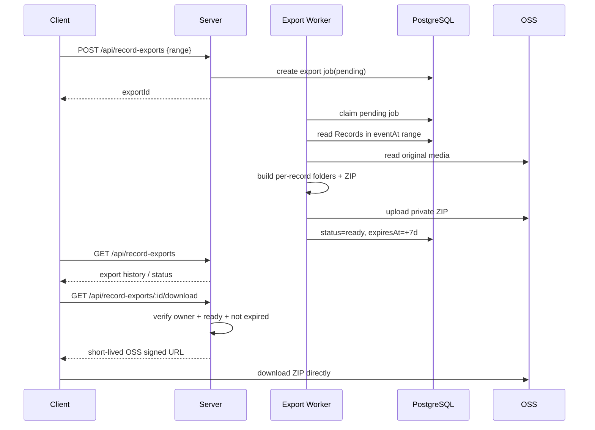

# Fanto 设置与记录导出方案

> 日期：2026-09-22  
> 状态：产品与技术方案  
> 目标：完善 Fanto iOS / H5 设置体系，并明确个人资料、Fanto 性格、语言偏好、通知、客户端本地偏好、Agent Context 注入与记录导出的产品和技术边界。  
> 非目标：本方案不重新设计认证体系；账号与登录沿用 `2026-09-19-user-auth-identity.md`。不在本方案中扩展 Record / Memory / Preference 的用户控制开关。

---

## 1. 产品结构

设置页保持 5 个一级区域，并将“退出登录”作为最外层底部独立操作：

```text
设置
├─ 个人
│  ├─ 个人资料
│  │  ├─ 头像
│  │  ├─ 昵称
│  │  └─ 生日
│  └─ 账号与登录
│     ├─ 手机号
│     ├─ Google
│     ├─ Apple
│     └─ 邮箱
├─ Fanto
│  └─ 性格
│     ├─ 安静
│     └─ 活泼
├─ 通知
│  ├─ 允许通知
│  └─ 安静时段
├─ 通用
│  ├─ 语言
│  ├─ 外观
│  └─ 强调色
├─ 数据与隐私
│  └─ 导出我的记录
└─ 退出登录
```

原则：

- 不把设置做成 AI 控制台。
- 不提供 Record、Memory、Preference 等内部能力开关。
- Fanto 设置只控制用户能感知的角色表达。
- 通用设置优先作为设备级偏好。
- 账号身份、Fanto 性格、通知、个人资料属于跨设备产品数据。

---

## 2. 个人资料

### 2.1 字段

第一版只保留：

```text
头像
昵称
生日
```

不包含性别、地区、职业、公司、兴趣、个性签名等。

原因：

- 昵称、生日是相对稳定、由用户主动维护的账户事实。
- 头像属于展示身份。
- 其他长期事实更适合来自 Record / Memory，而不是建立第二套手工画像。

### 2.2 Agent 使用范围

真正需要进入 Agent Context 的只有：

```text
displayName
birthday
```

头像、手机号、邮箱、登录 Provider 不进入 Prompt。

昵称只用于自然称呼，不能导致 Fanto 高频叫用户名字。
生日只在相关场景使用，不能为了表现“记得用户”而主动频繁提及。

---

## 3. Fanto 性格

第一版只有：

```text
quiet   安静
lively  活泼
```

默认：

```text
quiet
```

语义：

### quiet

- 平静、克制；
- 回答更简洁自然；
- 不为了制造陪伴感过度回应；
- 不频繁开玩笑。

### lively

- 更有表达欲；
- 语气更轻松；
- 可适当接话、开玩笑、表现好奇；
- 不浮夸、不表演式活泼、不滥用网络梗。

关键约束：

> 性格只影响表达风格，不改变真实性、认识论、事实标准、安全边界、工具使用规则和用户自主性。

因此不维护两套 Core Prompt。

---

## 4. Prompt 与语言策略

### 4.1 唯一 Prompt 使用中文

Fanto 只维护一套 Core / Operational Prompt，继续使用中文。

理由：

1. 当前产品主要人格、关系边界、表达细节均已用中文形成稳定语义。
2. 中文更适合准确表达 Fanto 的语气和角色细节，避免翻译导致人格漂移。
3. 多语言 Prompt 会造成长期维护分叉，任何原则变化都需要同步多份文件。
4. 当前模型能够理解中文系统提示并以其他语言自然输出。

不新增：

```text
core.zh.md
core.en.md
operational.zh.md
operational.en.md
```

### 4.2 Core Prompt 改为语言无关约束

当前类似：

```text
用自然、像熟人聊天的中文交流。
```

应逐步收敛为：

```text
使用用户当前首选语言自然交流。
```

具体首选语言由动态上下文提供。

---

## 5. UserContextProvider

### 5.1 目标

新增一个统一的 `UserContextProvider`，负责用户显式资料和当前语言。

不拆成过多 Provider，避免动态上下文碎片化。

建议输出：

```text
## User Context

昵称：Robin
生日：1995-08-12
首选语言：简体中文
```

对应 slot：

```text
{{user_context}}
```

### 5.2 Context Runtime 目标结构

```text
Run
 ↓
Context Build
 ├─ CharacterProvider
 ├─ UserContextProvider
 ├─ CurrentTimeProvider
 ├─ PreferenceProvider
 └─ MemoryProvider
 ↓
System Prompt
 ↓
Agent Loop
```

继续保持：

- Context Build 只在 Agent Loop 之前执行一次；
- 不在 Loop 内重复 build；
- 不改变现有 Agent Harness 主流程。

### 5.3 UserContextProvider 输入来源

```text
Profile:
- displayName
- birthday

Run metadata:
- resolvedLocale
```

UserContextProvider 可以通过 Business Server 获取 Profile，但语言不要求服务端保存，而由每次 Agent Run 的客户端 metadata 传入最终解析后的 locale。

---

## 6. 语言偏好

### 6.1 产品选项

```text
跟随系统
简体中文
English
```

### 6.2 Source of Truth

语言模式是设备偏好，不是账户偏好：

```text
languageMode = system | zh-CN | en
```

客户端解析：

```text
languageMode = system
  -> 读取当前设备 / 浏览器 locale
  -> resolvedLocale = zh-CN / en / ...
```

Agent 只接收：

```text
resolvedLocale
```

不接收客户端生成的 Prompt 文本。

### 6.3 Run 传递

每次 Agent Run metadata 增加：

```json
{
  "locale": "zh-CN"
}
```

链路：

```text
Client local languageMode
        ↓
resolve locale
        ↓
Agent request metadata
        ↓
Run Context
        ↓
UserContextProvider
        ↓
首选语言
```

用户当前消息明确切换语言时，当前消息优先。

---

## 7. Source of Truth

### 7.1 Server Source of Truth

以下数据必须跨设备一致，服务端为唯一事实源：

| 数据 | Source of Truth | 说明 |
| --- | --- | --- |
| 昵称 | Server | Profile |
| 生日 | Server | Profile |
| 头像 | Server + OSS | Profile 中保存稳定 media/object 引用 |
| 登录方式 | Server | Identity |
| Fanto 性格 | Server | Fanto Settings |
| 通知总开关 | Server | Notification Settings |
| 安静时段 | Server | Notification Settings |
| Record | Server | 现有 Records |
| 导出任务状态 | Server | Data Export Job |

### 7.2 Client Source of Truth

以下属于设备级体验，不需要跨设备同步：

| 数据 | Source of Truth |
| --- | --- |
| 语言模式 | Client local |
| 外观 Light / Dark / System | Client local |
| 强调色 | Client local |

iOS：

```text
UserDefaults
- app.languageMode
- app.appearance
- app.accentColor
```

H5：

```text
localStorage
- fanto.languageMode
- fanto.appearance
- fanto.accentColor
```

### 7.3 OS Source of Truth

系统通知权限：

```text
iOS / Android / Browser OS permission
```

它与 Fanto 自己的通知总开关不是同一个状态。

---

## 8. Server 领域建议

当前 Server 没有正式 Profile / Settings / Export 领域，需要补齐。

建议保持简单，不引入通用 Key-Value Settings 框架。

### 8.1 User Profile

```text
user_profiles

user_id
display_name
birthday
avatar_media_id
created_at
updated_at
```

也可以在正式 User 模型落地时合并到 users；执行阶段根据认证方案最终 schema 决定，不要求为了 Profile 单独建表。

### 8.2 Fanto Settings

```text
fanto_settings

user_id
personality        quiet | lively
created_at
updated_at
```

第一版不要提前增加未上线的 AI 能力开关。

### 8.3 Notification Settings

```text
notification_settings

user_id
enabled
quiet_hours_enabled
quiet_start
quiet_end
created_at
updated_at
```

时间只表示用户本地时钟语义。真正发送时必须结合用户当前可用时区 / device context 做解析。

### 8.4 API 建议

```text
GET   /api/users/me/profile
PATCH /api/users/me/profile

GET   /api/users/me/fanto-settings
PATCH /api/users/me/fanto-settings

GET   /api/users/me/notification-settings
PATCH /api/users/me/notification-settings
```

账号与登录 API 沿用认证方案，不在这里重复。

---

## 9. Agent 模块缺口

当前动态 Context 只有：

```text
Character
Current Time
User Preferences
Relevant Memory
```

需要增加：

```text
User Context
```

### 9.1 CharacterProvider

当前固定 Character 文本改为：

```text
读取当前 userId 对应 Fanto Settings
→ personality
→ quiet / lively Character fragment
```

如果 Server 请求失败：

```text
fallback = quiet
```

保证设置读取失败不会阻塞 Agent Run。

### 9.2 UserContextProvider

职责：

1. 读取 Profile；
2. 读取 Run metadata 中的 locale；
3. 生成极简 User Context；
4. 不读取登录 Identity；
5. 不把头像 URL、手机号、邮箱等身份信息注入模型。

### 9.3 FantoServerClient

补充只读能力：

```text
getUserProfile
getFantoSettings
```

不需要给 LLM 暴露 Tool。

这是 Context Runtime 的后台能力，不是 Agent Tool。

---

## 10. H5 / iOS 产品交互

### 10.1 入口

iOS：

- 第三个设置 Tab 或当前最终产品导航约定中的设置入口；
- 设置页为标准 NavigationStack。

H5：

- 当前已经实现第三个“设置”Tab；
- Desktop sidebar、Mobile bottom navigation 保持一致。

### 10.2 页面

个人资料：

```text
头像
昵称
生日
```

账号与登录：

- 展示已绑定：手机号 / Google / Apple / 邮箱；
- 未绑定项显示“绑定”；
- 已绑定可进入详情或解绑；
- 至少保留一种登录方式。

Fanto：

```text
性格
○ 安静
○ 活泼
```

通知：

```text
允许通知       ON/OFF
安静时段       ON/OFF
开始           23:00
结束           08:00
```

通用：

```text
语言
外观
强调色
```

退出登录：

- 独立放在设置首页最底部；
- 不放入“数据与隐私”。

---

# 11. 记录导出

## 11.1 产品范围

第一版“导出我的数据”明确收敛为：

> 导出我的记录

只导出 Record，不导出：

- Profile；
- Preferences；
- Creations；
- Conversation；
- Agent Tool Calls；
- Memory Index；
- 向量数据；
- System Prompt；
- 内部日志。

### 11.2 用户选择导出范围

用户进入：

```text
设置
→ 数据与隐私
→ 导出我的记录
```

选择时间范围：

```text
全部记录
最近 30 天
最近 90 天
自定义时间范围
```

最终服务端保存明确的：

```text
start_event_at
end_event_at
```

导出范围按 Record 的 `eventAt`，而不是 createdAt。

---

## 12. ZIP 结构

最终只生成一个 ZIP。

建议命名：

```text
fanto-records-2026-09-22.zip
```

解压后：

```text
fanto-records/
├── 2026-09-01_20-30-00/
│   ├── record.md
│   ├── photo-1.jpg
│   ├── photo-2.webp
│   └── audio-1.m4a
├── 2026-09-03_09-18-22/
│   ├── record.md
│   └── photo-1.jpg
└── ...
```

每个 Record 一个文件夹。

### 12.1 文件夹名

以 Record 的事件时间命名：

```text
YYYY-MM-DD_HH-mm-ss
```

如果多个 Record 的 eventAt 完全相同，为避免目录冲突：

```text
YYYY-MM-DD_HH-mm-ss_<recordId短前缀>
```

### 12.2 record.md

包含：

```markdown
# 记录

时间：2026-09-01 20:30:00

用户原始文本……
```

如果 Record 没有文本，只保留时间和附件即可。

第一版不要求把图片理解描述、音频转写写入导出正文；核心目标是导出用户原始 Record 和原始附件。

### 12.3 原始附件

导出：

- 原始图片文件；
- 原始音频文件；
- 后续 Record 支持的其他原始附件。

不能只导出签名 URL。

---

## 13. 异步导出链路

导出必须是异步任务。



Server 不代理大文件下载流量。

---

## 14. Export Job 模型

```text
record_exports

export_id
user_id
status              pending | processing | ready | failed | expired
start_event_at       nullable
end_event_at         nullable
object_key           nullable
file_size            nullable
record_count         nullable
created_at
completed_at         nullable
expires_at           nullable
error_code           nullable
```

“全部记录”可以使用：

```text
start_event_at = null
end_event_at = null
```

Job 必须 user-scoped。

---

## 15. Export API

建议：

```text
POST /api/record-exports
GET  /api/record-exports
GET  /api/record-exports/:exportId
GET  /api/record-exports/:exportId/download
```

创建：

```json
{
  "range": {
    "startEventAt": "2026-01-01T00:00:00+08:00",
    "endEventAt": "2026-09-22T23:59:59+08:00"
  }
}
```

全部记录时 range 可以为空。

下载接口只返回短期 OSS Signed URL，不返回 ZIP 二进制。

---

## 16. 导出完成提示

导出完成后：

1. App 内导出列表状态自动变为“可下载”；
2. 如果用户允许通知，可发送 Push：
   - “你的 Fanto 记录已经准备好了，可以下载。”
3. Push 失败或关闭不影响任务本身。

导出状态以 Server Job 为事实源。

---

## 17. 移动端导出页

页面顶部：

```text
导出我的记录

选择导出范围
○ 全部记录
○ 最近30天
○ 最近90天
○ 自定义

[开始导出]
```

页面下方固定展示“导出记录”：

```text
导出记录

2026-09-22
最近90天
128 条记录 · 86 MB
已完成
[下载]

2026-09-10
全部记录
已过期
```

状态：

```text
准备中
生成中
已完成
失败
已过期
```

完成项可点击下载。

下载流量：

```text
Client
→ 请求短期签名 URL
→ 直接从 OSS 下载 ZIP
```

业务 Server 不承载文件流量。

---

## 18. 7 天留存规则

导出 ZIP 和导出记录都只保留 7 天。

导出 ready 时：

```text
expires_at = completed_at + 7 days
```

到期后后台清理：

```text
找到 expires_at <= now 的 ready / failed export
        ↓
如存在 object_key
        ↓
删除 OSS ZIP
        ↓
删除 record_exports 行
```

用户导出历史因此只展示最近 7 天内仍存在的任务。

不是“标记过期永久保留”，而是：

> 7 天后同时删除导出任务记录和 OSS 文件。

清理任务必须幂等：

- OSS 文件已经不存在时仍可继续删 DB；
- DB 删除失败时下次可以继续处理；
- 不影响原始 Record / Media。

---

## 19. Worker 实现建议

当前 Server 的 Record postprocess queue 是进程内机制，不适合作为长期可靠导出任务的最终实现。

但 MVP 可以分阶段：

### Phase 1

单实例 Server 内部周期 Worker：

```text
record_exports table = durable queue
Server interval worker = executor
```

关键点：

- Job 本身持久化；
- Server 重启后 pending / processing 超时任务可重新拾取；
- 不依赖纯内存 queue。

### Phase 2

用户量扩大后再迁移：

```text
独立 Worker / Queue
```

不要当前提前引入复杂消息队列。

---

## 20. OSS 路径建议

```text
users/<userId>/exports/<exportId>/fanto-records.zip
```

必须使用 private bucket / private object。

下载通过短期 Signed URL。

导出文件不和 Record 原始媒体共用生命周期。

---

## 21. 当前能力缺口

### Server

缺少：

- Profile 数据模型 / API；
- Fanto Settings 数据模型 / API；
- Notification Settings 数据模型 / API；
- Record Export Job / API / Worker；
- Export OSS 生命周期清理；
- Push notification 基础设施。

### Agent

缺少：

- UserContext slot；
- UserContextProvider；
- Run metadata locale；
- CharacterProvider 读取用户 personality；
- FantoServerClient profile/settings read API。

### H5

当前已经有设置交互原型，但：

- 状态只在 React 内存；
- 没有 localStorage 通用设置；
- 没有真实 Profile / Settings API；
- 没有真实 Export Job 页面；
- 没有真实账号绑定。

### iOS

需要：

- Settings 页面；
- UserDefaults 保存语言 / 外观 / 强调色；
- Profile / Fanto Settings / Notification Settings API 接入；
- Export 创建与历史列表；
- Signed URL 下载；
- 导出完成 Push；
- 系统通知权限状态展示。

---

## 22. 实施阶段

### Phase 1 — Client Settings Foundation

- H5 localStorage：语言 / 外观 / 强调色；
- iOS UserDefaults：语言 / 外观 / 强调色；
- 保持现有 UI 产品结构；
- 不接 AI 能力开关。

### Phase 2 — Profile / Fanto Settings

Server：

- Profile；
- Fanto Settings；
- API。

Agent：

- UserContextProvider；
- CharacterProvider 动态 personality；
- locale metadata；
- Core Prompt 改为“使用用户当前首选语言自然交流”。

### Phase 3 — Notification Settings

- Server Notification Settings；
- iOS/H5 设置同步；
- Push 基础能力后再真正执行通知。

### Phase 4 — Record Export

- record_exports；
- API；
- durable DB job；
- ZIP builder；
- 原始附件读取；
- OSS upload；
- Signed URL download；
- 7-day cleanup；
- 移动端导出历史页。

---

## 23. 验证标准

### Settings

```text
[ ] 昵称/生日跨设备一致
[ ] Fanto personality 跨设备一致
[ ] quiet/lively 只改变 Character fragment
[ ] languageMode 只保存在当前设备
[ ] locale 正确进入 UserContextProvider
[ ] System Prompt 只维护中文唯一版本
[ ] 用户明确使用另一语言时当前消息优先
[ ] 外观/强调色不写 Server
```

### Export

```text
[ ] 可导出全部 / 30天 / 90天 / 自定义 eventAt 范围
[ ] 每个 Record 形成独立事件时间目录
[ ] record.md 保留原始文本
[ ] 原始媒体真实打包，不使用 URL 占位
[ ] ZIP 上传 private OSS
[ ] 下载只通过短期 Signed URL
[ ] 用户只能读取自己的 export job
[ ] 完成后导出页显示可下载
[ ] 允许通知时可提示用户
[ ] 7 天后 OSS ZIP 被删除
[ ] 7 天后 record_exports 行被删除
[ ] 清理失败可安全重试
```

---

## 24. 最终边界

```text
Server Product Data
├─ Profile
├─ Identity
├─ Fanto Settings
├─ Notification Settings
├─ Records / Media
└─ Record Export Jobs

Client Device Preferences
├─ Language Mode
├─ Appearance
└─ Accent Color

Agent Dynamic Context
├─ Character        ← Fanto Settings
├─ User Context     ← Profile + resolved locale
├─ Current Time
├─ User Preferences
└─ Relevant Memory
```

核心原则：

> Fanto 的系统人格只维护一套中文 Prompt；用户首选语言属于动态上下文。用户身份和 Fanto 性格属于跨设备产品数据，语言、外观和强调色属于设备偏好。记录导出是独立异步任务：按事件时间范围打包用户原始 Record 与原始附件，ZIP 存入私有 OSS，客户端通过短期 Signed URL 直接下载，任务记录和 ZIP 统一只保留 7 天。
