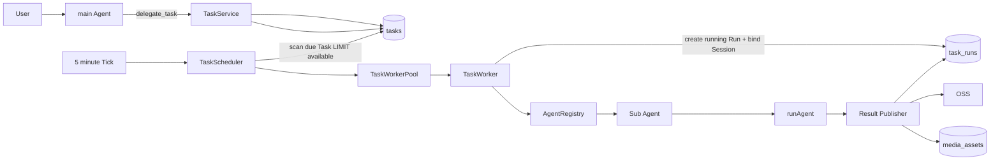
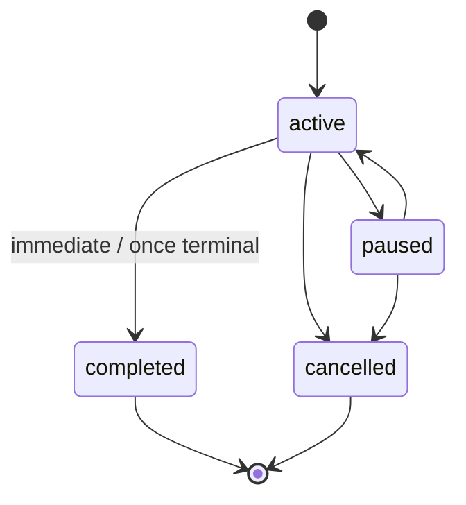
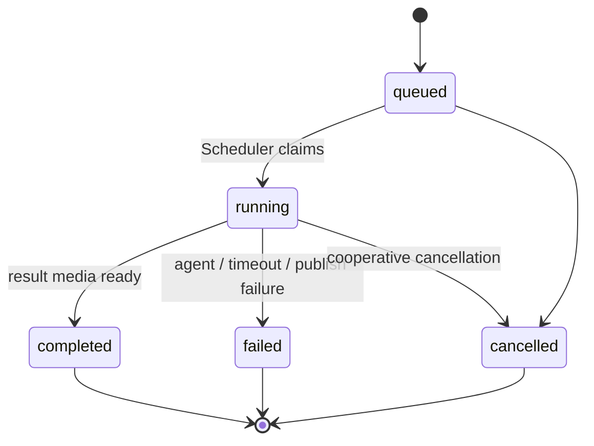
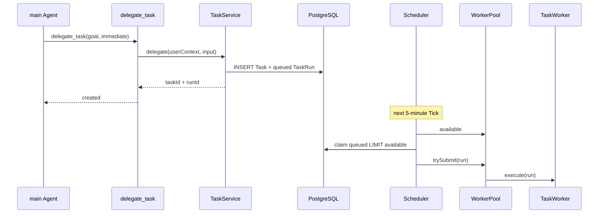
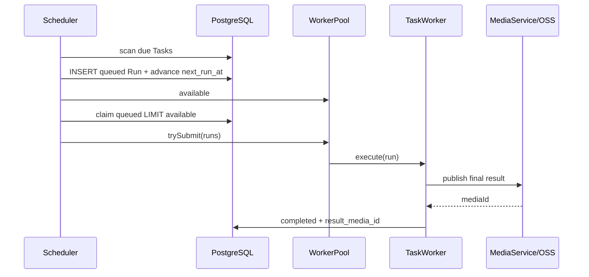

# Fanto Agent Task System

> 日期：2026-09-26
> 更新：2026-09-30
> 状态：实施中

## 0. 2026-09-30 实施约束（优先于后续历史方案）

本节是本次实现的最终契约；下方较早草案如有冲突，以本节为准。

- `main` 使用 `create_task`、`update_task`、`get_task`；删除 `replace_task`，不实现 Task 去重、idempotency key、版本、替代关系或 Task 并行关系。
- 只保留一个 `task-worker` 子 Agent；它的任务范围说明位于 `agent.yaml`，严格交付协议位于 `apps/server/src/agent/prompts/task-worker.ts`。HTML、网页、卡片、文件、报告、代码和其他可预览产物必须由 Main 创建其 Task，不允许 Main 直接输出完整文件。
- 一个 Main Session 可以创建多个 Task；当前 Task 摘要（含 `taskId`）进入 Main Prompt，由 Main Agent 自行决定创建或更新哪个 Task。
- 一个 TaskRun 对应一个独立 Worker Session；失败重试创建新的 TaskRun 和新的 Worker Session。`task_runs.result` 直接保存 `{ summary, artifacts[] }`，不新增 artifact 表。
- 一个 Worker Session 可以交付多个文件。Worker 必须先将主文件写到工作区根目录的 `result.md`、`result.txt` 或 `result.html`，然后调用 `deliver_task_result`；普通 Agent 文本不能完成 Run。
- `deliver_task_result` 从可信 Run Context 取得 `userId / taskId / taskRunId / workerSessionId / workspace`，只接受根目录相对文件名，校验文件后上传 OSS、创建 ready Media，再完成 TaskRun。失败返回可读、可重试的 Tool 错误，Run 保持 running。
- Task 产物对象键为 `users/{userId}/task/{yyyy-MM}/{workerSessionId}/{filename}`；用户主动上传的媒体对象键为 `users/{userId}/media/{yyyy-MM}/{mediaId}.{extension}`。
- Worker 无法成功调用交付工具时，TaskWorker 将 Run 标记为 `failed`，错误码为 `TASK_RESULT_NOT_DELIVERED`；不再把 `runAgent()` 的流式文本伪造成结果文件。
- `task_runs` 是一次已获 Worker 资源的执行审计，不是持久化队列；不存在 `queued` 状态，也不恢复或消费历史等待 Run。
- 每个 Task 都有 `nextRunAt`；immediate Task 的初始值为创建时刻。Scheduler 只扫描 active 且到期的 Task，并按当前 WorkerPool 可用槽位限制本轮候选数。
- Worker 先创建独立 Worker Session 并保留其资源，再以 `taskId + expectedNextRunAt` 原子创建 `running` TaskRun、写入 `worker_session_id`、推进 Task 的 `next_run_at`。任一步无法开始时不创建 Run，Task 保持待下轮扫描。
- 已错过多个 recurring 计划时间时，只执行最近一次错过的时间；下一次 `nextRunAt` 直接推进到未来时间。WorkerPool 满时不积压 Run，Task 保持到期，等待下一次 Tick。

## 1. 目标架构

Task System 完整运行在 `apps/server` 内：

- `main` Agent 只通过 `delegate_task` 创建任务。
- Task 定义、调度、TaskRun 创建、Worker 分发、子 Agent 执行、结果落库全部由 Server 完成。
- Worker 直接复用 Server 内现有 `AgentRegistry`、`AgentSessionManager`、`runAgent()`，不经过 HTTP Route，不存在 Agent → Server 内部 HTTP 调用。
- Task 与 TaskRun 持久化到 Server PostgreSQL。
- 每个 TaskRun 使用独立 Agent Session 和独立 Workspace。
- 任务最终结果必须形成结果文件，上传 OSS，并注册为用户可访问的 `mediaId`。
- 子 Agent 统一在 `apps/server/agent.yaml` 中声明。



## 2. 核心模型

```text
Task 1 ── N TaskRun
```

### Task

长期任务定义，描述：

- 谁创建；
- 由哪个 Agent 执行；
- 要执行什么；
- 何时执行；
- 每次最多执行多久；
- 当前生命周期状态；
- 下一次应创建 Run 的时间。

### TaskRun

Task 的一次具体执行，描述：

- 逻辑计划时间；
- 实际执行状态；
- 独立 Agent Session；
- 执行结果摘要；
- 结果文件 `mediaId`；
- 错误与运行时间。

### TaskService

负责：

- 创建 immediate / once / recurring Task；
- 创建 immediate TaskRun；
- 暂停、恢复、取消；
- 用户范围内查询 Task / TaskRun；
- immediate TaskRun 只持久化为 `queued`，不主动触发调度。

### TaskScheduler

负责：

- 每 5 分钟执行一次 Tick；
- 扫描到期 scheduled Task并创建 queued TaskRun；
- 推进 `next_run_at`；
- 根据 WorkerPool 当前 `available`，从 PostgreSQL 领取最多 N 个 queued Run；
- 将领取到的 Run 直接提交给 WorkerPool。

Scheduler 不等待 Worker 资源，也不维护等待队列。WorkerPool 满时本次 Tick 直接结束；TaskWorker 完成后只释放槽位，不主动触发下一轮调度。

### TaskWorkerPool

负责：

- 维护 `concurrency / running / available`；
- 接受 Scheduler 已领取的 Run；
- 启动 TaskWorker；
- TaskWorker 完成后释放槽位。

### TaskWorker

负责：

- 根据 Task 的 `agent_id` 找到子 Agent Definition；
- 创建独立 Session / Workspace；
- 在 Task 超时时间内执行 `runAgent()`；
- 发布主结果并写入最终状态。

## 3. `delegate_task` Tool

`delegate_task` 只开放给 `main` Agent，是 Main Agent 创建 Task 的唯一 Agent Tool。

Main Agent 实际提交的数据使用 Goal 模型，不传执行步骤：

```ts
type TaskGoal = {
  objective: string;
  context?: string;
  constraints?: string[];
  successCriteria?: string[];
};

delegate_task({
  title: string,
  agentId: string,
  goal: TaskGoal,
  trigger:
    | { type: "immediate" }
    | {
        type: "scheduled";
        schedule:
          | {
              type: "once";
              at: string;
              timezone: string;
            }
          | {
              type: "recurring";
              rrule: string;
              timezone: string;
              startAt?: string;
            };
      },
  timeoutSeconds?: number,
  result?: {
    format?: "markdown" | "text" | "html";
  }
})
```

Goal 语义：

- `objective`：最终要达成的目标，必填，必须可以独立理解。
- `context`：完成目标所需的必要背景，不复制整段聊天历史。
- `constraints`：必须遵守的边界、禁止事项、范围限制。
- `successCriteria`：判断任务是否完成的标准。
- Goal 不包含 `steps`、`plan`、工具调用顺序；执行方式由子 Agent 自主决定。

Main Agent 一次实际的 Immediate Tool Call 形态：

```json
{
  "title": "整理最近一周值得继续推进的想法",
  "agentId": "research",
  "goal": {
    "objective": "基于用户最近一周的记录，找出值得继续推进的想法并整理成可阅读的总结。",
    "context": "重点关注尚未形成结论、但出现过多次或与当前项目相关的想法。",
    "constraints": [
      "只使用当前用户可访问的数据",
      "没有依据的内容不要补充或猜测",
      "不要把普通生活记录强行解释为项目机会"
    ],
    "successCriteria": [
      "列出最值得继续推进的想法",
      "每项说明依据和下一步可继续思考的问题",
      "最终结果可独立阅读"
    ]
  },
  "trigger": {
    "type": "immediate"
  },
  "timeoutSeconds": 900,
  "result": {
    "format": "markdown"
  }
}
```

Tool Context 自动补充受信字段：

```text
userId
sourceSessionId
sourceMessageId
traceId
timeZone
```

约束：

- `userId`、来源 Session/Message、`traceId`、`timeZone` 不允许模型传入或覆盖。
- `AgentRegistry.taskAgents()` 自动筛选 `task.enabled=true` 且非 `main` 的 Agent，输出 `{ id, description }` catalog。
- `delegate_task` 的 `agentId` schema 从 catalog 动态生成 literal union，Tool description 同时列出每个 Agent 的 `id + description`；不维护第二份子 Agent 名单。
- `agentId` 必须存在于 `AgentRegistry`，且不能为 `main`。
- `agentId` 必须属于允许被 Task System 调度的 Agent。
- `goal` 必须自包含，Worker 不依赖 Main Chat 历史理解任务。
- `timeoutSeconds` 未传时使用目标 Agent 的默认值；最终值必须同时满足 Agent `maxTimeoutSeconds` 与 Server 全局最小/最大边界。
- `result.format` 默认 `markdown`。
- Tool 只创建 Task / TaskRun，不执行或唤醒 Worker。

Immediate 返回：

```ts
{
  taskId: string;
  runId: string;
  status: "active";
}
```

Scheduled 返回：

```ts
{
  taskId: string;
  status: "active";
  nextRunAt: string;
}
```

## 4. Agent 定义

所有可执行子 Agent 统一声明在：

```text
apps/server/agent.yaml
```

目标结构：

```yaml
version: 1

models:
  - provider: deepseek
    model: deepseek-v4-pro
  - provider: deepseek
    model: deepseek-v4-flash

agents:
  - id: main
    model_id: deepseek/deepseek-v4-flash
    description: Fanto 面向用户的长期记忆对话 Agent
    corePromptModule: core
    systemPromptModule: operational
    tools:
      - record_get
      - record_list
      - record_search
      - present_media
      - preference_manage
      - delegate_task
    skills: []
    compaction:
      enabled: true
      reserveTokens: 16384
      keepRecentTokens: 20000

  - id: research
    model_id: deepseek/deepseek-v4-pro
    description: 执行需要多步骤分析、资料整理和长文本交付的后台任务
    systemPrompt: |
      你是 Fanto 的后台 Research Agent。
      严格围绕 Task Goal 完成任务。
      任务结束时给出完整最终结果。
    tools:
      - read
      - write
      - edit
      - bash
      - record_get
      - record_list
      - record_search
    skills: []
    task:
      enabled: true
      defaultTimeoutSeconds: 900
      maxTimeoutSeconds: 3600
    compaction:
      enabled: true
      reserveTokens: 16384
      keepRecentTokens: 20000

  - id: coding
    model_id: deepseek/deepseek-v4-flash
    description: 在隔离 Workspace 中执行代码和文件处理任务
    systemPrompt: |
      你在隔离 Workspace 中执行 Task Goal。
      先检查输入，再完成任务，并返回完整最终结果。
    tools:
      - read
      - write
      - edit
      - bash
    skills: []
    task:
      enabled: true
      defaultTimeoutSeconds: 900
      maxTimeoutSeconds: 3600
    compaction:
      enabled: true
      reserveTokens: 16384
      keepRecentTokens: 20000
```

Agent Definition 增加 Task 调度属性：

```yaml
    task:
      enabled: true
      defaultTimeoutSeconds: 900
      maxTimeoutSeconds: 3600
```

约束：

- `main.task.enabled = false` 或不配置。
- `delegate_task.agentId` 只能选择 `task.enabled = true` 的 Agent。
- Task 创建时把最终生效的 `agentId` 与 `timeoutSeconds` 固化到 Task，不依赖后续默认值变化。
- Worker 使用 Task 保存的 `agent_id`，运行时再由 `AgentRegistry` 解析当前 Agent Definition。

`AgentDefinition` schema 同步支持：

```ts
task?:
  | { enabled: false }
  | {
      enabled: true;
      defaultTimeoutSeconds: number;
      maxTimeoutSeconds: number;
    };
```

## 5. 调度模型

### 5.1 `next_run_at`

`tasks.next_run_at` 表示下一次应产生 TaskRun 的逻辑计划时间。

- `immediate`：创建 Task 时同步创建 Run，`scheduled_at = now`，`next_run_at = NULL`。
- `scheduled/once`：创建 Task 时 `next_run_at = at`；创建唯一 Run 后置 `NULL`。
- `scheduled/recurring`：保存下一次 RRULE occurrence；每创建一期 Run 后推进到下一次未来 occurrence。

Worker 的成功、失败、超时不改变 recurring Task 的后续计划。

### 5.2 Scheduler

Scheduler 作为 Server 内部长期组件，每 5 分钟执行一次 Tick。Tick 使用 single-flight：上一次 Tick 尚未结束时跳过本次，不并发调度。

```text
TASK_SCHEDULER_INTERVAL_MS=300000
```

每次 Tick：

```text
1. 扫描到期 scheduled Task
2. 对每个到期 Task 在事务中：
   - 确定 scheduled_at
   - INSERT queued TaskRun
   - 推进 next_run_at
3. available = WorkerPool.available
4. available <= 0：本次 Tick 结束
5. 从 PostgreSQL 原子领取最多 available 个 queued Run
6. 将领取到的 Run 提交给 WorkerPool
7. Tick 结束，不等待 TaskWorker 完成
```

例如：

```text
WorkerPool concurrency = 1
running = 0
queued = 2

Tick #1:
  available = 1
  只领取 Run A
  Run B 保持 queued

Run A 10 秒后完成：
  WorkerPool running = 0
  不触发新的调度

Tick #2（5 分钟后）:
  available = 1
  领取 Run B
```

Worker 满载时：

```text
available = 0
-> 本次 Tick 直接结束
-> 所有 queued Run 保持数据库状态不变
-> 下一次 5 分钟 Tick 再尝试
```

PostgreSQL `task_runs(status=queued)` 是唯一等待队列；Scheduler 与 WorkerPool 不维护第二份任务队列。

scheduled recurring 在 Server 停机期间错过多个 occurrence 时：

```text
只创建 now 之前最近的一期 TaskRun
next_run_at 直接推进到 now 之后的下一期
```

唯一约束：

```text
UNIQUE(task_id, scheduled_at)
```

### 5.3 Immediate Task

Immediate Task 只负责持久化：

```text
delegate_task
  -> TaskService 创建 Task
  -> 同事务创建 TaskRun(status=queued, scheduled_at=now)
  -> commit
  -> 返回 taskId / runId
```

不调用 Scheduler，不检查 WorkerPool，不唤醒 Worker。

该 Run 在下一次 Scheduler Tick 中与其他 queued Run 一起按 `scheduled_at ASC, created_at ASC` 竞争可用槽位，因此正常启动延迟为 0～5 分钟，存在积压时继续排队。

## 6. Worker 执行

### 6.1 WorkerPool

Server 配置：

```text
TASK_WORKER_CONCURRENCY=1
TASK_TIMEOUT_MIN_SECONDS=30
TASK_TIMEOUT_MAX_SECONDS=3600
```

WorkerPool 只负责并发计数，不维护等待队列：

```ts
class TaskWorkerPool {
  private running = 0;

  get available() {
    return Math.max(0, this.concurrency - this.running);
  }

  trySubmit(run: TaskRun): Promise<void> | null {
    if (this.available <= 0) return null;
    this.running++;
    return this.worker.execute(run).finally(() => {
      this.running--;
    });
  }
}
```

Scheduler 调用 `trySubmit()` 后不等待返回 Promise：

```ts
const execution = workerPool.trySubmit(run);
if (execution) void execution;
```

因此：

- WorkerPool 不保存 queued Run；
- WorkerPool 不等待空闲资源；
- `available` 决定 Scheduler 本次最多从数据库领取多少 Run；
- TaskWorker 完成后只释放槽位；下一条 queued Run 等待下一次 Scheduler Tick。

### 6.2 原子领取

Scheduler 按 `scheduled_at ASC, created_at ASC` 从 PostgreSQL 领取最多 `available` 个 Run，并在领取时完成 `queued -> running`。

Repository 对外提供：

```ts
claimQueued(limit: number): Promise<TaskRun[]>
```

领取必须保证同一 Run 只返回给一个调度者。当前单 Server 目标状态可使用事务 + 条件更新；实现语义等价于：

```sql
UPDATE task_runs
SET
  status = 'running',
  started_at = NOW(),
  updated_at = NOW()
WHERE run_id = :runId
  AND status = 'queued'
RETURNING *;
```

Scheduler 只对成功领取的 Run 调用 WorkerPool。

### 6.3 Run Session

每个 TaskRun：

```text
TaskRun.userId
  + Task.agentId
  -> AgentRegistry.get(agentId)
  -> AgentSessionManager.create(definition, userId)
  -> 独立 Session
  -> Workspace = {workspaceRoot}/{userId}/{sessionId}
  -> runAgent()
```

Worker 不复用：

- Main Agent Session；
- 其他 TaskRun Session；
- 其他用户 Workspace。

Workspace 统一采用两层用户隔离目录：

```text
{AGENT_WORKSPACE_ROOT}/{userId}/{sessionId}
```

现有 `createWorkspace(root, sessionId)` 调整为：

```ts
createWorkspace(root: string, userId: string, sessionId: string)
```

Main Chat Session 与 TaskRun Session 都使用同一目录规则。`userId` 与 `sessionId` 必须来自受信运行上下文，不接受 Agent Tool 参数覆盖。

`AgentSessionManager` 增加 Run 级释放能力：

```ts
release(sessionId: string): Promise<void>
```

TaskRun 进入终态后从内存 Session cache 移除并关闭 Runtime；持久化 Session 记录可保留用于审计，但不得长期占用运行时资源。

Run Context：

```ts
{
  userId,
  sessionId: workerSessionId,
  traceId,
  timeZone,
  taskId,
  taskRunId,
  sourceSessionId,
  sourceMessageId
}
```

TaskWorker 从 Task / TaskRun 构造内部执行输入：

```ts
type TaskExecutionInput = {
  goal: TaskGoal;
  scheduledAt: string;
  timeZone: string;
  resultFormat: "markdown" | "text" | "html";
};
```

内部 `taskId`、`runId`、`userId`、`agentId` 用于运行时与工具上下文，不写入给子 Agent 的用户消息。`timeZone` 优先取 Task trigger 中的 schedule timezone；Immediate Task 使用创建时由 Main Agent Run Context 持久化的受信 `timeZone`。

Worker 最终调用：

```ts
await runAgent(
  session,
  renderTaskGoal(input),
  signal,
  { traceId, timeZone },
  emit,
);
```

`renderTaskGoal(input)` 固定渲染为：

```markdown
# Task Goal

## Objective
{goal.objective}

## Context
{goal.context 或 "No additional context."}

## Constraints
- {constraint 1}
- {constraint 2}

## Success Criteria
- {criterion 1}
- {criterion 2}

## Execution Context
- Scheduled at: {scheduledAt}
- Time zone: {timeZone}
- Result format: {resultFormat}

Complete the goal autonomously. Decide the execution plan yourself. Return the final result only when the goal is complete.
```

`constraints` / `successCriteria` 为空时对应区块可省略。Main Agent 的聊天历史、Tool 调用历史不会传给子 Agent。

### 6.4 超时

每个 Task 保存最终生效的 `timeout_seconds`。

执行时：

```text
AbortController
  + timeoutSeconds
  -> runAgent(..., signal, ...)
```

超时后：

```text
running -> failed
error = { "code": "TASK_TIMEOUT", "message": "Task execution timed out" }
```

Worker 必须调用 runtime abort，并关闭该 Run Session。

## 7. 结果与 Media

### 7.1 最终结果文件

一期只处理 TaskWorker 的最终文本结果。

每个成功 TaskRun 必须将 `runAgent()` 的最终文本生成一个主结果文件：

| output.format | 文件名 | MIME |
| --- | --- | --- |
| `markdown` | `result.md` | `text/markdown` |
| `text` | `result.txt` | `text/plain` |
| `html` | `result.html` | `text/html` |


### 7.2 Media 扩展

`media_assets` 扩展为可承载 Server 生成文件：

```text
media_type:
  image
  audio
  file
```

一期新增支持 MIME：

```text
text/plain
text/markdown
text/html
```

MediaService 增加 Server 内部写入能力：

```ts
createGeneratedFile(input: {
  userId: string;
  filename: string;
  mimeType: "text/plain" | "text/markdown" | "text/html";
  data: Buffer;
  extData?: Record<string, unknown>;
}): Promise<MediaAsset>
```

执行语义：

```text
生成 mediaId
-> objectKey = users/{userId}/media/{mediaId}/{safeFilename}
-> Server 直接上传 OSS
-> INSERT media_assets(status=ready, media_type=file)
-> 返回 mediaId
```

OSS Client 增加 Server-side upload：

```ts
putObject(key, data, contentType)
```

客户端仍通过现有用户鉴权的 Media API 获取 URL，不暴露 OSS objectKey。客户端 `POST /api/uploads` 继续只接受现有图片/音频类型；`media_type=file` 只由 Server 内部生成文件入口创建。

`MediaService.readyMetadata()` 对 file 类型额外返回：

```ts
{
  mediaId,
  mediaType: "file",
  mimeType,
  bytes,
  filename
}
```

### 7.3 TaskRun 结果绑定

`task_runs.result` 保存主结果元数据：

```ts
{
  summary: string,
  outputFormat: "markdown" | "text" | "html",
  filename: string
}
```

独立列：

```text
result_media_id
```

`result_media_id` 是结果文件绑定的唯一事实来源，用于 TaskRun 详情、前端查看和下载。

生成的 Media `ext_data`：

```json
{
  "source": "task",
  "taskId": "...",
  "taskRunId": "...",
  "filename": "result.md"
}
```

只有主结果文件成功上传 OSS 且 Media 已进入 `ready`，TaskRun 才能：

```text
running -> completed
```

结果发布失败：

```text
running -> failed
error = { "code": "RESULT_PUBLISH_FAILED", "message": "Task result could not be published" }
```

## 8. 数据模型

Task System 只使用两张业务表：

```sql
CREATE TABLE tasks (
  task_id               UUID PRIMARY KEY,
  user_id               TEXT NOT NULL REFERENCES users(user_id) ON DELETE CASCADE,

  title                 TEXT NOT NULL,
  goal                  JSONB NOT NULL,

  agent_id              TEXT NOT NULL,
  timeout_seconds       INTEGER NOT NULL,

  trigger_type          TEXT NOT NULL
                        CHECK (trigger_type IN ('immediate', 'scheduled')),
  trigger               JSONB NOT NULL,
  output                JSONB NOT NULL DEFAULT '{}'::jsonb,
  ext_data              JSONB NOT NULL DEFAULT '{}'::jsonb,

  status                TEXT NOT NULL
                        CHECK (status IN ('active', 'paused', 'completed', 'cancelled')),
  next_run_at           TIMESTAMPTZ,

  source_session_id     TEXT,
  source_message_id     TEXT,

  created_at            TIMESTAMPTZ NOT NULL,
  updated_at            TIMESTAMPTZ NOT NULL
);

CREATE TABLE task_runs (
  run_id                UUID PRIMARY KEY,
  task_id               UUID NOT NULL REFERENCES tasks(task_id) ON DELETE CASCADE,
  user_id               TEXT NOT NULL REFERENCES users(user_id) ON DELETE CASCADE,

  status                TEXT NOT NULL
                        CHECK (status IN ('queued', 'running', 'completed', 'failed', 'cancelled')),
  scheduled_at          TIMESTAMPTZ NOT NULL,

  worker_session_id     TEXT,
  result_media_id       TEXT REFERENCES media_assets(media_id),
  result                JSONB,
  error                 JSONB,
  ext_data              JSONB NOT NULL DEFAULT '{}'::jsonb,

  started_at            TIMESTAMPTZ,
  finished_at           TIMESTAMPTZ,
  created_at            TIMESTAMPTZ NOT NULL,
  updated_at            TIMESTAMPTZ NOT NULL,

  CONSTRAINT uq_task_runs_task_scheduled_at UNIQUE(task_id, scheduled_at)
);
```

索引：

```sql
CREATE INDEX idx_tasks_due
ON tasks(status, next_run_at)
WHERE next_run_at IS NOT NULL;

CREATE INDEX idx_tasks_user_status_updated
ON tasks(user_id, status, updated_at DESC, task_id DESC);

CREATE INDEX idx_task_runs_status_scheduled
ON task_runs(status, scheduled_at ASC, created_at ASC);

CREATE INDEX idx_task_runs_task_created
ON task_runs(task_id, created_at DESC);

CREATE INDEX idx_task_runs_user_created
ON task_runs(user_id, created_at DESC);
```

### `tasks.ext_data`

用于非核心、可演进元数据：

```json
{
  "traceId": "...",
  "timeZone": "Asia/Shanghai",
  "source": "agent",
  "delegate": {
    "requestedByAgentId": "main"
  }
}
```

以下字段必须独立建列，不能只放 `ext_data`：

```text
agent_id
timeout_seconds
trigger_type
next_run_at
status
user_id
```

### `task_runs.ext_data`

用于 Run 级扩展信息：

```json
{
  "worker": {
    "host": "...",
    "agentRevision": "..."
  },
  "usage": {},
  "result": {
    "publishAttempts": 1
  }
}
```

## 9. 状态机

### Task



Task `status` 表示调度生命周期，不代表某一期执行是否成功；执行结果以 TaskRun `status` 为准。

### TaskRun



规则：

- immediate / once Task 的唯一 Run 进入终态后，Task 进入 `completed`；Task 被用户取消时进入 `cancelled`。
- recurring Task 的某一期 completed / failed 不改变 Task 的 `active` 状态。
- paused Task 不再创建新 Run；恢复时重新计算下一次未来 occurrence。
- queued Run 在 Task 被取消时同步取消。
- 一期不要求强杀已经 running 的 Run；Worker 在关键阶段检查 Task/Run 是否已取消，并可将 `running -> cancelled`。

## 10. 重启恢复

Server 启动 Task System 时：

```text
1. 将遗留 status=running 的 TaskRun 标记为 failed
2. `error = { "code": "SERVER_RESTARTED", "message": "Server restarted while task was running" }`
3. queued Run 保持不变
4. 启动 Scheduler 5 分钟 Tick
5. queued Run 由下一次 Tick 统一领取
```

遗留 Session / Workspace 由生命周期清理逻辑回收，不作为 Task 状态事实来源。

## 11. Server 模块结构

```text
apps/server/
├── agent.yaml
└── src/
    ├── agent/
    │   ├── agent-runtime.ts
    │   ├── harness/
    │   └── tools/
    │       ├── delegate-task.ts
    │       └── index.ts
    │
    ├── domain/
    │   ├── tasks/
    │   │   ├── model.ts
    │   │   ├── repository.ts
    │   │   ├── service.ts
    │   │   └── index.ts
    │   └── media/
    │       └── ...
    │
    ├── task-runtime/
    │   ├── scheduler.ts
    │   ├── worker-pool.ts
    │   ├── worker.ts
    │   ├── result-publisher.ts
    │   └── index.ts
    │
    ├── routes/
    │   └── tasks.ts
    │
    └── infrastructure/
        ├── clients/
        │   └── oss-client.ts
        └── database/
            └── schema.ts
```

职责边界：

```text
agent/tools/delegate-task.ts
  -> Agent Tool 适配层，只调用 TaskService

domain/tasks/*
  -> Task / TaskRun 领域模型与 PostgreSQL 持久化

task-runtime/scheduler.ts
  -> 创建到期 Run；按 WorkerPool available 领取 queued Run；直接提交 WorkerPool

task-runtime/worker-pool.ts
  -> 仅控制并发数量，不维护等待队列

task-runtime/worker.ts
  -> 子 Agent Session + runAgent 执行

task-runtime/result-publisher.ts
  -> runAgent 最终文本 -> 主结果文件 -> OSS -> Media -> TaskRun result
```

## 12. Server Runtime 装配

`bootstrap/main.ts` 目标装配顺序：

```text
Database
OSS
MediaService
RecordService / PreferenceService / ...
TaskRepository / TaskService
AgentRuntime
TaskWorker
TaskWorkerPool
TaskScheduler
TaskSystem.start() -> Scheduler.start(300000ms Tick)
HTTP Server
```

Agent Tool 只依赖以下窄接口：

```ts
export type AgentTaskService = {
  delegate(context: AgentRequestContext, input: DelegateTaskInput): Promise<DelegateTaskResult>;
};
```

`createAgentRuntime()` 接收：

```ts
{
  records,
  media,
  preferences,
  tasks,
  ...agentConfig
}
```

`createAgentBusinessServices()` 暴露 Task 所需能力，`createTools()` 根据 Agent Definition 决定是否实例化 `delegate_task`。

TaskWorker 直接持有最终创建完成后的 `AgentRuntime`。

## 13. HTTP API

客户端 Task API 全部使用现有 JWT 用户身份。

```text
GET    /api/tasks
GET    /api/tasks/:taskId
GET    /api/tasks/:taskId/runs
GET    /api/tasks/:taskId/runs/:runId
POST   /api/tasks/:taskId/pause
POST   /api/tasks/:taskId/resume
DELETE /api/tasks/:taskId
```

TaskRun 返回：

```ts
{
  runId,
  taskId,
  status,
  scheduledAt,
  startedAt,
  finishedAt,
  result: {
    summary,
    mediaId,
    filename,
    outputFormat
  } | null,
  error
}
```

结果下载/查看继续复用：

```text
GET /api/media/:mediaId/meta
GET /api/media/:mediaId/url
GET /api/media/:mediaId
```

所有 Task Repository 与 Media Repository 查询均必须强制 `user_id` 条件。

## 14. 配置

Server 配置增加：

```text
TASK_SCHEDULER_INTERVAL_MS=300000
TASK_WORKER_CONCURRENCY=1
TASK_TIMEOUT_MIN_SECONDS=30
TASK_TIMEOUT_MAX_SECONDS=3600
```

Agent 默认超时在 `agent.yaml -> agent.task` 中配置；环境变量只定义全局安全边界和 WorkerPool 容量。

## 15. 执行链路

### Immediate



### Scheduled



## 16. 验证标准

必须覆盖：

1. `main` 只通过 `delegate_task` 创建 Task，不能直接执行后台 Task Worker。
2. `delegate_task` 只能选择 `agent.yaml` 中 `task.enabled=true` 的 Agent。
3. Task 正确固化 `agent_id`、`timeout_seconds`、`goal`、`ext_data`。
4. `delegate_task` 使用 Goal 模型，TaskWorker 按固定模板将 Goal 提交给子 Agent。
5. immediate 只创建 queued TaskRun，不主动触发 Scheduler；由下一次 5 分钟 Tick 领取。
6. once / recurring 正确生成 Run 和推进 `next_run_at`。
7. recurring 错过多期时只补最近一期。
8. `UNIQUE(task_id, scheduled_at)` 阻止重复 Run。
9. Scheduler Tick 不会重复领取同一 Run。
10. WorkerPool 并发不超过配置值。
11. 每个 Run 使用独立 Session，Workspace 路径为 `{workspaceRoot}/{userId}/{sessionId}`。
12. Worker 根据 Task `agent_id` 正确加载子 Agent Definition。
13. Task timeout 可以 abort Agent Run，并写入 failed。
14. 成功 Run 一定存在 ready 状态的主结果 `mediaId`。
15. 结果文件真实存在 OSS，并可通过现有 Media API 查看或下载。
16. OSS / Media 发布失败时 Run 不得进入 completed。
17. Server 重启后 running Run 被收敛为 failed，queued Run 能继续执行。
18. Task / TaskRun / Media 的所有读取均保持 user-scoped。
19. Server typecheck、test 通过。

验证命令：

```bash
pnpm --filter @fanto/server typecheck
pnpm --filter @fanto/server test
```

## 17. 一期边界

不包含：

- Redis / MQ / transactional outbox；
- Task 自动重试；
- Task 优先级；
- running Run 的强制进程级中止；
- 多 Server 实例分布式 Worker 协调；
- 独立 artifact 表；
- Task 完成后的 Push Notification；
- Task 结果自动写回 Main Chat Session。
