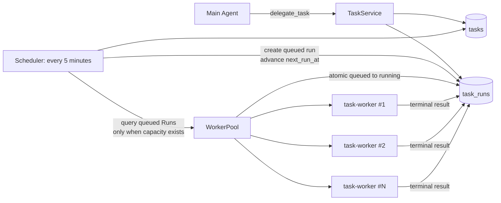
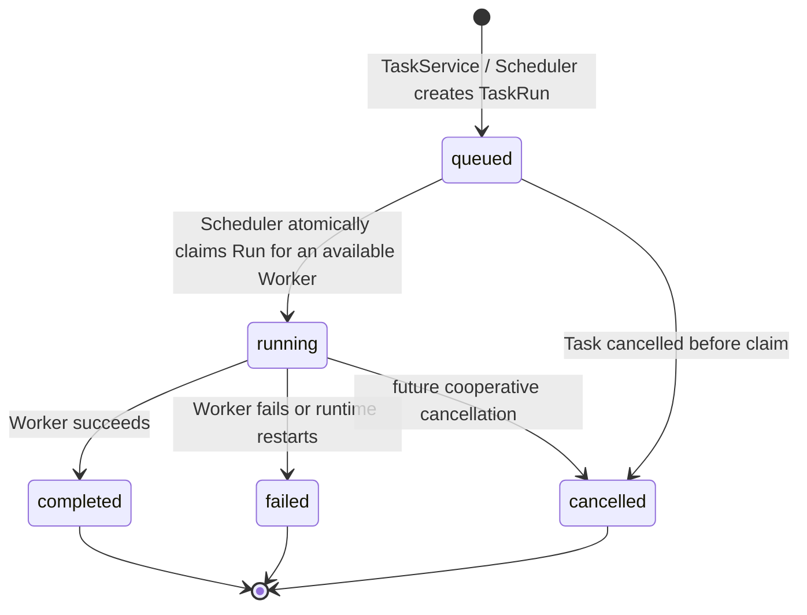

# Fanto Agent Task System

> 日期：2026-09-26；更新：2026-09-28
> 状态：设计方案
> 目标：在 Agent Runtime 内建立统一的后台任务系统：Main Agent 委派任务，Scheduler 生成待执行 Run，并在本机 WorkerPool 有空闲槽位时直接启动独立 Worker 异步执行。
> 边界：Task 完全属于 `apps/agent`，不依赖 Business Server 数据库。旧 `agent_tasks / TaskRunner / POST /api/agent/tasks` 整体删除，不做兼容迁移。

## 1. 已确认的设计决策

| 决策 | 结论 |
| --- | --- |
| 执行交接 | 不使用 Redis、内存队列或 `TaskRunQueue`。Scheduler 在每次 Tick 中直接向本机 WorkerPool 分发已持久化的 `queued` Run。 |
| 状态事实来源 | Agent SQLite 中的 `tasks`、`task_runs` 是唯一事实来源。 |
| 定时扫描频率 | Scheduler 每 5 分钟扫描到期 Task。定时任务允许 0–5 分钟启动延迟。 |
| 立即任务 | `delegate_task(immediate)` 立即持久化 `queued` Run；由下一次 Scheduler Tick 在有空闲槽位时启动，延迟最多约 5 分钟。 |
| Worker 并发 | 单机并发数由 `AGENT_TASK_WORKER_CONCURRENCY` 配置，默认 `1`。 |
| Worker 超时 | 单个 Worker 的最大运行时长由 `AGENT_TASK_WORKER_TIMEOUT_MS` 配置，默认 `900000`（15 分钟）；超时 Run 进入 `failed`。 |
| 重复领取 | Scheduler 重叠 Tick 或未来扩展导致重复尝试时，条件更新 `queued → running` 确保一个 Run 最多启动一次 Worker。 |
| 重启恢复 | 启动时遗留的 `running` Run 标记为 `failed`；`queued` Run 不变，下一个 Scheduler Tick 自动再次尝试分发。 |
| 补偿扫描器 | 第一版不实现周期性补偿扫描或 transactional outbox；没有队列投递失败路径。 |
| 遗漏调度 | 周期 Task 发生停机或长时间未调度时，仅补建最近一次已错过的 occurrence，并将 `next_run_at` 推进至下一次未来 occurrence。 |
| Worker 调用 Server | Worker 只能通过 `apps/agent/src/clients/server-client.ts` 调用 Server；Client 使用 Server 手工配置的内部 API Token，且每个请求必须同时提供 `X-API-Token` 与 `X-User-Id`；Server 仅开放白名单业务接口。 |
| Worker 执行 Agent | 每个 Run 使用独立的 `task-worker` Agent Session，并复用唯一的 `runAgent()` 入口；用户 JWT 不进入 Run Context 或 Agent→Server 调用。 |
| Worker 工具 | `task-worker` 可使用 `read`、`write`、`edit`、`bash`、`record_get`、`record_list`、`record_search`、`preference_manage`；Tool 的用户身份仍只来自 Run Context。 |
| 输出 | 仅支持 `text`、`markdown`、`html`。结果写入 OSS，Run 仅保存 OSS 对象引用及摘要元数据。 |

## 2. 核心模型与职责

```text
Task（长期定义） 1 ── N TaskRun（一次实际执行）
```

- **Task**：用户委托的任务定义、触发规则和生命周期。
- **TaskRun**：某一期实际执行，保存其逻辑计划时间、状态与结果。
- **TaskService**：创建、暂停、恢复、取消 Task；立即任务创建 `queued` Run。
- **TaskScheduler**：每 5 分钟创建到期 Run、推进 `next_run_at`，再将可用槽位分配给 `queued` Run；它不直接执行模型。
- **WorkerPool**：维护本机空闲 Worker 槽位。Scheduler 仅在有空闲槽位时调用它启动独立 Worker。
- **task-worker**：以独立 Session 执行 TaskRun，不决定 Task 生命周期；可使用受限的 coding、Record 与 Preference Tool。



## 3. Main Agent 入口：`delegate_task`

`delegate_task` 是 Main Agent 创建 Task 的唯一入口。模型只能传递用户意图，调用上下文补充用户身份与来源信息。

```ts
delegate_task({
  title: string,
  instruction: string,
  trigger:
    | { type: "immediate" }
    | {
        type: "scheduled";
        schedule:
          | { type: "once"; at: string; timezone: string }
          | { type: "recurring"; rrule: string; timezone: string; startAt?: string };
      },
  output?: {
    type: "text" | "markdown" | "html";
    description?: string;
  }
})
```

不向模型开放 `userId`、`sessionId`、`sourceMessageId`、`status`、`nextRunAt`、`workerAgentId`、优先级或队列参数。

`instruction` 必须自包含。Worker 不依赖 Main Agent 的聊天记录理解任务。

### 3.1 委派流程

```text
Tool schema / trigger validation
  → 从 Run Context 补充 userId、sourceSessionId、sourceMessageId
  → TaskService.delegate()
  → 持久化 Task（和 immediate TaskRun）
  → immediate Run 保持 queued，等待下一次 Scheduler Tick 分发
  → 返回 taskId / runId / nextRunAt
```

Tool 不启动 Worker，也不等待结果。立即任务的启动延迟最多约 5 分钟，Tool 只能声明任务已创建，不能声称已开始执行。

## 4. 调度

### 4.1 `next_run_at` 的含义

`next_run_at` 是 **下一次应产生 TaskRun 的逻辑计划时间**；不是 Worker 空闲时间、最近一次开始时间或完成时间。

- immediate：创建 Run 时 `scheduled_at = now`，Task 的 `next_run_at = NULL`。
- scheduled once：创建时 `next_run_at = at`；首次生成 Run 后置空。
- scheduled recurring：创建时为 RRULE 首次 occurrence；每次生成 Run 后推进到下一次 occurrence。

Worker 成功、失败、拥塞均不得阻止周期 Task 推进下一期的 `next_run_at`。

### 4.2 Scheduler（每 5 分钟）

查询：

```sql
SELECT *
FROM tasks
WHERE status = 'active'
  AND trigger_type = 'scheduled'
  AND next_run_at IS NOT NULL
  AND next_run_at <= :now
ORDER BY next_run_at
LIMIT :batch_size;
```

每个到期 Task 在同一数据库事务中执行。对 recurring Task，先计算不晚于 `now` 的最后一个 occurrence；如果原 `next_run_at` 已落后多个周期，只为该最后 occurrence 创建一个 Run：

```text
current = latestOccurrenceAtOrBefore(now)
INSERT task_runs(status = queued, scheduled_at = current)
UPDATE tasks SET next_run_at = next occurrence strictly after now（once 为 NULL）
COMMIT
```

`UNIQUE(task_id, scheduled_at)` 防止 Scheduler 重叠运行时产生同一期的两个 Run。

### 4.3 延迟与积压

- 到期时间距离下一次扫描最多约 5 分钟，属于正常调度延迟。
- Run 创建后如无 Worker 容量，保持 `queued` 至下一次 Scheduler Tick，不改变其 `scheduled_at`。
- 周期 Run 可因 Worker 容量不足而与下一期重叠；这是允许的。并发上限控制资源，而不是丢弃计划执行。

## 5. Scheduler 与 WorkerPool

### 5.1 WorkerPool 容量模型

```env
# 每个 Agent Runtime 进程同时执行的 task-worker 数量
AGENT_TASK_WORKER_CONCURRENCY=1
# 单个 Run 从领取到完成的最大时长；超时后标记为 failed
AGENT_TASK_WORKER_TIMEOUT_MS=900000
```

约束：

1. 配置必须是正整数；默认 `1`。启动日志写明生效值。
2. `AGENT_TASK_WORKER_TIMEOUT_MS` 必须为正整数；默认 15 分钟。
3. 每个空闲槽位一次只执行一个 Run；Run 终态后才释放槽位。
4. 没有空闲槽位时，Scheduler 不启动新的 Worker；待处理 Run 保持 `queued` 至下一次 Tick。
5. 每个 Run 建立新的 `task-worker` Session，绝不复用 Main Chat Session 或另一 Run 的 Worker Session；Session owner 固定为 `TaskRun.userId`，工作区由该 Session 独占。

单机并发数控制的是本进程资源。当前持久化使用 SQLite，第一版只支持单个 Agent Runtime 进程拥有此数据库；未来多机/多进程扩容前必须迁移为共享数据库并重新验证原子领取语义。

### 5.2 原子领取与执行

Scheduler 在创建到期 Run 后，读取 `status = 'queued'` 的 Run，并在 WorkerPool 空闲槽位数量内按 `scheduled_at, created_at` 顺序尝试领取：

```text
发现空闲 Worker 槽位
  → 按 runId 条件更新 queued → running
  → 若未返回记录：忽略取消或已领取 Run
  → 创建 worker session
  → 启动 task-worker
  → Worker 成功上传结果到 OSS 后：写 completed / result / finished_at，释放槽位
  → Worker 异常或超时：写 failed / error / finished_at，释放槽位
```

领取 SQL 必须等价于：

```sql
UPDATE task_runs
SET status = 'running', started_at = :now, updated_at = :now
WHERE id = :run_id
  AND status = 'queued'
RETURNING *;
```

同一个 Run 被重复尝试领取或多个重叠 Scheduler Tick 竞争时，只有一个调用可拿到记录并启动 Worker。

### 5.3 Worker 结束与进程重启

- Worker 成功：先通过 Server 白名单上传接口将 `text`、`markdown` 或 `html` 写入 OSS；上传成功后 Run → `completed`，持久化 OSS 对象引用、内容类型、摘要与 `finished_at`。
- Worker 异常、结果上传失败或达到最大运行时长：Run → `failed`，持久化受限长度的安全错误、`finished_at`。
- 取消：领取前 Run/Task 已取消则不启动；运行中取消为后续能力，第一版不承诺强制中止模型调用。
- 进程启动时：遗留 `running` Run 标为 `failed`，错误为“Agent Runtime 在 Worker 运行时重启”；遗留 `queued` Run 不改变，等待下一个 Scheduler Tick。

单次 immediate / scheduled once Task 的唯一 Run 到终态后，Task 也变为 `completed` 或 `cancelled`；周期 Task 在某期 Run 终态后保持 `active`。

## 6. 数据模型

```sql
CREATE TABLE tasks (
  id                  TEXT PRIMARY KEY,
  user_id             TEXT NOT NULL,
  title               TEXT NOT NULL,
  instruction         TEXT NOT NULL,
  trigger_type        TEXT NOT NULL CHECK (trigger_type IN ('immediate', 'scheduled')),
  trigger             TEXT NOT NULL,
  output              TEXT,
  status              TEXT NOT NULL CHECK (status IN ('active', 'paused', 'completed', 'cancelled')),
  next_run_at         TEXT,
  source_session_id   TEXT,
  source_message_id   TEXT,
  created_at          TEXT NOT NULL,
  updated_at          TEXT NOT NULL
);

CREATE TABLE task_runs (
  id                  TEXT PRIMARY KEY,
  task_id             TEXT NOT NULL,
  user_id             TEXT NOT NULL,
  status              TEXT NOT NULL CHECK (status IN ('queued', 'running', 'completed', 'failed', 'cancelled')),
  scheduled_at        TEXT NOT NULL,
  worker_session_id   TEXT,
  result              TEXT,
  error               TEXT,
  started_at          TEXT,
  finished_at         TEXT,
  created_at          TEXT NOT NULL,
  updated_at          TEXT NOT NULL,
  FOREIGN KEY(task_id) REFERENCES tasks(id)
);

CREATE UNIQUE INDEX uq_task_runs_task_scheduled_at
ON task_runs(task_id, scheduled_at);

CREATE INDEX idx_tasks_due
ON tasks(status, trigger_type, next_run_at);

CREATE INDEX idx_tasks_user_status
ON tasks(user_id, status);

CREATE INDEX idx_task_runs_task_created
ON task_runs(task_id, created_at DESC);

CREATE INDEX idx_task_runs_user_created
ON task_runs(user_id, created_at DESC);

CREATE INDEX idx_task_runs_status_created
ON task_runs(status, created_at);
```

- JSON 类型的 `trigger`、`output`、`result`、`error` 使用 SQLite `TEXT` 存储。`result` 保存 OSS `objectKey`、`contentType`、摘要等引用元数据，不内嵌完整结果正文。
- `scheduled_at` 是该 Run 对应的逻辑计划时间，不能为 NULL；立即任务使用 Run 创建时刻。
- `output.type` 仅允许 `text`、`markdown`、`html`；不支持 `file`。
- 一期只支持一个主要 OSS 对象；Run 内仅保存引用元数据 JSON，不创建 artifacts 表。

## 7. 状态机



`queued` 代表数据库已准备执行、但尚未获得 Worker 槽位。它可跨进程重启保留，并由后续 Scheduler Tick 再次尝试分发。

## 8. Worker、身份与数据边界

`agents.yaml` 新增 `task-worker` Agent Definition。Worker 只接收由 Scheduler / WorkerPool 组装的自包含任务上下文。

Worker 启动路径固定为：WorkerPool 创建绑定 `TaskRun.userId` 的新 Session，使用该 Session 调用既有 `runAgent()`；不得通过 Main Agent、HTTP stream Route 或复用 Main Chat Session 间接执行。Run Context 只包含受信的 `userId`、`traceId`、时区、TaskRun 标识和自包含 instruction，不包含用户 Access Token。

`task-worker` 的工具白名单为：

```text
read / write / edit / bash
record_get / record_list / record_search
preference_manage
```

coding Tool 只可访问该 Worker Session 的工作区；Record 与 Preference Tool 从 Run Context 取 `userId`，并由 `src/clients/server-client.ts` 使用内部 `X-API-Token`、`X-User-Id` 调用 Server。OSS 结果上传也必须复用该 Client，不得在 Worker、Tool 或 Scheduler 中自行发起 HTTP 请求。`task-worker` 不默认获得 Main Agent 的聊天记录、其他用户的工作区或不在白名单内的业务能力。

`prompts/task-worker.md` 必须指导 Worker：以 Task instruction 为唯一任务目标；先检查可用的 Record / Preference 上下文是否确有帮助；仅在任务要求时使用 coding Tool；不把用户数据写入工作区以外的位置；完成后输出可上传的 `text`、`markdown` 或 `html` 结果。涉及 `preference_manage` 的写操作仍必须满足该 Tool 对用户原话和来源信息的校验，不能根据推断修改长期偏好。

必须保持：

1. `userId` 只来自 TaskRun 的受信持久化记录，不能来自 Tool 或队列消息。
2. Worker 调用 Business Server 时必须同时带 `X-API-Token` 与 `X-User-Id`。Token 由 Server 的 `AGENT_API_TOKEN` 和 Agent 的 `FANTO_SERVER_API_TOKEN` 以受控配置保存，不能进入 H5、iOS 或源码。
3. Server 仅对合法内部 Token 开放明确的任务执行白名单接口；内部 Token 不得绕过请求必须提供的 `X-User-Id`，也不得成为通用未鉴权入口。
4. Worker Session 与 Main Session 分离，工作区也分离；Session 不能成为跨用户数据通道。

内部服务身份是执行前置条件，不能用持久化用户 Access Token 替代。

## 9. API 与可见结果

新 Task HTTP API 只服务于客户端读取和用户操作：用户只能读取/暂停/恢复/取消自己的 Task，读取自己的 Run 历史和结果。每个 Repository 查询都必须带 `user_id` 条件，不能依赖路由层过滤。

本方案保证结果落在 `task_runs.result`。任务完成后的主动通知、聊天消息回填和 artifact 下载协议需在客户端交付设计中单独定义；未定义前不能宣称会自动通知用户。

## 10. 模块结构

```text
apps/agent/
├── agents.yaml
├── prompts/task-worker.md
└── src/
    ├── clients/
    │   ├── server-client.ts
    │   └── server-schemas.ts
    ├── tools/delegate-task.ts
    ├── tasks/
    │   ├── model.ts
    │   ├── repository.ts
    │   ├── service.ts
    │   ├── scheduler.ts
    │   ├── worker-pool.ts
    │   └── index.ts
```

`agents.yaml` 中的 `task-worker` 只声明上述 Tool，不继承 Main Agent 的完整 Tool 集合；Prompt 文件只在 Runtime 启动时读取。

`clients/server-client.ts` 是 Agent→Business Server 的唯一 HTTP 适配器，统一管理内部身份 Header、timeout、cancellation 和 JSON envelope。`routes/` 仅承载外部客户端进入 Agent Runtime 的 Web Route；本任务不新增 Task HTTP Route。

旧 `AgentTaskRepository`、`TaskRunner`、`agent_tasks` schema 和旧 `POST /api/agent/tasks` 的“复用当前会话异步执行”语义全部移除。

## 11. 验证标准

至少覆盖：

1. immediate Task 落库为 `queued` Run，Main Agent 不等待结果；下一个 Tick 在有容量时启动它。
2. Scheduler 对到期 once / recurring Task 每 5 分钟扫描，并正确创建 Run、推进 `next_run_at`。
3. 重复扫描同一期不会创建重复 Run。
4. 重叠 Scheduler Tick 对同一 queued Run 的重复领取只会启动一次 Worker。
5. 并发数为 N 时，最多同时运行 N 个 Worker；无空闲槽位的 Run 保持 queued 至下一次 Tick。
6. 成功、失败、超时、取消和重启后的状态转移正确；周期 Task 不因某一期失败停止。
7. 周期任务遗漏多个 occurrence 时只创建最近一次 Run，并将下一次调度推进到未来。
8. 用户隔离查询、Task Worker 独占 Session/工作区、Tool 白名单与内部 Token 白名单有效。

模块验证入口：

```bash
pnpm --filter @fanto/agent typecheck
pnpm --filter @fanto/agent test
pnpm --filter @fanto/agent build
```

## 12. 非目标与后续演进

第一版不包含周期性补偿扫描、transactional outbox、自动重试、运行中强制取消、优先级、分布式多进程执行或自动用户通知。未来若引入队列或多机执行，必须重新设计共享持久化与领取语义，不能反向改变本方案的状态事实来源。
