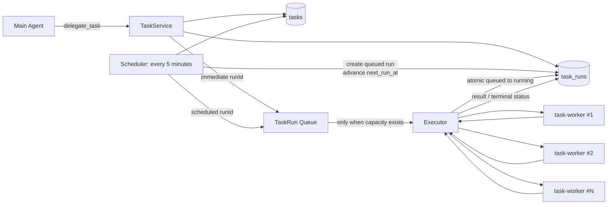
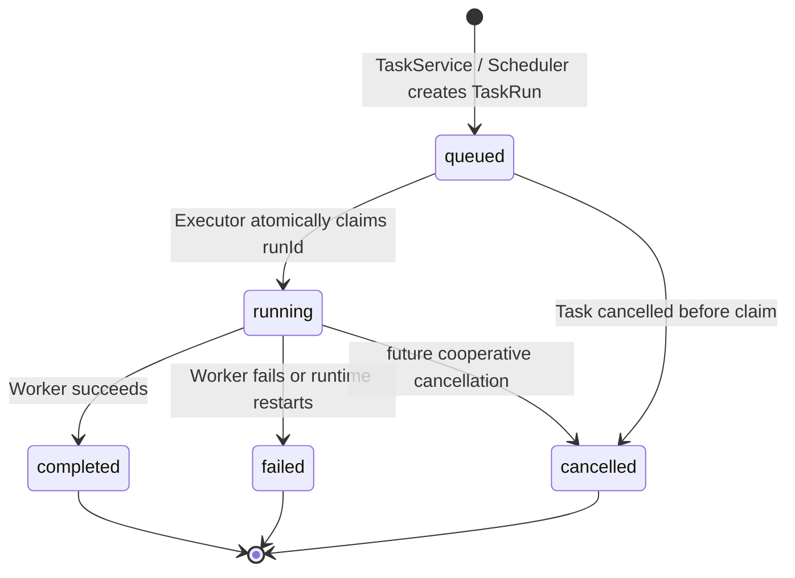

# Fanto Agent Task System

> 日期：2026-09-26；更新：2026-09-27
> 状态：设计方案
> 目标：在 Agent Runtime 内建立统一的后台任务系统：Main Agent 委派任务，Scheduler 生成并投递待执行 Run，具备容量控制的 Executor 调度多个独立 Worker 异步执行。
> 边界：Task 完全属于 `apps/agent`，不依赖 Business Server 数据库。旧 `agent_tasks / TaskRunner / POST /api/agent/tasks` 整体删除，不做兼容迁移。

## 1. 已确认的设计决策

| 决策 | 结论 |
| --- | --- |
| 执行交接 | Scheduler 与 Executor 异步交接；队列消息只含 `runId`。 |
| 状态事实来源 | Agent SQLite 中的 `tasks`、`task_runs` 是唯一事实来源；队列不是状态或结果来源。 |
| 定时扫描频率 | Scheduler 每 5 分钟扫描到期 Task。定时任务允许 0–5 分钟启动延迟。 |
| 立即任务 | `delegate_task(immediate)` 持久化 Run 后立即投递，不等待下一轮扫描。 |
| Worker 并发 | 单机并发数由 `AGENT_TASK_WORKER_CONCURRENCY` 配置，默认 `1`。 |
| 重复投递 | 允许。Executor 必须用数据库原子领取，确保一个 Run 最多启动一次 Worker。 |
| 补偿扫描器 | 第一版不实现。数据库成功但队列投递失败的 Run 会停在 `queued`，记录错误并由人工处理。 |

## 2. 核心模型与职责

```text
Task（长期定义） 1 ── N TaskRun（一次实际执行）
```

- **Task**：用户委托的任务定义、触发规则和生命周期。
- **TaskRun**：某一期实际执行，保存其逻辑计划时间、状态与结果。
- **TaskService**：创建、暂停、恢复、取消 Task；立即任务创建 Run 后投递。
- **TaskScheduler**：每 5 分钟为到期 Task 创建 Run、推进 `next_run_at` 并投递新 Run；绝不执行 Agent。
- **TaskRunQueue**：可靠传递 `{ runId }` 的队列抽象，仅负责唤醒 Executor。
- **TaskExecutor**：按本机空闲 Worker 槽位消费消息，原子领取 Run，启动独立 Worker。
- **task-worker**：仅执行 TaskRun，不决定 Task 生命周期。



## 3. Main Agent 入口：`delegate_task`

`delegate_task` 是 Main Agent 创建 Task 的唯一入口。模型只能传递用户意图，调用上下文补充用户身份与来源信息。

```ts
delegate_task({
  title: string,
  instruction: string,
  trigger:
    | { type: "immediate" }
    | {
        type: "scheduled";
        schedule:
          | { type: "once"; at: string; timezone: string }
          | { type: "recurring"; rrule: string; timezone: string; startAt?: string };
      },
  output?: {
    type: "text" | "markdown" | "html" | "file";
    description?: string;
    filename?: string;
  }
})
```

不向模型开放 `userId`、`sessionId`、`sourceMessageId`、`status`、`nextRunAt`、`workerAgentId`、优先级或队列参数。

`instruction` 必须自包含。Worker 不依赖 Main Agent 的聊天记录理解任务。

### 3.1 委派流程

```text
Tool schema / trigger validation
  → 从 Run Context 补充 userId、sourceSessionId、sourceMessageId
  → TaskService.delegate()
  → 持久化 Task（和 immediate TaskRun）
  → immediate：事务提交后投递 runId
  → 返回 taskId / runId / nextRunAt
```

Tool 不启动 Worker，也不等待结果。若立即任务的队列投递失败，Tool 返回已创建的 Task/Run，但必须让 Main Agent 获得可观测的失败信息，不能声称任务已开始执行。

## 4. 调度与投递

### 4.1 `next_run_at` 的含义

`next_run_at` 是 **下一次应产生 TaskRun 的逻辑计划时间**；不是 Worker 空闲时间、最近一次开始时间或完成时间。

- immediate：创建 Run 时 `scheduled_at = now`，Task 的 `next_run_at = NULL`。
- scheduled once：创建时 `next_run_at = at`；首次生成 Run 后置空。
- scheduled recurring：创建时为 RRULE 首次 occurrence；每次生成 Run 后推进到下一次 occurrence。

Worker 成功、失败、拥塞均不得阻止周期 Task 推进下一期的 `next_run_at`。

### 4.2 Scheduler（每 5 分钟）

查询：

```sql
SELECT *
FROM tasks
WHERE status = 'active'
  AND trigger_type = 'scheduled'
  AND next_run_at IS NOT NULL
  AND next_run_at <= :now
ORDER BY next_run_at
LIMIT :batch_size;
```

每个到期 Task 在同一数据库事务中执行：

```text
current = task.next_run_at
INSERT task_runs(status = queued, scheduled_at = current)
UPDATE tasks SET next_run_at = next occurrence（once 为 NULL）
COMMIT
```

事务提交后，仅对**本次新插入**的 Run 投递 `{ runId }`。`UNIQUE(task_id, scheduled_at)` 防止 Scheduler 重复扫描产生同一期的两个 Run。

若队列投递失败：

```text
TaskRun 保持 queued
记录 queue_publish_error / 日志 / 指标告警
不回滚已提交的 Run 或 next_run_at
第一版不自动重投，待人工重新投递该 runId
```

这是一项明确的一期限制。后续可增加 queued Run 补偿扫描器或 transactional outbox，但二者均不属于本次范围。

### 4.3 延迟与积压

- 到期时间距离下一次扫描最多约 5 分钟，属于正常调度延迟。
- Run 创建后如无 Worker 容量，会留在队列中等待，不改变其 `scheduled_at`。
- 周期 Run 可因队列积压而与下一期重叠；这是允许的。并发上限控制资源，而不是丢弃计划执行。

## 5. 队列与 Executor

### 5.1 `TaskRunQueue` 契约

队列适配层暴露最小能力：

```ts
type TaskRunQueue = {
  publish(input: { runId: string }): Promise<void>;
  consume(options: {
    concurrency: number;
    onMessage: (input: { runId: string }) => Promise<void>;
  }): Promise<QueueConsumer>;
};
```

消息正文只能包含 `runId`。Executor 一律从数据库读取 Task、TaskRun、指令、用户归属和输出定义，不能信任消息内的业务字段。

第一版采用至少一次投递语义：重复消息是正常情况。队列确认发生在 Executor 已成功完成数据库领取并启动本地 Worker 后；队列不追踪最终成功或失败。

### 5.2 Executor 容量模型

```env
# 每个 Agent Runtime 进程同时执行的 task-worker 数量
AGENT_TASK_WORKER_CONCURRENCY=1
```

约束：

1. 配置必须是正整数；默认 `1`。启动日志写明生效值。
2. Executor 的消费并发/预取上限不得超过该值。
3. 每个空闲槽位一次只执行一个 Run；Run 终态后才释放槽位。
4. 没有空闲槽位时停止拉取新消息，而不是先取走消息后在进程内排队。
5. 每个 Run 建立新的 `task-worker` Session，绝不复用 Main Chat Session 或另一 Run 的 Worker Session。

单机并发数控制的是本进程资源。当前持久化使用 SQLite，第一版只支持单个 Agent Runtime 进程拥有此数据库；未来多机/多进程扩容前必须迁移为共享数据库并重新验证原子领取语义。

### 5.3 原子领取与执行

Executor 收到队列消息后的固定流程：

```text
等待空闲 Worker 槽位
  → 按 runId 条件更新 queued → running
  → 若未返回记录：确认/忽略重复、取消或已领取消息
  → 创建 worker session
  → 启动 task-worker
  → 确认队列消息，保持本地槽位占用
  → Worker 结束：写 terminal status / result / error，释放槽位
```

领取 SQL 必须等价于：

```sql
UPDATE task_runs
SET status = 'running', started_at = :now, updated_at = :now
WHERE id = :run_id
  AND status = 'queued'
RETURNING *;
```

同一个 `runId` 被重复投递、多个 Executor 竞争、或一次消费回调重试时，只有一个调用可拿到记录并启动 Worker。

### 5.4 Worker 结束与进程重启

- Worker 成功：Run → `completed`，持久化 `result`、`finished_at`。
- Worker 异常：Run → `failed`，持久化受限长度的安全错误、`finished_at`。
- 取消：领取前 Run/Task 已取消则不启动；运行中取消为后续能力，第一版不承诺强制中止模型调用。
- 进程启动时：遗留 `running` Run 标为 `failed`，错误为“Agent Runtime 在 Worker 运行时重启”。第一版不自动重放。

单次 immediate / scheduled once Task 的唯一 Run 到终态后，Task 也变为 `completed` 或 `cancelled`；周期 Task 在某期 Run 终态后保持 `active`。

## 6. 数据模型

```sql
CREATE TABLE tasks (
  id                  TEXT PRIMARY KEY,
  user_id             TEXT NOT NULL,
  title               TEXT NOT NULL,
  instruction         TEXT NOT NULL,
  trigger_type        TEXT NOT NULL CHECK (trigger_type IN ('immediate', 'scheduled')),
  trigger             TEXT NOT NULL,
  output              TEXT,
  status              TEXT NOT NULL CHECK (status IN ('active', 'paused', 'completed', 'cancelled')),
  next_run_at         TEXT,
  source_session_id   TEXT,
  source_message_id   TEXT,
  created_at          TEXT NOT NULL,
  updated_at          TEXT NOT NULL
);

CREATE TABLE task_runs (
  id                  TEXT PRIMARY KEY,
  task_id             TEXT NOT NULL,
  user_id             TEXT NOT NULL,
  status              TEXT NOT NULL CHECK (status IN ('queued', 'running', 'completed', 'failed', 'cancelled')),
  scheduled_at        TEXT NOT NULL,
  worker_session_id   TEXT,
  queue_published_at  TEXT,
  queue_publish_error TEXT,
  result              TEXT,
  error               TEXT,
  started_at          TEXT,
  finished_at         TEXT,
  created_at          TEXT NOT NULL,
  updated_at          TEXT NOT NULL,
  FOREIGN KEY(task_id) REFERENCES tasks(id)
);

CREATE UNIQUE INDEX uq_task_runs_task_scheduled_at
ON task_runs(task_id, scheduled_at);

CREATE INDEX idx_tasks_due
ON tasks(status, trigger_type, next_run_at);

CREATE INDEX idx_tasks_user_status
ON tasks(user_id, status);

CREATE INDEX idx_task_runs_task_created
ON task_runs(task_id, created_at DESC);

CREATE INDEX idx_task_runs_user_created
ON task_runs(user_id, created_at DESC);

CREATE INDEX idx_task_runs_status_created
ON task_runs(status, created_at);
```

- JSON 类型的 `trigger`、`output`、`result`、`error` 使用 SQLite `TEXT` 存储。
- `scheduled_at` 是该 Run 对应的逻辑计划时间，不能为 NULL；立即任务使用 Run 创建时刻。
- `queue_published_at` / `queue_publish_error` 仅用于投递可观测性和人工恢复，不改变 Run 生命周期。
- 一期只支持一个主要 artifact；结果内嵌 JSON，不创建 artifacts 表。

## 7. 状态机



`queued` 代表数据库已准备执行，不等于消息已成功进入队列；是否投递成功以 `queue_published_at` / `queue_publish_error` 表示。该区分使“提交成功但投递失败”的一期限制可观察且可人工恢复。

## 8. Worker、身份与数据边界

`agents.yaml` 新增 `task-worker` Agent Definition。Worker 只接收由 Executor 组装的自包含任务上下文。

必须保持：

1. `userId` 只来自 TaskRun 的受信持久化记录，不能来自 Tool 或队列消息。
2. 任务执行所需的 Business Server 授权不能依赖旧 TaskRunner 的进程内 `Map<taskId, accessToken>`；定时任务和重启后任务没有原请求 Token。
3. 设计并实现 Worker 调用业务 API 所需的服务端委派身份方案之前，`task-worker` 不开放需要用户授权的 Record/Preference 写能力。
4. Worker Session 与 Main Session 分离，工作区也分离；Session 不能成为跨用户数据通道。

该“委派身份”是执行前置条件，不能用持久化用户 Access Token 替代。

## 9. API 与可见结果

新 Task HTTP API 只服务于客户端读取和用户操作：用户只能读取/暂停/恢复/取消自己的 Task，读取自己的 Run 历史和结果。每个 Repository 查询都必须带 `user_id` 条件，不能依赖路由层过滤。

本方案保证结果落在 `task_runs.result`。任务完成后的主动通知、聊天消息回填和 artifact 下载协议需在客户端交付设计中单独定义；未定义前不能宣称会自动通知用户。

## 10. 模块结构

```text
apps/agent/
├── agents.yaml
├── prompts/task-worker.md
└── src/
    ├── tools/delegate-task.ts
    ├── tasks/
    │   ├── model.ts
    │   ├── repository.ts
    │   ├── service.ts
    │   ├── scheduler.ts
    │   ├── queue.ts
    │   ├── executor.ts
    │   └── index.ts
    └── http/tasks.ts
```

旧 `AgentTaskRepository`、`TaskRunner`、`agent_tasks` schema 和旧 `POST /api/agent/tasks` 的“复用当前会话异步执行”语义全部移除。

## 11. 验证标准

至少覆盖：

1. immediate Task 落库后立即发布 `runId`，Main Agent 不等待结果。
2. Scheduler 对到期 once / recurring Task 每 5 分钟扫描，并正确创建 Run、推进 `next_run_at`。
3. 重复扫描同一期不会创建重复 Run。
4. 重复队列消息只会启动一次 Worker。
5. 并发数为 N 时，最多同时运行 N 个 Worker；槽位释放后才消费后续消息。
6. 成功、失败、取消和重启后的状态转移正确；周期 Task 不因某一期失败停止。
7. 队列投递失败会保留 `queued` Run 并记录可观测错误。
8. 用户隔离查询与 Task Worker 身份边界有效。

模块验证入口：

```bash
pnpm --filter @fanto/agent typecheck
pnpm --filter @fanto/agent test
pnpm --filter @fanto/agent build
```

## 12. 非目标与后续演进

第一版不包含 queued Run 自动补偿扫描、transactional outbox、自动重试、运行中强制取消、优先级、分布式多进程执行或自动用户通知。它们必须建立在本方案的持久化 Run、幂等领取和队列适配边界之上，不能反向改变这些事实来源与状态机。
