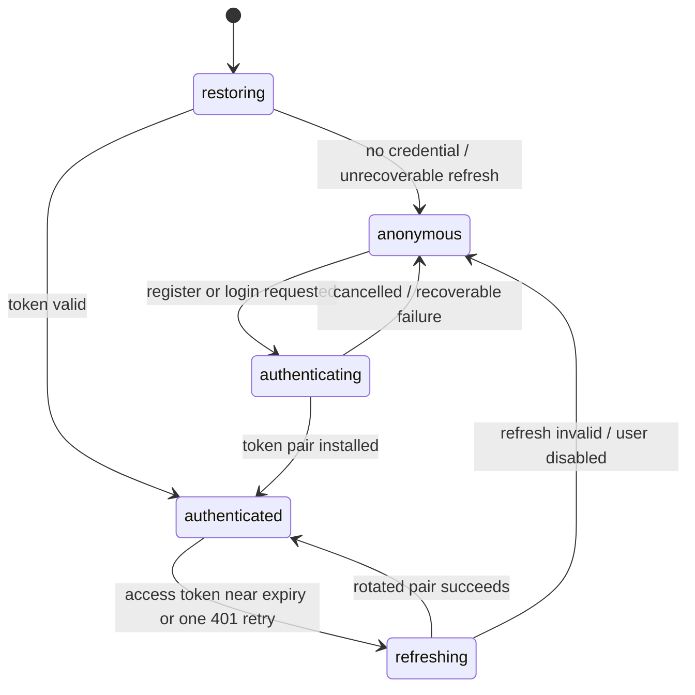

# iOS Google OAuth 账号体系设计

## 目标与边界

目标是在 iOS 端移除任何以本地 `userId`、固定 token 或调用方传入用户身份为基础的旧用户逻辑，建立以 Fanto access JWT 为唯一业务身份的标准账号入口；首个登录方式为 Google。本期只交付“欢迎页 → 注册/登录页 → Google 系统授权 → 已认证主页”的闭环，包含启动恢复、凭证刷新和常见失败状态。

本方案以当前 Server 的 AuthService 和路由为事实基线，而不是重做 OAuth 协议：

- 已有公开接口：`POST /api/auth/intents`、`/registrations`、`/logins`、`/tokens/refresh`；
- 已有受保护接口：`GET /api/users/me`，以及身份绑定和解绑接口；本期不消费它们；
- Google ID token 必须携带服务端发放的 nonce，服务端验证签名、issuer、audience、expiry、sub、nonce；
- 所有业务 API 仍只接受 `Authorization: Bearer <Fanto access JWT>`，不接收 `userId`、`x-user-id` 或 Google token；

不在本期做：任何“我的”/设置页、退出登录入口、账号资料展示、身份绑定或解绑、设备会话管理、token 撤销、密码、邮箱验证码、手机号、社交关系、头像编辑、账号合并、用户自行删除账号和 Apple 登录。后续接入 Apple 时再扩展 provider；本期不为尚未出现的 provider 建立抽象层。

## 体验原则

采用 SwiftUI **standard** profile：原生导航、系统 `Form`/`List`/`sheet`/`alert`，克制的单一品牌色，内容优先。认证是安全和高频中断场景，不使用自定义全屏手势、复杂玻璃效果或装饰性动画。

- 认证状态由一个 `@MainActor` 的 `AuthenticationStore` 唯一拥有；token 的读取、刷新、替换和清除由一个 `actor` 唯一拥有。
- 页面只表达状态，不能在 `body` 内发起网络、Keychain 或 Google SDK 操作。
- 所有可取消的异步操作与当前认证流程绑定；用户取消 Google 面板不会显示错误，也不会改变登录状态。
- 本期认证后的用户作用域以认证接口返回的 `AuthUser` 为准；ID token、refresh token 和 signed URL 不进入 `UserDefaults`、日志、分析事件或 SwiftUI 状态快照。
- refresh 无效或用户被禁用时，先清除全部用户作用域的内存状态，再切回欢迎页，防止旧账号内容闪现。

## 信息架构与页面设计

### 1. 启动恢复页

启动时显示全屏、不可交互的 `ProgressView` 和“正在恢复登录状态”。它不是 Launch Screen 的替代品，只在 Keychain 与必要的 refresh 校验期间出现。

结果只有三种：

| 结果 | 去向 | 行为 |
| --- | --- | --- |
| 有效 access token | 主 Tab | 使用 Keychain 中的 `AuthUser` 建立用户作用域，后台按原业务节奏预加载数据 |
| access token 临近到期、refresh 有效 | 主 Tab | 原子刷新 token 对，并使用返回的 `AuthUser` 更新用户作用域 |
| 无凭证、refresh 无效、用户已禁用 | 欢迎页 | 删除本地凭证和用户作用域运行态；禁用时显示一次可理解说明 |

### 2. 欢迎页

`WelcomeView` 使用 `NavigationStack`。纵向结构为：品牌标识、标题“把生活线索留给自己”、一段说明、主操作、辅助登录、隐私说明。

- 主按钮：Google 官方 `GoogleSignInButton`，文案随上下文为“使用 Google 创建账号”或“使用 Google 登录”；不伪造 Google 品牌按钮。
- 默认入口是“创建 Fanto 账号”；底部文字按钮“已有账号？登录”。进入登录页后反向提供“还没有账号？创建账号”。
- 注册页在 Google 按钮前以简短文案说明“继续即表示同意服务条款与隐私政策”，链接使用 `Link`；服务端随注册请求记录已同意的条款版本后才创建用户。
- 登录和注册不使用 segmented picker。它会让两个语义完全不同的操作抢占同一主页面，也不利于 VoiceOver 解释当前行为。
- 提交期间 Google 按钮禁用并展示原位 loading；保留返回或取消入口。不会在自定义蒙层下阻塞系统 Google 授权界面。

### 3. Google 授权与结果页内反馈

系统 Google 授权面板由 SDK 展示。回到 App 后根据服务器错误给出页面内可行动反馈，不使用不可恢复的全屏错误页：

| 业务错误 | 用户文案与操作 |
| --- | --- |
| `IDENTITY_NOT_REGISTERED` | “这个 Google 账号尚未创建 Fanto 账号。”主操作：创建账号 |
| `IDENTITY_ALREADY_REGISTERED` | “这个 Google 账号已有 Fanto 账号。”主操作：直接登录 |
| `CHALLENGE_INVALID` / `INVALID_PROVIDER_PROOF` | “验证已过期或未完成，请重新使用 Google 继续。”重试 |
| `USER_DISABLED` | “此账号目前不可用。”无自动重试，提供支持入口 |
| 网络 / 5xx / 限流 | 明确失败原因与“重试”；限流显示稍后再试，不倒计时猜测 |
| 用户取消 | 无错误、停留在原页 |

错误区通过语义 `ContentUnavailableView` 或 `Label` 表达，除颜色外始终有图标和文字；异步失败使用 VoiceOver announcement。

### 4. 认证后主页

认证完成才创建 `AppRootView` 的业务子树。首页维持“记录 / Fanto / 脉络”三个 peer tabs；删除现有“我的”Tab 及其 `AccountView`，不把登录页放入 TabView。

认证成功后直接进入“记录”Tab，并按现有策略开始加载业务数据。主页不显示用户 UUID、登录方式、退出入口或设置入口。欢迎、注册和登录页面应支持最大香蕉字体、深浅色、增加对比度和 Reduce Transparency；所有触控目标使用系统控件，不靠颜色表达加载或错误。

## 认证状态机



建议类型：

```swift
enum AuthenticationState: Equatable {
    case restoring
    case anonymous(presentation: AuthEntryPresentation)
    case authenticating(flow: AuthFlow)
    case authenticated(CurrentUser)
}

enum AuthFlow: Equatable { case register, login, reauthenticate }
enum AuthEntryPresentation: Equatable { case welcome, register, login }
```

`AuthenticationStore` 只处理屏幕状态、用户动作和可展示错误。`AuthSession` actor 只处理持久化凭证与 refresh 去重；两者都不拥有业务 Store。认证成功后才创建业务根树；refresh 无效时应用根统一执行 `FantoStore.resetUserData()`、释放 `ConversationStore` 和当前用户 session key，再回到欢迎页。

## 前后端交互

### 注册 / 登录序列

```mermaid
sequenceDiagram
    participant I as iOS
    participant F as Fanto Server
    participant G as Google
    I->>F: POST /auth/intents {purpose, provider:"google"}
    F-->>I: intentId, nonce, expiresAt (10 min)
    I->>G: Google Sign-In(nonce, iOS client ID, server client ID)
    G-->>I: Google ID token
    I->>F: POST /auth/registrations or /auth/logins {intentId, proof:{idToken}}
    F->>G: verify JWT signature / issuer / audience / exp / nonce
    F->>F: consume challenge; create or find identity; issue pair
    F-->>I: user summary, access JWT, refresh JWT, expiry times
    I->>I: atomically save pair in Keychain
    I->>I: create authenticated app scope
```

现有 `intent → Google nonce → proof` 链路必须保留。iOS 不交换 Google authorization code，也不向业务 API 转发 Google token。`GIDServerClientID` 对应 Web/Server client ID，必须同时列入 Server 的 `GOOGLE_ALLOWED_CLIENT_IDS`；`GIDClientID` 和 reversed URL scheme 对应 iOS client ID。

### 受保护请求、刷新与一次重试

本期保持现有业务 Client 的边界，认证层只负责凭证安装、恢复和刷新。业务 Client 继续从 `AuthSession` 获取 Fanto access token，并保持 `Authorization: Bearer <token>`。

1. 请求前 `AuthSession.accessToken()`：token 剩余不满 60 秒则合并到唯一 refresh task。
2. 首次 401（仅 `UNAUTHENTICATED`）时，调用 `forceRefresh()`，以新 token **仅重放一次**原请求。
3. refresh 成功：Keychain 原子覆盖整对 token；等待同一 task 的请求读取同一新 pair。
4. refresh 无效或账号 disabled：清 Keychain，发布 auth-invalidated 事件，应用根清空用户 scope，回欢迎页。
5. 网络、解码和普通业务 4xx 不触发 refresh，避免请求风暴与错误掩盖。

当前 `Notification.Name` 可在此重构中改为 Swift 6 的具类型 main-actor message；如项目 Xcode/Swift 配置无法支持，则保留单一私有 notification，并禁止携带 token 或用户资料。

### 服务端范围

现有 `/auth/intents`、`/auth/registrations`、`/auth/logins` 和 `/auth/tokens/refresh` 已覆盖本期所需流程，Server 不新增账号、设置、退出或设备会话接口。客户端只需对现有稳定错误码做本地化映射。服务端日志继续脱敏 `Authorization`、ID token、refresh token 和 nonce。

错误契约应保持统一响应信封，并为认证错误稳定返回 `errorCode`。服务端 access log 必须继续脱敏 `Authorization`、id token、refresh token、nonce、email / displayHint。速率限制从进程内 map 升级为部署层或共享存储，才能在多实例下真实生效。

## iOS 代码变更结构

```text
apps/ios/fanto/fanto/
  Authentication/
    Models/
      AuthenticationState.swift        # 页面状态、AuthFlow、CurrentUser、Identity
      AuthCredentials.swift            # 仅 token pair 与到期时间
      AuthenticationError.swift        # 可展示、可测试的错误分类
    API/
      AuthAPIClient.swift              # intent/register/login/refresh
      AuthDTO.swift                    # API DTO，不泄露到 View
    Session/
      AuthSession.swift                # actor：keychain、refresh 去重
      AuthCredentialStore.swift        # Keychain read/write/delete；整对凭证原子替换
    Providers/
      GoogleAuthenticationProvider.swift # Google SDK；只输出短生命 ID token
    UI/
      AuthenticationGateView.swift
      WelcomeView.swift
      RegistrationView.swift
      LoginView.swift
      AuthFeedbackView.swift
    AuthenticationStore.swift          # @MainActor，唯一 UI 状态 owner
  App/
    AppRootView.swift                  # 只接收 authenticated scope，不自行猜测用户
  Networking/
    CreationAPIClient.swift            # 迁移到 AuthenticatedHTTPClient
    AgentAPIClient.swift               # 迁移到 AuthenticatedHTTPClient
```

保留现有 `Authentication` 目录中的概念，但按职责拆分，避免把 View、Google SDK、URLSession 和 Keychain 全塞入一个 Store。优先使用 concrete types；在当前仅有 Google provider 时不要为“可能的多 provider”建立协议树。将来接入 Apple 时再以一个小的 `IdentityProvider` 抽象收敛两个真实实现。

认证结果中的 `AuthUser` 仅用于建立已认证状态和用户作用域；本期没有账号资料页面，因此不读取或展示 `/users/me` 的身份资料。

现有需要替换或迁移的风险点：

- 把 `AuthenticationGateView` 中的 segmented “登录 / 创建账号”改为独立、语义明确的入口页面；
- 删除 `AccountView` 和 `AppRootView` 中的“我的”Tab；
- `AuthSession` 失效通知由认证 Gate 接收，并在回欢迎页前重置现有业务 Store；
- Google SDK 回调应通过 `onOpenURL` 保持；配置占位值必须在运行前检查，不能发起无效授权。

## 数据与安全约束

- Keychain service 按 bundle ID 命名；access / refresh pair 使用 `kSecAttrAccessibleAfterFirstUnlockThisDeviceOnly`，不允许 iCloud 同步。若未来不需要后台读取，则改为 `WhenUnlockedThisDeviceOnly` 并验证所有后台路径。
- 存储、替换、删除 token pair 都必须作为一个完整 session 进行；不得留下新 access + 旧 refresh 的半更新状态。
- 绝不将 Google ID token、Fanto access/refresh token、nonce、email、完整 UUID 写入 `Logger` 的 public 字段、崩溃标记或 UI 错误。
- records、media、agent 请求全部由 server-side JWT `sub` 作用户边界；客户端过滤只是展示优化。
- 启动、恢复和刷新过程中都检查 task cancellation；不会让已过期的异步结果覆盖较新的认证状态。
- Google Cloud Console 分别配置 Debug / Release bundle ID、iOS client ID、reversed scheme 和 Server client ID；受信任的 server client ID 仅配置在服务端环境变量，不提交真实值。

## 验证与验收

### 自动化

1. `AuthAPIClient` 用 URLProtocol fixture 覆盖 intent、注册、登录、refresh、`/me`、错误信封和时间格式。
2. `AuthSession` 覆盖空 Keychain、有效 access、60 秒内 refresh、并发 10 请求只 refresh 一次、refresh 失败清理和写入失败不留下半会话。
3. `AuthenticationStore` 覆盖取消、登录与注册互相引导、账号禁用、重复点击及恢复竞争。
4. Server 覆盖 challenge 一次性使用、nonce/aud/iss/exp/sub 验证、identity 唯一性、用户隔离和所有响应脱敏。
5. XCUITest（真 Google 登录以 test seam / staging account 控制）覆盖欢迎、错误恢复、启动恢复与回到登录页。

### 人工与设计质量门

- 真机完成 Debug Google 注册、随后冷启动恢复、refresh 和既有账号登录；验证业务请求没有 `x-user-id`。
- 测试网络断开、OAuth 取消、challenge 过期、服务端 429/5xx、用户禁用、后台/前台切换和并发请求。
- 在最小 iPhone、横竖屏、iPad 窄/宽窗口、深浅色、最大辅助功能字号、Bold Text、VoiceOver、Reduce Motion、Reduce Transparency、Increase Contrast、Differentiate Without Color 下检查欢迎、注册和登录页。
- 快速连续点击 Google 按钮、刷新中切后台再回来，状态机不得进入重复 sheet、死 loading 或错误账号。
- 在实现后运行 iOS scheme build、相关测试及 SwiftUI UI audit；若没有真机或 OAuth staging 配置，明确记录为未验证，不以静态检查宣称完成。

## 成功标准

用户无需输入或看到内部 user ID，即可创建或登录 Fanto 账号并进入主页；Google token 只用于一次 server proof；Fanto token 只存在 Keychain；所有业务请求身份都来自 Bearer JWT；会话过期可无感恢复或清楚地回到欢迎页；每条认证错误都可理解且可恢复或说明原因。
