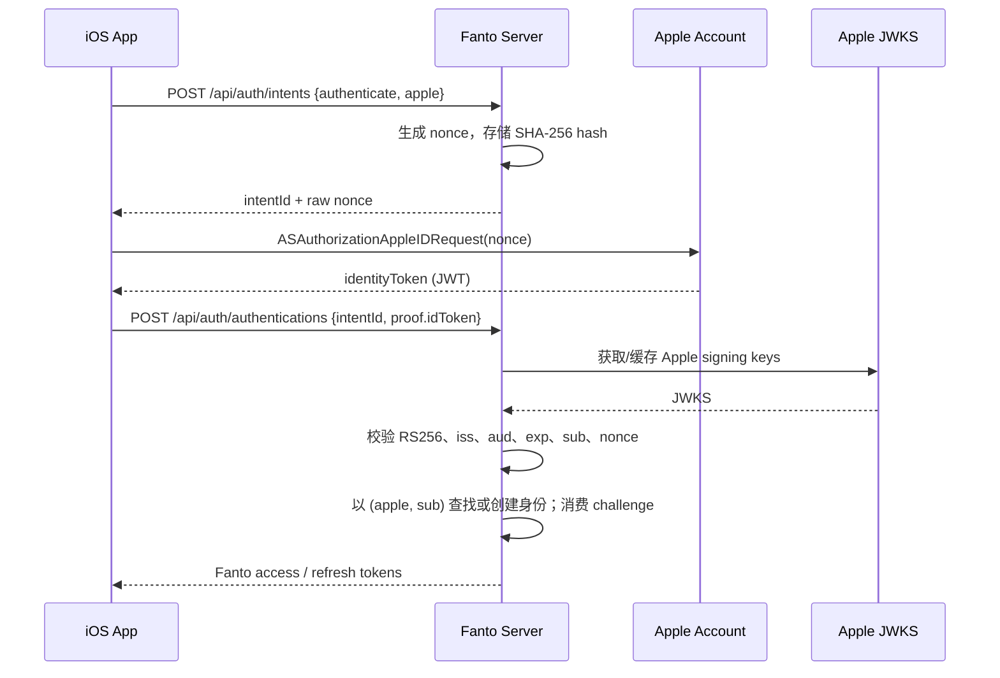

# Apple ID 登录接入方案

## 目标与范围

在保留现有 Google 登录与统一 `authenticate` 语义的前提下，为 iOS 增加 Sign in with Apple。Apple 成功认证后复用现有 Fanto 用户、身份、challenge 和 access/refresh JWT 体系；首次 Apple 登录自动创建 Fanto 用户，后续以 Apple `sub` 登录同一用户。

本方案不实现网页端 Apple 登录、Apple 授权码换取 refresh token、Apple 邮件投递、账号管理 UI 或 Google 网络问题的绕过。

## 已确认的现状

- Server 的认证路由已接受 `provider: "apple"`，但启动时只注册 `GoogleIdentityProvider`，因此 Apple 目前不可用。
- `AuthService.authenticate` 已按 `(provider, provider_subject)` 原子查找或创建用户，可直接复用；`auth_challenges` 已包含 nonce hash 与一次性消费语义。
- iOS 当前通过 Server intent 获取 nonce，Google SDK 取得 ID Token 后调用 `POST /api/auth/authentications`。
- iOS Bundle ID 为 `com.robinverse.fanto`。
- 生产服务器已实测能从 Node 访问 `https://appleid.apple.com/auth/keys` 并取得 JWKS；这是 Apple JWT 验签的外部网络前置条件。

## 目标链路



## 设计决策

### 接口与数据

继续使用现有通用请求体，不增加 Apple 专用 HTTP endpoint：

```json
{ "purpose": "authenticate", "provider": "apple" }
```

随后提交：

```json
{ "intentId": "...", "proof": { "idToken": "..." } }
```

Apple ID Token 的 `sub` 是唯一身份键；不以 email、Apple credential 的本地 `user` 字段或姓名作为身份键。只将已验证 token 的 email 转为现有脱敏 `display_hint`。姓名仅首次授权可能返回，且当前数据模型没有 profile 字段，因此本次不持久化。

### Server 验证

新增 `AppleIdentityProvider`，结构与 Google Provider 对齐：

- JWKS：`https://appleid.apple.com/auth/keys`；
- 算法仅 `RS256`；
- issuer：`https://appleid.apple.com`；
- audience：配置的 `APPLE_ALLOWED_CLIENT_IDS`，原生 iOS 首值为 `com.robinverse.fanto`；
- 必须存在非空 `sub` 与 `nonce`，并以当前 challenge 的 nonce hash 做常量语义比对；
- 签名、issuer、audience、expiry、claim 或 nonce 任一不合格均不创建用户、不签发 Fanto token，且 challenge 保持未消费。

Apple 的 JWKS 可由 `jose` 的 remote JWK set 缓存；不得固定公钥、跳过签名校验，或信任客户端提交的 Apple `user` 值。

### iOS 实现

使用系统 `AuthenticationServices`，不添加第三方 SDK。Provider 封装负责：将 Server 原始 nonce 放入 `ASAuthorizationAppleIDRequest.nonce`、请求 `.fullName` / `.email`、保留 `ASAuthorizationController` 生命周期、将 `identityToken` 以 UTF-8 转为 String，并把用户取消与系统错误映射为既有 `AuthenticationError`。

`AuthenticationStore` 统一编排 intent → provider token → `/auth/authentications` → 安装 Fanto session；Google 与 Apple 只在创建 intent 的 provider 值和获取 ID Token 的步骤不同。登录页使用系统 `SignInWithAppleButton`，与 Google 按钮使用同一提交中状态，避免并发认证。

### 配置与平台前置条件

Server 增加必填环境变量：

```env
APPLE_ALLOWED_CLIENT_IDS=com.robinverse.fanto
```

只存 Client ID，不需要 Apple private key、Key ID 或 Team ID；那些仅在授权码换 token、刷新/撤销 Apple token 等不在本范围的场景才需要。

Apple Developer 后台须启用 `com.robinverse.fanto` 的 Sign in with Apple（Primary App ID）；Xcode target 添加同一 capability，产生并提交相应 entitlement，且重新生成含该能力的 profile。

## 失败语义与可观测性

对客户端继续返回通用且不泄露 token 细节的 `INVALID_PROVIDER_PROOF`。Server 日志需以结构化、无敏感信息的原因标签区分 `jwks_fetch_failed`、`invalid_signature`、`invalid_issuer`、`invalid_audience`、`expired_token`、`missing_claim` 与 `nonce_mismatch`。日志不得记录 ID Token、authorization code、email 或原始 nonce。

## 验证与验收

- Server provider 单元测试覆盖合法 token 与每个关键拒绝分支，JWKS 使用本地测试 key/mock，不依赖实时 Apple。
- Server 路由测试覆盖 Apple intent 和 proof 到统一 endpoint 的透传。
- `pnpm --filter @fanto/server typecheck` 与 `pnpm --filter @fanto/server test` 均通过。
- Xcode 成功构建，真机验证首次授权、取消、再次登录及 Apple “隐藏我的邮箱”。
- 生产部署前后从同一 Node 运行时验证 `https://appleid.apple.com/auth/keys` 返回 200，随后使用测试 Apple ID 完成端到端登录。

