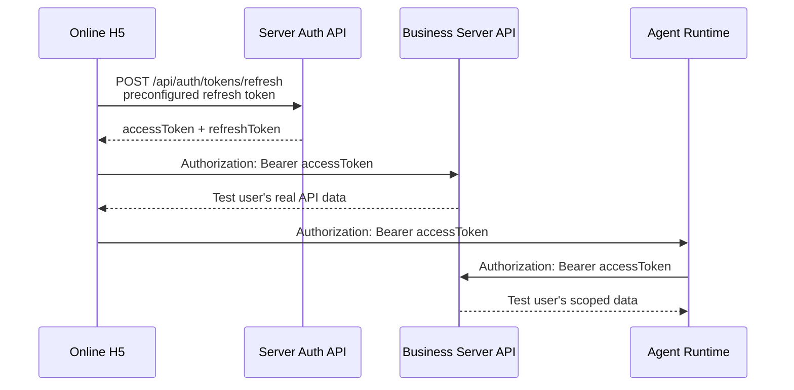

# 线上 H5 免登录测试认证方案

> 日期：2026-09-27  
> 状态：待实施  
> 目标：在不依赖 Google / Apple 登录的情况下，让线上部署的 H5 以固定测试用户身份调用真实 Server 与 Agent 接口；认证仍使用现有 Fanto JWT refresh / access 流程。

## 1. 范围与结论

本方案不增加 Server 的测试登录接口，不修改现有 JWT 验签、用户隔离或第三方登录流程。

线上 H5 预置一个由 Server 正常签发的 refresh token。H5 启动时调用现有 `POST /api/auth/tokens/refresh` 换取短期 access token；业务请求与 Agent 请求携带该 access token。

测试用户固定为：

```text
h5-online-test
```

若已有待复用数据归属于另一个用户 ID，则以该已有用户 ID 替代上述值；Token 的 `sub`、`users.user_id` 和全部测试数据 `user_id` 必须完全一致。



## 2. 服务端数据准备

### 2.1 必须存在的用户记录

Refresh 后的 access token 会通过现有中间件验证，并在业务请求时调用 `AuthService.assertActiveUser()`。因此只需确保：

```sql
INSERT INTO users (user_id, status, created_at, updated_at, disabled_at)
VALUES ('h5-online-test', 'active', now(), now(), NULL)
ON CONFLICT (user_id) DO UPDATE
SET status = 'active', updated_at = now(), disabled_at = NULL;
```

不需要创建：

- `user_login_identities`；
- `auth_challenges`；
- Google / Apple proof；
- refresh-token 数据表。

### 2.2 测试数据

Records、Media、Preferences、Creations、向量索引等数据都按现有 schema 写入，且 `user_id = 'h5-online-test'`。Media 同时需要对应可读的 OSS 对象；有附件的 Record 需要使用真实 `media_id`。

业务接口仅按 JWT `sub` 读取数据，因此无需为 H5 额外传递或信任 `X-User-Id`。

## 3. Token 签发与生命周期

在 Server 的受控运行环境中，加载当前 `AUTH_JWT_*` 配置并调用：

```ts
await JwtTokenService.issuePair("h5-online-test")
```

得到的 refresh token 必须满足当前验证契约：

- EdDSA 签名，`kid` 为当前 `AUTH_JWT_ACTIVE_KID`；
- `sub = h5-online-test`；
- `iss = AUTH_JWT_ISSUER`；
- `aud = fanto-refresh`；
- `token_use = refresh`；
- 有 `jti`、`iat` 与未过期 `exp`。

不要手工拼装 JWT，也不要在 H5 或版本库中保存 JWT 私钥。当前 Token Service 一次签发的 access token 同时具备 `fanto-api` 和 `fanto-agent` audience，因此 H5 可用同一个 access token 调用 Business Server 与 Agent Runtime。

当前 refresh token 生命周期为 30 天。H5 每次成功 refresh 后使用服务端响应中的新 refresh token，刷新失败时重新回退到部署时预置的 token；预置 token 过期后重新生成并更新部署环境变量。

## 4. H5 配置与运行时行为

H5 不再使用当前硬编码的 `FANTO_USER_ID`、`FANTO_AGENT_TOKEN` 或 `X-User-Id` 作为认证方式。

线上测试部署只配置：

```env
VITE_H5_TEST_AUTH=true
VITE_H5_TEST_REFRESH_TOKEN=<server-issued-refresh-token>
```

H5 运行时认证模块职责：

1. 仅在 `VITE_H5_TEST_AUTH=true` 时启用；普通构建不启用此逻辑。
2. 启动时以部署 token 调用 `/api/auth/tokens/refresh`。
3. 将最新 access / refresh token 保存到 `sessionStorage`。
4. 所有 Business Server 请求与 Agent 请求统一附加 `Authorization: Bearer <accessToken>`。
5. 收到 `401` 时只重试一次 refresh；成功后重放原请求，仍失败则显示“测试会话失效”。
6. 不发送 `X-User-Id`；用户身份唯一来自 access JWT 的 `sub`。

H5 继续使用相对 `/api/*` 路径。线上反向代理将 `/api` 转发至 Business Server，将 `/api/agent` 转发至 Agent Runtime；不需要向浏览器暴露服务端内部地址。

## 5. Agent Runtime 配置

Agent Runtime 必须配置与 Server 当前签发公钥一致的 `AUTH_JWT_PUBLIC_KEYS`、`AUTH_JWT_ISSUER`，以验证 H5 带来的 access token。Agent 将同一 Token 转发给 Business Server，因此其 Record、Preference、Media Tool 仍受 `h5-online-test` 用户边界限制。

不再使用当前 H5 中的固定 `FANTO_AGENT_TOKEN`。

## 6. 不变的安全与数据边界

本方案虽跳过交互式登录，但不绕过以下运行时事实：

- 所有业务 API 仍要求有效 Bearer access JWT；
- 所有数据查询仍由 JWT `sub` 限定用户；
- access token 过期、refresh token 无效或测试用户 disabled 时，现有接口正常拒绝请求；
- Google / Apple OAuth 代码、配置和最终登录路径不因测试模式而改变。

## 7. 验收标准

1. 线上 H5 首次打开不显示登录页，自动获得 access token。
2. Records、Media、Preferences、Creations 能读取且仅能读取 `h5-online-test` 数据。
3. 创建、更新、删除、上传均按普通 JWT 链路成功，并只写入测试用户数据。
4. Chat 可创建 Agent Session、流式运行，并让 Agent 使用同一用户范围的数据。
5. access token 失效后，H5 能通过 refresh 自动恢复一次请求。
6. 禁用测试用户后，refresh、Business Server 与 Agent 请求均失效。

## 8. 退出方式

停止线上免登录测试时：移除 H5 部署环境变量并重新部署；禁用或删除 `h5-online-test` 用户；随后恢复普通 Google / Apple 登录入口。无需修改 OAuth 配置或删除任何正式认证代码。
