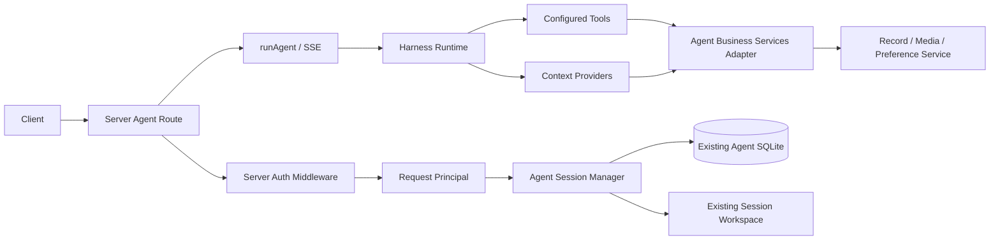

# Agent Runtime 迁入 Server：完整设计

## 目标与已确定边界

将 `apps/agent` 的运行时作为 `apps/server` 的子模块运行，并由 Server 提供 `/api/agent/*` HTTP 接口。此次迁移只改变宿主进程和内部依赖方向，不改变 Agent 的会话存储、Harness 生命周期、SSE 协议、取消语义、Tool 名称或客户端请求格式。

已确定的约束：

- Agent HTTP 请求使用 Server 既有 Bearer JWT 鉴权与 request principal；不再接受、生成或透传 `X-API-Token`、`X-User-Id`。
- Agent Tool 和动态 Context Provider 直接调用所需的领域 `xxx-service`；不得调用 Server Route、HTTP API 或 Repository。
- Pi SQLite Session、`fanto.session_owner` custom entry、Session workspace、Session busy 规则和 `close()` 生命周期保持现状。
- SSE 事件格式、心跳、120 秒超时、客户端断连取消和 `runAgent` 入口保持现状。
- 原独立 `apps/agent` 暂时保留，用作兼容入口与对照实现；通过验证后才删除。
- 仓库是 TypeScript / Node.js 项目。Prompt 保持 Markdown 文件，迁入 `apps/server/agent/prompts/` 并在启动时读取；不引入 Python 运行时。

非目标：不迁移 Session SQLite 到 PostgreSQL；不改变 Pi Session 数据格式；不增加新 Agent 能力；不在本次改造中删除旧 Agent 服务；不重写现有领域 Service。

## 目标调用链



服务依赖只允许沿箭头向右、向下流动。特别禁止：

```text
Tool / Provider -> Server Route
Tool / Provider -> HTTP Client -> localhost Server
Tool / Provider -> Repository
Tool -> 全量 ServerServices 容器
```

## 最终目录结构

```text
agent.yaml

apps/server/src/
├── agent/
│   ├── agent-runtime.ts             # 创建 registry、session manager；暴露 close
│   ├── business-services.ts         # Tool / Provider 所需的最小 Service 适配层
│   ├── harness/definition.ts        # YAML / Prompt 模块加载、校验与 revision 计算
│   ├── context/
│   │   ├── index.ts                  # 仅公开三个 Context API
│   │   ├── run-context.ts
│   │   ├── system-prompt.ts
│   │   ├── transform-context.ts
│   │   ├── internal/slot-store.ts
│   │   └── providers/
│   ├── harness/
│   │   ├── build-runtime.ts
│   │   ├── definition.ts
│   │   ├── events.ts
│   │   ├── hooks.ts
│   │   ├── registry.ts
│   │   └── run.ts
│   ├── sessions/
│   │   └── session-manager.ts
│   ├── tools/
│   │   ├── index.ts
│   │   ├── records.ts
│   │   ├── media.ts
│   │   └── preferences.ts
│   ├── skills/loader.ts
│   └── workspace/
│       ├── bash.ts
│       └── paths.ts
├── routes/
│   └── agent/
│       ├── sessions.ts               # HTTP validation / response mapping only
│       ├── stream.ts                 # SSE bridge only
│       ├── schemas.ts
│       └── errors.ts
├── bootstrap/
│   ├── config.ts                     # 加入 agent 配置（兼容旧变量）
│   ├── app.ts                        # 接收 AgentRuntime，注册 Agent routes
│   └── main.ts                       # 创建 AgentRuntime，关闭时 close
└── domain/                            # 现有服务，保持业务唯一入口

apps/agent/                            # 迁移阶段保留：原进程及对照测试
```

`routes/agent/` 只保留 HTTP 工作，不能反向放进 `agent/`。`agent/business-services.ts` 是进程内适配器，不是新的业务 Domain，也不是 HTTP gateway。

## 领域 Service 适配

Tool 与 Provider 的输入/输出不能直接复用 HTTP envelope，也不应让 Tool 了解 Server Route DTO。适配器仅转换领域 Service 的稳定实体为 Agent 所需的紧凑投影，并从 Run Context 取得用户边界。

```ts
export type AgentBusinessServices = {
  records: Pick<RecordService, "find" | "list" | "search">;
  media: Pick<MediaService, "readyMetadata">;
  preferences: Pick<PreferenceService, "list" | "create" | "update" | "delete">;
};
```

各能力映射：

| Agent 能力 | 调用 Service | 适配要点 |
| --- | --- | --- |
| `record_get` | `RecordService.find(userId, recordId)` | `null` 映射为统一的不可访问 / 不存在工具错误；不暴露 signed URL。 |
| `record_list` | `RecordService.list(userId, cursor, limit)` | 保持 10 默认值、20 上限和 preview 截断。 |
| `record_search` | `RecordService.search(userId, query, limit)` | 保持 query trim、结果字段、时区格式化。 |
| `present_media` | `MediaService.readyMetadata(userId, mediaId)` | 逐个校验归属与 ready 状态，仅返回白名单 metadata。 |
| `preference_manage` | `PreferenceService` 的 list/create/update/delete | 保留当前消息逐字 sourceQuote、Session ID、source message ID 的 provenance 校验。 |
| Preference Provider | `PreferenceService.list(userId)` | 保持最多 20 条、模板插槽降级规则。 |
| Memory Provider | `RecordService.search(userId, query, limit)` | 保留 query rewrite、去重、最多 2 条记忆和取消传播。 |

所有适配方法显式接受 `userId`；Tool 参数不新增 `userId`。调用时该值只能来自 `createRunContext.read(context)`。

## 鉴权与 HTTP 路由适配

Server `app.ts` 的现有 `/api/*` 鉴权中间件先验证 `fanto-api` audience、检查 active user、再写入 `runWithRequestPrincipal`。Agent routes 注册在此中间件之后：

```text
POST /api/agent/sessions
POST /api/agent/stream
GET  /api/agent/sessions/:sessionId/history
```

Route 从 `requireUserId(c.req.raw)` 或等价的 Server principal API 获得 userId，再传给 Session Manager / `runAgent`。删除 Agent 模块独有的 `auth/access.ts` AsyncLocal principal；不得嵌套第二套 JWT 校验。

需同步 Server CORS：加入 `X-Time-Zone`，并允许 Agent 所需 `GET`、`POST` 方法。`/api/agent/*` 继续使用 64 KiB body limit。HTTP 成功 / 错误 envelope、SSE 事件名和 payload 保持旧 Agent 协议，以免客户端同步改造。

## Session、运行和关闭适配

保留下列行为和实现的逻辑等价性：

- Session DB 路径与 workspace 根路径仍来自 `AGENT_SESSION_DB`、`AGENT_WORKSPACE_ROOT`；相对路径解析基准必须保持仓库根目录。
- Session 创建继续写入 `fanto.session_owner`，读取历史继续隐藏 `fanto.*` 与 compaction entries。
- `AgentSessionManager.reserve` 继续阻止同一 Session 并发运行。
- `runAgent` 仍是唯一 `lane.prompt` 入口：构建 Run Context、订阅 event、传递 AbortSignal、finally 取消订阅。
- `streamSSE` 继续在断连时 abort，保持 15 秒心跳与 120 秒超时。
- Server 进程 SIGINT / SIGTERM 时，先停止 HTTP listener，再调用 `agentRuntime.close()`，最后销毁业务 DB；超时退出策略保持与现有 Agent 一致。

## 配置、定义与 Prompt 迁移

Server Config 增加可选 `agent` 子配置，读取并兼容旧 Agent 环境变量：

| 旧变量 | Server 配置字段 | 迁移期语义 |
| --- | --- | --- |
| `AGENT_SESSION_DB` | `agent.sessionDatabasePath` | 原值和默认路径不变。 |
| `AGENT_WORKSPACE_ROOT` | `agent.workspaceRoot` | 原值和默认路径不变。 |
| `DEEPSEEK_API_KEY` | `agent.deepseekApiKey` | 当前 YAML 使用 DeepSeek；Server 在启动期校验，Pi 继续从同名环境变量读取。 |
| `FANTO_SERVER_BASE_URL` | 删除 | 进程内调用 Service，不再需要。 |
| `FANTO_SERVER_API_TOKEN` | 删除 | 进程内调用 Service，不再需要。 |
| Agent `PORT` | 删除 | 由 Server `PORT` 承载新入口。 |

`agents.yaml` 的有效定义迁为 `agent/definitions.ts` 的只读常量；保留相同的 main/coding、模型、tools、skills、compaction 和 revision 行为。Prompt 的 Markdown 文本分别迁入 `prompts/*.ts` 的字符串常量，保持字节内容、插槽写法和拼接顺序。迁移前后应使用 fixture 断言解析后的 definition、Prompt 文本和 revision 一致。

## 旧服务共存与删除门槛

迁移完成后，Server 是新 `/api/agent/*` 入口；旧 `apps/agent` 保持 `:3001` 对照入口。两者可使用同一 Session SQLite 路径，但同一 Session 不能同时由两个进程运行；对照测试必须使用隔离临时数据库与 workspace，生产灰度期间必须按入口或用户分流。

删除旧 Agent 工程的前置条件：

1. Server 新入口完成真实模型、Tool、SSE 与断连取消验证；
2. 新旧入口在固定 fixture 下的 HTTP / SSE 事件序列等价；
3. 至少一个完整 Session 跨 Server 重启后可恢复、保留 owner 与 workspace；
4. 客户端已切至 Server 地址；
5. `FANTO_SERVER_BASE_URL`、`FANTO_SERVER_API_TOKEN`、`AGENT_API_TOKEN` 已无运行调用；
6. 旧独立进程、部署配置、README、文档与测试已删除或替换。

## 完成标准

- `apps/server` 单进程即可提供业务 API 与 Agent API；不启动 `apps/agent` 也能创建 Session、读历史、流式运行 Agent。
- 新 Agent Runtime 不引用 `FantoServerClient`、`server-client.ts`、`X-API-Token` 或 `X-User-Id`。
- Tool / Provider 只接触声明过的领域 Service 最小能力。
- 原 Session 文件在 Server 下能打开；同用户和跨用户访问限制与迁移前一致。
- SSE 的 `start`、`turn_start`、`tool_start`、`tool_end`、`delta`、`done/error`、心跳、超时与取消语义保持兼容。
- 全仓 typecheck、test、Server build 与 Agent 对照测试通过。
