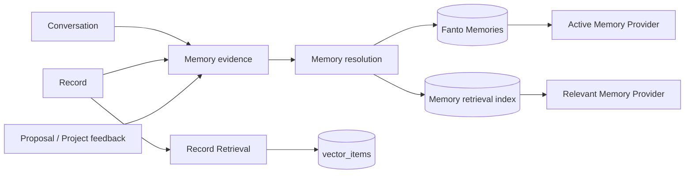

# Fanto Memory System：从 Record Retrieval 到长期记忆

## 目标

构建独立的 Fanto Memory：它保存 Fanto 对用户形成、可审阅、可修正、可遗忘的长期认识。Memory 不替代用户的 Record，也不复用 Record Retrieval 的 `vector_items`。

当前事实：

- `records` 是用户原始记录；`Record Retrieval` 只为 Record 建立可重建的 pgvector 索引。
- Project 可被确认或拒绝，但没有结构化反馈和原因。
- Agent Run 会注入 Recent Records；独立 Memory 尚未实现。

## 调研结论

主流产品与框架没有把所有历史压缩进一个向量库，而是分成几种不同语义和生命周期的数据：

| 模式 | 代表做法 | 对 Fanto 的结论 |
| --- | --- | --- |
| 固定上下文 | Letta 的 memory blocks 始终附在 prompt，且有明确长度上限 | 仅把少量高确定性、当前有效的记忆放入每轮上下文 |
| 原始历史与已保存记忆分离 | ChatGPT 将 saved memories 与 chat history 分开，并允许分别关闭 | Record / Conversation 是来源；Memory 是单独、用户可管理的派生认识 |
| 按需检索 | LangChain 区分语义、情节、程序记忆，并按相关性取用 | 需要区分“用户事实/偏好”和“发生过什么”；不能把向量搜索等同于长期记忆 |
| 记忆更新 | LangChain 建议集合中的条目需要显式更新、删除与评估；Letta 提醒整块替换会产生并发覆盖 | 使用窄粒度条目、版本、证据和冲突处理，避免一个自由文本 Profile 被模型整段覆盖 |

参考： [LangChain Memory Overview](https://docs.langchain.com/oss/python/concepts/memory)、[Letta Memory Blocks](https://docs.letta.com/v1-sdk/memory/memory-blocks)、[ChatGPT Memory FAQ](https://help.openai.com/en/articles/8590148-memory-faq)。

## 领域边界



### Record

用户原始记录和媒体理解结果。它是事实来源，由用户编辑或删除；Fanto 不应把它重命名为 Memory。

### Record Retrieval

对 Record 的派生索引和搜索。它只回答“用户记录过什么”，不回答“Fanto 应如何理解或适应用户”。现有 `vector_items` 保持此用途。

### Memory Evidence

不可变的来源证据。它回答“这条认识为什么存在”，并把记忆同具体的对话、Record 或反馈关联起来。Evidence 本身不等于当前记忆。

### Fanto Memory

当前有效、可被用户审阅的认识。它回答“在未来有关场景，Fanto 应参考什么”。一条 Memory 可以有多条支持或反驳 Evidence；一条 Record 也可支持零到多条 Memory。

## Memory 类型

首期只实现用户导向的语义记忆，避免把 Agent 自身行为规则写入用户数据。

| `kind` | 含义 | 示例 | 初始写入条件 |
| --- | --- | --- |
| `preference` | 希望 Fanto 遵循的长期偏好或回避项 | “周末活动优先一小时车程内” | 用户明确要求长期适用；或经确认的候选 |
| `profile_fact` | 相对稳定、对服务有帮助的用户事实 | “目前住在杭州” | 用户明确表达，或用户确认提取结果 |
| `goal` | 仍在进行且会影响建议的长期目标 | “准备半马，希望年底完赛” | 明确、具持续性的目标 |
| `relationship_context` | 用户明确希望被记住的重要人物或关系 | “小林是我的伴侣” | 用户明确表达或确认 |

暂不实现：Agent procedural memory、跨用户共享记忆、自动心理画像、敏感信息自动提取、以点击/停留等隐式行为直接写入长期记忆。

`preference` 的初始 `category` 为 `communication / scenario / lifestyle / assistance / project`。Proposal 不是类别，而是 Evidence / Feedback 来源；一个 proposal 的拒绝原因可能形成距离、预算、风格或主动程度等不同类别的偏好。

## 数据模型

### `fanto_memories`

当前记忆的权威状态：

```text
id                    UUID business ID
user_id               用户边界
kind                  preference | profile_fact | goal | relationship_context
category              kind 内的稳定分类
key                   规范化语义键；用于同义归并和冲突定位
statement             可读的当前记忆表述
scope                 JSON：适用场景、对象、条件与时间范围
polarity              prefer | avoid | fact | pursuing
state                 candidate | active | superseded | forgotten
source_mode           explicit | inferred | confirmed_inference
importance            low | normal | high
valid_until           可选；只有来源明确时效才填写
version               乐观并发版本
created_at/updated_at Server UTC
```

`statement` 是给 Fanto 和用户阅读的结论，不能存模型的推理过程。`key + scope` 用于判断同义项、相反项和可并存的场景项；不以全文字符串去重。

### `memory_evidence`

```text
id                    UUID
user_id               用户边界
memory_id             可空；尚未归并的候选证据也可保留
source_type           conversation_message | record | feedback | user_edit
source_id             来源业务 ID
source_version        来源版本；Record 与可变对象必填
quote                 连续的用户原话或经过展示的 Record 文本片段
stance                supports | refutes | replaces
explicitness          explicit | inferred
extractor             user | agent_tool | memory_worker
content_hash          幂等键的一部分
created_at
```

Evidence 的引用必须由服务端验证：对话必须属于当前用户与 Session；Record 必须属于当前用户且版本匹配；反馈目标也必须属于当前用户。模型不能自带 user ID、来源 ID 或未验证 quote 写库。

### `memory_feedback`

为 proposal、project 和 Fanto 输出预留独立反馈事实：

```text
id, user_id, target_type, target_id, target_version
action                accept | reject | like | dislike
reason_codes          JSON array：timing / effort / cost / distance / inaccurate / too_intrusive / already_done / other
reason_text           用户自然语言原因，可空
source_message_id     可空
created_at
```

“拒绝一次 proposal”首先是 feedback，不自动等于“讨厌该主题”；只有原因包含可泛化的明确长期意图，才产生或修正 Memory。

### `memory_index_items`

Memory 的独立派生检索表。使用单独表而不复用 `vector_items`，以防 Record 重建或删除影响 Fanto Memory。只索引 `active` Memory 的 `statement + scope`，并含 `memory_id`、`user_id`、hash、status、embedding 和 indexed_at。

### `memory_settings`

按用户保存 `memory_enabled`、`automatic_learning_enabled`、`sensitive_memory_enabled`。默认开启已明确要求保存的记忆；自动学习和敏感记忆均默认关闭。Temporary / memory-off 会话不读取也不写入 Memory。

## 写入与归并

### 明确对话：热路径

用户说“记住”“以后”“总是”“不要再”等明确长期意图时，主 Agent 通过受限工具提交候选 mutation。Server 验证连续原话、来源和用户归属，再在同一事务内写 Evidence 与 Memory。工具结果返回当前 Memory 摘要，让本轮继续工作。

### Record 与普通对话：异步候选

对已持久化的 Record 和普通对话，Memory Extractor 输出结构化候选：`kind / key / statement / scope / polarity / explicitness / evidence quote`。它不能直接写 active Memory，而是进入 Resolution Service：

1. 验证来源、版本与 quote；
2. 查找同 `user_id + kind + key` 的 active / candidate Memory；
3. 判断合并、补充证据、替换、降级或新建候选；
4. 明确来源可直接 active；推断来源保持 candidate，待用户确认或多个独立证据；
5. 写入 Memory、Evidence 与索引更新任务。

Memory 系统应使用持久化 outbox / job 表承载异步提取和索引，使用 `source_type + source_id + source_version + extractor` 幂等。它不复用当前不持久的 Record postprocess queue：Record 检索可容忍遗漏，长期 Memory 不能因进程退出悄然失去来源处理。

### 冲突、撤回和删除

- 当前用户消息与明确 Memory 冲突时，当前消息优先；如表达长期修正，旧项 `superseded` 并建立 `replaces` Evidence。
- Record 更新或删除时，失效其对应 Evidence，随后重新解析仍有足够支持的 Memory；没有有效证据的 inferred Memory 降为 candidate 或 forgotten。
- 用户“忘记这条”将 Memory 设为 `forgotten`，删除其 Memory 索引，并写 user_edit Evidence。历史 Record 和对话不因此删除；后续自动提取不得从已遗忘的同一证据复活它。
- 用户删除来源内容与删除 Memory 是不同操作，界面和 API 必须明确区分。

## 读取与上下文

每轮不注入完整 Memory 库，而是分两层：

1. `ActiveMemoryProvider`：注入小而稳定的 always-relevant Memory，如明确的沟通偏好、硬约束和仍活跃目标。总预算固定，例如 1,200 tokens；超限时按 `importance / explicitness / updatedAt` 排序。
2. `RelevantMemoryProvider`：将当前 query 语义检索到的 active Memory 加入 `relevant_memories`，总预算固定，例如最多 6 条或 800 tokens。它独立于 Record 搜索；需要原始经历时仍调用 `record_search`。

Context 中携带 `memoryId / version / kind / statement / scope`，让 Agent 能响应用户的修改或遗忘请求。candidate、反驳 Evidence、原始推理和后台评分不进入 Prompt。

## 用户控制与产品体验

Memory 不应只是后台状态。必须提供：

- “Fanto 记得什么”列表，按类型、状态和更新时间浏览；
- 单项详情：当前表述、适用条件和来源摘要；
- 修改、忘记、清空、暂停自动学习；
- 对抽取候选的确认 / 拒绝；
- 对 proposal / project 的采纳、拒绝及可选原因；
- memory-off / temporary 会话：不读取、不写入、不从中提取。

敏感健康、金融、精确位置、政治或亲密关系信息必须默认不自动学习；只有用户明确要求保存时才允许写入，并在 UI 标示为敏感。

## API 与模块边界

```text
domain/memory/
├── memory-service.ts              # 查询、修改、忘记、解析状态
├── memory-resolution-service.ts   # evidence 到当前记忆的归并规则
├── memory-extraction-service.ts   # 调用结构化抽取器，不直接持久化结论
├── memory-job-service.ts          # outbox / 幂等任务
├── repository.ts
├── postgres-repository.ts
├── model.ts
└── index.ts

agent/context/providers/
├── active-memory.ts
└── relevant-memory.ts
```

Route 只处理 HTTP 入参、JWT 用户边界和响应。Agent Tool 与 Provider 只能经 `business-services.ts` 调用 Memory Service。PostgreSQL repository 留在 Memory domain；Embedding / LLM client 留在 `infrastructure/clients/`。

## 不做的事

- 不把 `records`、`vector_items` 或 Record Retrieval 移回 Memory domain。
- 不把每条 Record、每条对话或每次 tool result 自动升格为 active Memory。
- 不允许 LLM 直接执行 SQL、传入 userId，或自行决定未验证来源。
- 不以单一 global Profile 覆盖所有事实；Memory 条目必须可独立版本化和忘记。
- 不在第一阶段引入知识图谱、跨用户画像或 Agent 自我改写 system prompt。

## 成功标准

1. 用户可查看、编辑与忘记 Fanto Memory，且后续对话立即遵守最终有效状态。
2. 每条 active Memory 可追溯到可验证的用户来源或反馈；没有来源的模型推断不可进入 active。
3. Record 编辑、删除和用户遗忘不会留下仍可被检索或注入的过期 Memory。
4. Record Retrieval 与 Memory 分别可索引、删除和演进。
5. 所有读取、写入、Evidence、Feedback 和索引查询均强制 `user_id` 边界。
