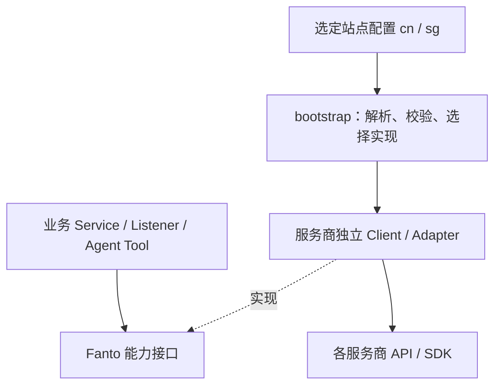

# Fanto 站点配置与依赖隔离审查

2026-10-10。只读代码审查与配置草案，未实现站点加载器或更改业务代码。

按用户最新约束：服务商选型保证相同产品能力；不同服务商使用独立实现；统一能力接口和启动装配屏蔽差异，不在业务层按站点/服务商分支。站点配置与发布环境分开。本次将海外基础设施按阿里云新加坡整理；海外模型与搜索没有确定选型，保留空值。

## 1. 两套配置草案

下列 YAML 是建议的目标配置结构，**当前程序不会读取它**，不能直接作为现有 `.env` 使用。国内模型和端点取自当前 `.env.example` / agent.yaml 的非敏感配置，不代表已确认线上账户可用；国内 ECS/数据库具体区域尚未明确，留空，不从模型北京端点推断主机区域。

`api_key` 等空字符串表示尚未提供，不代表禁用产品能力。实际落地时由受控秘密注入补齐；启用的依赖缺配置必须启动失败，不回退到其它站点默认值。

### 国内阿里云：cn

```yaml
site: cn
environment: production
release_id: ""
infrastructure:
  provider: aliyun
  region: ""
  public_origin: "https://fanto.robinverse.me"
  tls_certificate: ""
  tls_private_key: ""
server:
  host: "0.0.0.0"
  port: 3000
database:
  provider: aliyun-postgresql
  url: ""
  ca_certificate: ""
storage:
  provider: aliyun-oss
  region: oss-rg-china-mainland
  endpoint: "https://oss-rg-china-mainland.aliyuncs.com"
  bucket: ""
  access_key_id: ""
  access_key_secret: ""
ai:
  embedding:
    provider: aliyun-dashscope
    endpoint: "https://ws-2gkw6cbbhgg7bqz5.cn-beijing.maas.aliyuncs.com/compatible-mode/v1"
    api_key: ""
    model: qwen3.7-text-embedding-flash
    dimension: 768
  vision:
    provider: aliyun-dashscope
    endpoint: "https://ws-2gkw6cbbhgg7bqz5.cn-beijing.maas.aliyuncs.com/compatible-mode/v1"
    api_key: ""
    model: qwen3-vl-plus
  transcription:
    provider: aliyun-dashscope
    endpoint: "https://ws-2gkw6cbbhgg7bqz5.cn-beijing.maas.aliyuncs.com/api/v1/services/aigc/multimodal-generation/generation"
    api_key: ""
    model: qwen3-asr-flash
  image_generation:
    provider: aliyun-dashscope
    endpoint: "https://ws-2gkw6cbbhgg7bqz5.cn-beijing.maas.aliyuncs.com/api/v1/services/aigc/multimodal-generation/generation"
    api_key: ""
    model: qwen-image-3.0-pro
agent:
  provider: deepseek
  endpoint: ""
  api_key: ""
  models:
    main: deepseek-v4-flash
    proposal: deepseek-v4-flash
    creator: deepseek-v4-pro
    task_worker: deepseek-v4-pro
  definition_path: apps/server/agent.yaml
  workspace_root: /var/lib/fanto/production-cn/workspaces
web_search:
  provider: deepseek
  endpoint: "https://api.deepseek.com/anthropic/v1/messages"
  api_key: ""
  model: deepseek-v4-pro
auth:
  jwt:
    issuer: fanto-production-cn
    active_kid: ""
    private_key: ""
    public_keys: {}
  apple:
    client_ids: [com.robinverse.fanto]
  google:
    client_ids: []
runtime:
  agent_concurrency: 2
  scheduler_interval_ms: 300000
  task_timeout_min_seconds: 30
  task_timeout_max_seconds: 3600
  creative_enabled: true
  proposal_timeout_ms: 900000
  creator_timeout_ms: 600000
  image_timeout_ms: 300000
  log_directory: /var/log/fanto/production-cn
```

国内 public_origin 沿用客户端已有地址；它是否继续承担国内正式入口需部署时核实。Agent endpoint 留空，因为当前地址由 Pi catalog 决定，应用层没有显式配置，不凭记忆填一个可能与实际协议不一致的 URL。Google client_ids 空数组表示尚未提供，当前代码会因此校验失败；它不表示本方案要求移除 Google 登录。

### 阿里云新加坡：sg

```yaml
site: sg
environment: production
release_id: ""
infrastructure:
  provider: aliyun
  region: ap-southeast-1
  public_origin: ""
  tls_certificate: ""
  tls_private_key: ""
server:
  host: "0.0.0.0"
  port: 3000
database:
  provider: aliyun-postgresql
  url: ""
  ca_certificate: ""
storage:
  provider: aliyun-oss
  region: oss-ap-southeast-1
  endpoint: "https://oss-ap-southeast-1.aliyuncs.com"
  bucket: ""
  access_key_id: ""
  access_key_secret: ""
ai:
  embedding:
    provider: ""
    endpoint: ""
    api_key: ""
    model: ""
    dimension: 768
  vision:
    provider: ""
    endpoint: ""
    api_key: ""
    model: ""
  transcription:
    provider: ""
    endpoint: ""
    api_key: ""
    model: ""
  image_generation:
    provider: ""
    endpoint: ""
    api_key: ""
    model: ""
agent:
  provider: ""
  endpoint: ""
  api_key: ""
  models:
    main: ""
    proposal: ""
    creator: ""
    task_worker: ""
  definition_path: apps/server/agent.yaml
  workspace_root: /var/lib/fanto/production-sg/workspaces
web_search:
  provider: ""
  endpoint: ""
  api_key: ""
  model: ""
auth:
  jwt:
    issuer: fanto-production-sg
    active_kid: ""
    private_key: ""
    public_keys: {}
  apple:
    client_ids: [com.robinverse.fanto]
  google:
    client_ids: []
runtime:
  agent_concurrency: 2
  scheduler_interval_ms: 300000
  task_timeout_min_seconds: 30
  task_timeout_max_seconds: 3600
  creative_enabled: true
  proposal_timeout_ms: 900000
  creator_timeout_ms: 600000
  image_timeout_ms: 300000
  log_directory: /var/log/fanto/production-sg
```

SG 的 provider 空值是真正未定，不以国内服务替代。若选择阿里云百炼新加坡，对应 provider 为 aliyun-dashscope，工作空间 endpoint 来自账户 `{WorkspaceId}.ap-southeast-1.maas.aliyuncs.com`，各能力使用对应兼容/原生路径；在取得账户地址和确认模型前保持空值。站点模型应覆盖 main/proposal/creator/task-worker，并保留共享 Agent 定义里的工具、Prompt 和 Skill 权限。

## 2. 所有当前依赖点：隔离与切换结论

“已有接口”与“已按配置选择实现”分别判断；同一服务商换地区不要求额外实现，不同服务商即使协议兼容也分别实现 Client。

| 依赖 | 当前代码证据与隔离情况 | 同服务商两站点 | 换服务商 | 最小补齐 |
| --- | --- | --- | --- | --- |
| PostgreSQL/pgvector（业务） | infrastructure/database/database.ts 创建 pg + Kysely；Repository/Service 使用 Kysely 与 PG SQL | DATABASE_URL 可切实例 | 换 PostgreSQL 托管厂商可复用 PostgreSQL 驱动；换数据库类型不支持纯配置 | 若要求云厂商独立 Client，在 bootstrap 分 aliyun-postgresql 等工厂，复用底层 PG 驱动；不为同 PostgreSQL 复制 Repository |
| Agent Session 持久化 | harness/session-manager.ts 通过 PgSessionRepo，复用同 DATABASE_URL | 可随数据库配置切换 | 同 PG 协议可；不是 SQLite | 无需额外站点判断；与业务库一并切换 |
| 对象存储 | MediaService 和 PostprocessListener 直接依赖 OssStorage；OssStorage 封装 ali-oss，但 head() 暴露 SDK 原始响应，MediaService 读取 res.headers；缩略图由 OSS image process 实现 | region/endpoint/bucket/key 可切 | 未隔离完整 | 引入 ObjectStorage 能力接口，head 返回 bytes/contentType 等标准值，缩略图/签名参数留在服务商实现 |
| Embedding | domain/records/retrieval/embedding-provider.ts 定义 EmbeddingProvider；Record/Memory/Project 已依赖 embed() 能力 | baseUrl/model/key 可切，维度固定 768 | 上层接口已准备；bootstrap 固定 new EmbeddingsClient | 按 provider 装配独立实现；不同服务商不复用当前泛名 Client；保留结果/失败校验 |
| 图片理解与图片审查 | ImageUnderstanding 已用于 Postprocess/Creative，QwenImageUnderstanding implements 接口 | baseUrl/model/key 可切 | 有能力接口，工厂未配置化 | 标准接口移到中立目录；保持 describe/review 业务能力，provider 分别实现 |
| 音频转写 | AudioTranscriptionClient 已用于 Postprocess；QwenAudioTranscription 封装原生协议 | baseUrl/model/key 可切；原生 endpoint 由兼容地址推导 | 有能力接口，工厂未配置化 | 单独配 ASR endpoint/key，服务商转换响应、映射失败；能力契约保持 |
| 图片生成与结果下载 | ImageGenerationClient 已被 CreativeService 依赖；generate/download/recovery 分阶段 | endpoint/model/key 可配，但请求白名单只允许北京/DashScope，下载白名单只允许国内/accelerate 格式，SG 未支持 | 上层接口存在，recovery 为提供商不透明 token，生成/下载必须配套同实现 | provider 工厂 + 各实现内部可信主机策略；结果下载也是依赖，不能只改请求地址 |
| Agent LLM（4 个角色）与 compaction | builtinModels() + agent.yaml provider/model + Harness；已有 Pi 提供商抽象；应用没显式 endpoint/key 装配 | 可选 catalog 已注册 provider/model；key 必须符合 SDK 的凭据读取，未证实站点装配 | 有 SDK 适配能力，但任意 provider/endpoint 不能仅靠当前 YAML | 按站点创建模型目录/配置 SDK 已验证的凭据入口，注入 Harness；压缩复用选定角色模型，无单独配置入口 |
| 网页搜索 | Agent Tool 调用 AgentBusinessServices.searchWeb，但 business-services.ts 接收 DeepSeekWebSearchClient；返回类型也放在具体实现文件；endpoint 构造可传但 bootstrap 未传；model 硬编码 deepseek-v4-pro | 当前只能换 DEEPSEEK_API_KEY，地址/模型无配置入口 | 未完整隔离 | WebSearchProvider + 中立结果类型 + 服务商独立实现，endpoint/model/key 分别配置 |
| Apple 身份验证 | IdentityProvider/Registry 已隔离；AppleIdentityProvider 验 nonce/audience，访问固定官方 JWKS；iOS 使用 AppleAuthenticationProvider | client IDs 可配 | Provider 接口已支持多个实现；固定 JWKS 是协议内责任 | 站点配置装配 client IDs；不把官方地址迁到业务层 |
| Google 身份验证 | 同一 IdentityProvider 边界；GoogleIdentityProvider 封装固定官方 JWKS；iOS 使用 GoogleSignIn SDK | client IDs 可配；iOS plist 构建配置 | 接口已有 | 统一站点认证配置装配；当前 Apple/Google 都强制注册和必填，空值不意味着已禁用 |
| JWT 签发/验证 | JwtTokenService 包装 jose；AuthService 仍依赖具体类；issuer/key ring 可配置 | 已可换 issuer/密钥 | 本地签名不是云厂商服务，暂无其它实现需求 | 保留本地 JWT；站点 key ring 隔离即可，不增加云 JWT Client |
| 手机认证/短信 | IdentityProviderName 有 phone，但没有 PhoneProvider/SMS Client 接入 main.ts | 无运行依赖 | 尚未实现 | 本次不增加短信配置或称其可用 |
| iOS 到 Fanto API | 4 个 API Client 写死 fanto.robinverse.me；业务协议统一，但站点入口未配置化 | 不能切域名 | 不属于外部供应商切换 | 单一 API endpoint 注入；凭据、缓存、Session 与站点绑定 |
| iOS/H5 媒体直传与读取 | 客户端使用 API 返回 uploadUrl/readUrl，不自行构造 OSS URL；上传内容/签名行为需接口契约 | 跟随存储配置自动切换 | HTTP 签名契约一致时客户端可复用 | 各 Storage 实现输出客户端能执行的统一签名请求；不在客户端做厂商分支 |
| H5 到 API/认证 | 同源 /api 请求；vite.config.ts 开发代理固定 localhost:3000；线上由 Nginx 决定 | 线上同源可随站点 Nginx 切 | 与供应商无关 | 不增加供应商 H5 Client；测试 token 是现有测试依赖，不混入公开配置 |
| iOS 地点/地图 | RecordLocationCoordinator/View 直接调用 CLLocationManager、MKReverseGeocodingRequest、MKLocalSearch/MapKit | 由系统 SDK 运行，不由 Server 配置控制 | 没有统一地图服务适配层 | 两站点保持系统依赖；若以后换服务商，需要单独客户端 LocationSearch/Geocoder 接口 |
| Agent 工作区/文件/b​​ash | 本地工作区 + NodeExecutionEnv，read/write/edit/bash 在当前主机执行 | AGENT_WORKSPACE_ROOT 可切目录 | 没有远程执行/沙箱 provider 配置 | 当前均用同站点本地环境；bash 可能访问模型选择的公网目标，不属于有固定 Client 的依赖 |
| 队列/调度/事件/缓存 | RecordPostprocess、Embedding、AgentExecution、SessionEventBus、TTL cache 都在进程内 | 并发/扫描/目录部分可配；不是外部云服务 | 没有 MQ/Redis 实现 | 本次不虚构 MQ/Redis 配置；站点切换不改变其单进程边界 |
| 日志 | logging/logger.ts 本地文件，LOG_DIR 在模块级读 process.env，未统一入 AppConfig | 进程环境 LOG_DIR 可换；导入早于 loadEnv，文件值可能太迟生效 | 无外部遥测/日志 provider | 将路径与站点配置统一装配；没有已接入 SLS/CloudWatch 等服务 |
| HTTP 入口/证书/静态资源 | Nginx、PM2、deploy/manual；域名、证书、端口、H5 目录部分写死 | 部分配置化，不能完整切站点 | 属于部署配置，不是业务 Client | 站点模板生成 Nginx/PM2 参数与健康检查地址 |
| 构建依赖 | Node/pnpm/npm packages、sharp 原生模块、Pi SDK、GoogleSignIn Swift 包 | 构建网络与 OS/架构影响发布 | SDK 版本属于实现层 | 锁版本、匹配构建架构；不把 npm registry 当运行业务依赖 |

尚未接入支付、邮件、短信、推送、第三方监控、外部 MQ/Redis、CDN API；不因部署方案而为它们构造已存在的 Client。

## 3. 最小目标结构



建议中立接口：ObjectStorage、EmbeddingProvider、ImageUnderstanding、AudioTranscriptionClient、ImageGenerationClient、WebSearchProvider、IdentityProvider。已有接口优先复用，只有位置和服务商响应泄漏需要修正。错误映射要统一；已有普通 Error 字符串不能当成完整的防腐错误契约。

启动入口根据能力的 provider 选择独立实现；不根据 site 在 Service 内决定 Client。配置中各能力独立，即使某站点全部使用同一云厂商，也不把 embedding/VL/ASR/image 强绑一个 Key/endpoint。上层只调用能力接口，外部服务差异按用户约束不改变产品行为。

数据库特例：云厂商资源配置可以独立装配，底层 PostgreSQL 驱动/SQL 方言是共同协议依赖，不需要每厂商复制数据访问逻辑。JWT、工作区、日志属于本地依赖，不包装成云供应商 Client。

## 4. 与现有配置的映射和已知阻塞

- database.url -> DATABASE_URL；storage.* -> OSS_*；auth.jwt.* -> AUTH_JWT_*；auth client_ids -> *_ALLOWED_CLIENT_IDS。
- ai.embedding / vision / transcription 目前共用 DASHSCOPE_API_KEY 与 DASHSCOPE_BASE_URL；当前不能分别为三种能力选 provider/key/endpoint。生图有独立 CREATIVE_IMAGE_*，但 API Key 空会复用 DASHSCOPE_API_KEY。
- agent.models 目前在 agent.yaml；provider 必须是 Pi catalog 已注册项。启动时 DEEPSEEK_API_KEY 必填，用于搜索；不能把 Agent provider 换掉就认为该必填依赖被移除。
- site、provider 工厂、独立 AI 配置、启动配置文件选择都尚未实现；当前 loadEnv() 会覆盖进程变量，空模型变量通过 `??` 不一定走默认值，CREATIVE_IMAGE_* 则通过 `||` 会回退，因此不能直接复制这些空字段到生产 env 声称完成切站点。
- LOG_DIR 必须在模块导入前生效或改为装配；Agent YAML 目录决定 SkillLoader 路径，不能把它直接搬到任意 config 目录而不处理 skillsRoot。
- PostgreSQL 当前强制 TLS 但关闭证书校验，需要独立补齐严格验证；这不影响“能换实例”的结论，却影响生产连接设计。

本次结论是代码静态审查；没有真实访问生产数据库、OSS 或收费模型，所以“可配置”不等于“该区实际联调通过”。

## 5. 官方依据

- [百炼地区与端点](https://help.aliyun.com/en/model-studio/regions/)：地区独立 endpoint/Key/model list；新加坡区域 ap-southeast-1，生产优先 workspace 专属域名。
- [OSS 地区与端点](https://www.alibabacloud.com/help/en/oss/user-guide/regions-and-endpoints)：新加坡 endpoint 为 oss-ap-southeast-1.aliyuncs.com。

执行拆解见 `2026-10-10-site-config-dependency-tasks.md`。本审查细化配置与防腐，不授权实施此前大部署计划，也不重新讨论供应商对产品行为的影响。
