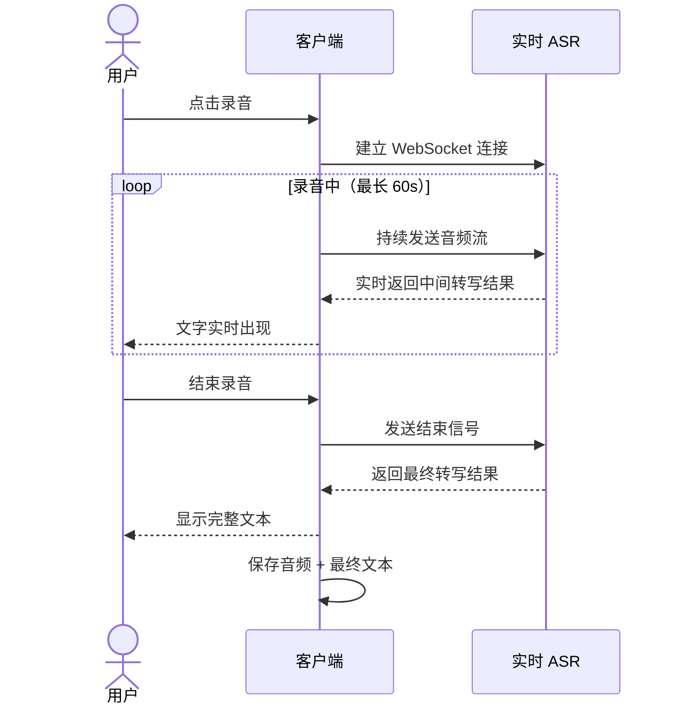
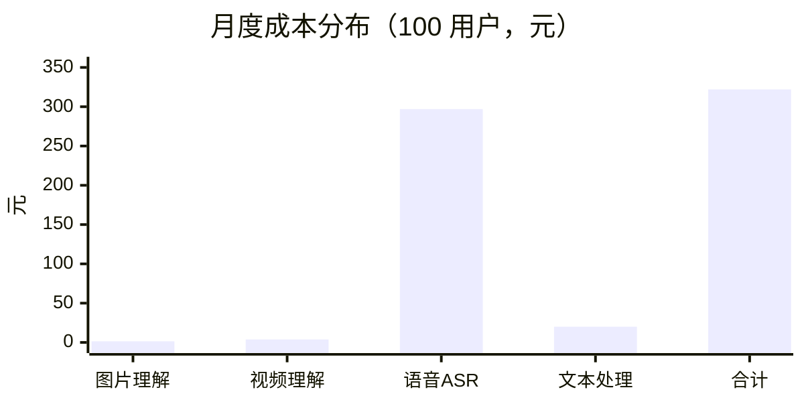

# 多模态输入：成本评估与方案结论

> 版本：2.0（替代 v1.0）
> 前置参考：[product-pivot.md](./product-pivot.md)
> 用量基准：100 用户，2 图/人天，1 视频/人天，5 语音/人天

---

## 一、日用量基准

| 模态 | 计算 | 每日请求数 | 每日音频时长 |
|---|---|---|---|
| 图片理解 | 100 人 × 2 图 = 200 图，约 100 次请求（2 图/次） | **100 次** | - |
| 视频理解 | 100 人 × 1 视频 = 100 视频，抽 10 帧/次 | **100 次** | - |
| 语音转写 | 100 人 × 5 语音 × 60s = 30,000s | **500 次** | **30,000 秒（8.3 小时）** |

---

## 二、图片 + 视频理解：模型成本对比

图片和视频共用同一类模型（Vision 模型），视频通过抽 10 帧转为多图请求。

### 2.1 候选模型价格表（每百万 token，华北2）

| 模型 | 输入单价 | 输出单价 | 多图支持 | 说明 |
|---|---|---|---|---|
| **DeepSeek V4-Flash-Vision-Exp** | 1.5 元(空闲) / 3.0 元(高峰) | 4.5 元(空闲) / 9.0 元(高峰) | 支持，600 张/请求 | 当前在用供应商 |
| **Qwen3-VL-Flash** | **0.15 元** | **1.5 元** | 支持 | **最便宜** |
| Qwen3-VL-Plus | 1.0 元 | 10.0 元 | 支持 | 质量更高 |
| Qwen-VL-Max | 1.6 元 | 4.0 元 | 支持 | 最高质量 |
| Qwen-VL-Plus | 0.8 元 | 2.0 元 | 支持 | 上一代 |

> DeepSeek 价格分空闲/高峰时段，Qwen 不分时段。

### 2.2 Token 消耗估算

| 请求类型 | 图片 token | Prompt token | 输出 token | 合计 input |
|---|---|---|---|---|
| **图片（2 张/次）** | 2 × 384 = 768 | ~300 | ~200 | **1068** |
| **视频（10 帧/次）** | 10 × 384 = 3840 | ~500 | ~400 | **4340** |

### 2.3 日成本对比

#### 图片理解（100 次/天，每次 2 图）

| 模型 | 日 Input | 日 Output | **日成本** | **月成本** |
|---|---|---|---|---|
| **Qwen3-VL-Flash** | 106.8K | 20K | **0.046 元** | **1.4 元** |
| DeepSeek Vision (空闲) | 106.8K | 20K | 0.25 元 | 7.5 元 |
| DeepSeek Vision (高峰) | 106.8K | 20K | 0.50 元 | 15 元 |
| Qwen3-VL-Plus | 106.8K | 20K | 0.31 元 | 9.3 元 |
| Qwen-VL-Max | 106.8K | 20K | 0.97 元 | 29 元 |

#### 视频理解（100 次/天，每次 10 帧）

| 模型 | 日 Input | 日 Output | **日成本** | **月成本** |
|---|---|---|---|---|
| **Qwen3-VL-Flash** | 434K | 40K | **0.13 元** | **3.8 元** |
| DeepSeek Vision (空闲) | 434K | 40K | 0.83 元 | 25 元 |
| DeepSeek Vision (高峰) | 434K | 40K | 1.66 元 | 50 元 |
| Qwen3-VL-Plus | 434K | 40K | 0.83 元 | 25 元 |

### 2.4 结论

```
图片+视频月度总成本：

  Qwen3-VL-Flash      ████░░░░░░░░░░░░░░░░  5.2 元    ← 推荐
  DeepSeek Vision     ████████████████░░░░  32-65 元
  Qwen3-VL-Plus       █████████████░░░░░░░  34 元
```

**Qwen3-VL-Flash 是最优选择**：
- 价格是 DeepSeek Vision 的 **1/6 ~ 1/12**
- 输入单价仅 0.15 元/百万 token，不到 DeepSeek 的 1/10
- 阿里出品，中文理解能力在 80% 以上水准完全满足需求
- 与项目现有阿里云百炼 Embedding 同一供应商

**DeepSeek Vision 在视频场景成本偏高**，因为 10 帧请求的 input token 量大，而 DeepSeek 的未命中缓存单价是 Qwen3-VL-Flash 的 20 倍。

---

## 三、语音转写（ASR）：模型成本对比

### 3.1 候选 ASR 价格表

| 模型 | 单价 | 类型 | 免费额度 |
|---|---|---|---|
| **paraformer-v2** | **0.00008 元/秒** | 录音文件 | 10 小时/月 |
| **qwen3-asr-flash (filetrans)** | 0.00022 元/秒 | 录音文件 | 10 小时/月 |
| **fun-asr** | 0.00022 元/秒 | 录音文件（SenseVoice 内核） | 10 小时/月 |
| qwen-audio-3.0-asr-flash-filetrans | 0.00022 元/秒 | 录音文件 | 10 小时/月 |
| **qwen3-asr-flash-realtime** | **0.00033 元/秒** | **实时 ASR** | 10 小时/月 |
| **fun-asr-realtime** | **0.00033 元/秒** | **实时 ASR** | 10 小时/月 |
| fun-asr-flash-8k-realtime | 0.00022 元/秒 | 实时 ASR（8kHz） | 10 小时/月 |

> 所有模型输出均不计费，仅按音频秒数计费。

### 3.2 日成本对比（500 条 × 60s = 30,000 秒/天）

| 模型 | 日成本 | 月成本 | 实时 | 备注 |
|---|---|---|---|---|
| **paraformer-v2** | **2.4 元** | **72 元** | 否 | 最便宜，但无实时模式 |
| qwen3-asr-flash / fun-asr | 6.6 元 | 198 元 | 否 | 质量更好，SenseVoice 内核 |
| **qwen3-asr-flash-realtime** | **9.9 元** | **297 元** | **是** | 实时+质量兼顾 |
| **fun-asr-realtime** | **9.9 元** | **297 元** | **是** | 同上 |
| fun-asr-flash-8k-realtime | 6.6 元 | 198 元 | 是 | 8kHz 低采样率，适合电话音质 |

### 3.3 免费额度影响

每个 ASR 模型有 **36,000 秒/月（10 小时）免费额度**。

- 日用量 30,000 秒 >> 月度免费额度 36,000 秒
- 免费额度仅覆盖约 **1.2 天** 的用量
- 免费额度对 100 用户规模几乎无影响

但如果分模型使用（不同模型各有免费额度），可稍微节省。

### 3.4 实时 ASR 的交互体验

用户偏好实时 ASR，需要评估交互可行性：



**实时 ASR 的关键指标：**

| 指标 | 表现 |
|---|---|
| 首字延迟 | ~300-500ms |
| 尾句延迟 | ~500-1000ms |
| 中间结果更新频率 | 每 200-500ms |
| 用户体验 | 边说边出文字，类似输入法 |

### 3.5 实时 vs 录音文件的体验差异

| 维度 | 实时 ASR | 录音文件识别 |
|---|---|---|
| 录音中体验 | 边说边出文字 | 录音中无文字 |
| 录音后等待 | 无（已结束即完成） | 2-5 秒处理延迟 |
| 转写质量 | 略低（流式处理） | 略高（整段处理） |
| 实现复杂度 | 高（WebSocket 长连接） | 低（HTTP 请求） |
| 成本 | 1.5 倍（0.00033 vs 0.00022） | 基准 |

### 3.6 结论

```
ASR 月度总成本：

  paraformer-v2（非实时）    ██████░░░░░░░░░░░░░░  72 元     最便宜
  fun-asr（非实时）          ██████████████░░░░░░  198 元    质量好
  fun-asr-flash-8k-realtime  ██████████████░░░░░░  198 元    实时+便宜
  qwen3-asr-flash-realtime   ████████████████████  297 元    实时+质量  ← 推荐
```

**推荐方案：qwen3-asr-flash-realtime**

- 实时 ASR 体验显著优于录音文件识别（用户边说边看到文字）
- 297 元/月 对 100 用户规模可接受（约 3 元/用户/月）
- 与百炼平台统一，OpenAI 兼容 SDK
- 非思考场景下中文识别质量优秀

**降级方案**：如果成本敏感，可用 `fun-asr-flash-8k-realtime`（198 元/月），代价是 8kHz 采样率（适合语音，不适合音乐）。

---

## 四、社交链接解析

### 4.1 MediaCrawler 不可用

已确认 MediaCrawler 依赖 Playwright 浏览器自动化 + 登录态保存，部署和维护成本高，不适合 Fanto 的轻量架构。

### 4.2 替代方案评估

| 方案 | 覆盖平台 | 可行性 | 成本 |
|---|---|---|---|
| **通用 HTTP fetch + og:tag** | 所有公网链接 | 高 | 零（代码实现） |
| **各平台开放 API** | 部分（需申请） | 中 | 免费或低价 |
| **第三方解析服务** | 较全 | 中 | 按次计费 |

#### 各平台实际可获取内容（无需登录态）

| 平台 | og:title | og:description | og:image | 正文 | 可行性 |
|---|---|---|---|---|---|
| **微信公众号** | 有 | 有 | 有 | 可通过 HTML 解析 | **高** |
| **小红书** | 有（短链需跳转） | 有 | 有 | SPA 渲染，需 JS | **中** |
| **微博** | 有 | 有 | 有 | 部分可获取 | **中高** |
| **B 站** | 有 | 有 | 有 | 有 | **高** |
| **抖音** | 有（短链需跳转） | 有 | 有 | 有限 | **中** |
| **通用网页** | 有 | 有 | 有 | 可解析 | **高** |

### 4.3 推荐策略

**MVP 阶段**：通用 HTTP fetch + og:tag 解析，覆盖所有平台的基础元数据（标题、描述、封面图）。

- 微信公众号文章：可额外做 HTML 正文解析（文章页不需要登录）
- B 站：og:tag 信息完整，通用解析即可
- 小红书/抖音：短链先做 302 跳转，再 og:tag 解析；正文获取优先级低

**不做的事**：不部署 Playwright，不保存登录态，不爬取评论/完整图文。

**成本**：零额外费用，纯代码实现。

---

## 五、总成本汇总

### 5.1 推荐方案

| 模态 | 推荐模型 | 月成本 |
|---|---|---|
| **图片理解** | Qwen3-VL-Flash | **1.4 元** |
| **视频理解** | Qwen3-VL-Flash（10 帧） | **3.8 元** |
| **语音转写** | qwen3-asr-flash-realtime | **297 元** |
| **社交链接** | HTTP fetch + og:tag | **0 元** |
| **实体提取/摘要** | DeepSeek V4-Flash（文本） | ~20 元（估算） |

### 5.2 月度总成本



| 项目 | 月成本 | 占比 |
|---|---|---|
| 语音 ASR | 297 元 | **92%** |
| 文本处理（实体提取等） | ~20 元 | 6% |
| 视频理解 | 3.8 元 | 1% |
| 图片理解 | 1.4 元 | <1% |
| **合计** | **~322 元** | |

### 5.3 单用户成本

**~3.2 元/用户/月**

其中 ASR 占 3 元/用户/月，是绝对的成本大头。

---

## 六、最终结论

### 6.1 方案选择

| 决策 | 结论 | 理由 |
|---|---|---|
| 图片+视频理解 | **Qwen3-VL-Flash** | 成本仅 5.2 元/月，是 DeepSeek Vision 的 1/6~1/12，效果满足 80% 需求 |
| 语音转写 | **qwen3-asr-flash-realtime** | 实时出字体验好，297 元/月可接受，与百炼统一 |
| 社交链接 | **通用 HTTP fetch** | 零成本，og:tag 覆盖大部分平台基础信息 |
| 是否用 Omni | **不用** | 成本过高，分模型方案总成本仅 322 元/月 |
| 是否用 MediaCrawler | **不用** | 依赖浏览器自动化+登录态，不可用 |

### 6.2 供应商策略

| 供应商 | 用途 | 理由 |
|---|---|---|
| **阿里云百炼** | Embedding + Vision + ASR | 统一供应商，统一账号和计费 |
| **DeepSeek** | 文本 LLM（实体提取、摘要） | 文本模型价格极低 |

### 6.3 风险项

| 风险 | 影响 | 缓解 |
|---|---|---|
| Qwen3-VL-Flash 图片理解质量不足 | 描述不够准确 | 可升级 Qwen3-VL-Plus（成本 ×6，仍可控） |
| 实时 ASR 在嘈杂环境准确率下降 | 转写错误 | 保留原始音频，可后续用文件识别重跑 |
| 小红书/抖音链接解析受限 | 只能拿到基础元数据 | MVP 可接受，后续可探索平台 API |
| 用量增长到 1000 用户 | ASR 成本 ~3000 元/月 | 可考虑自部署 SenseVoice 或切换到 Paraformer |
