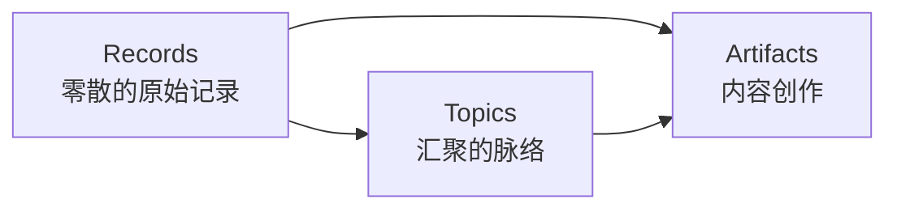
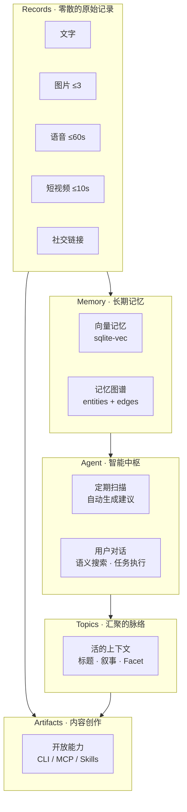
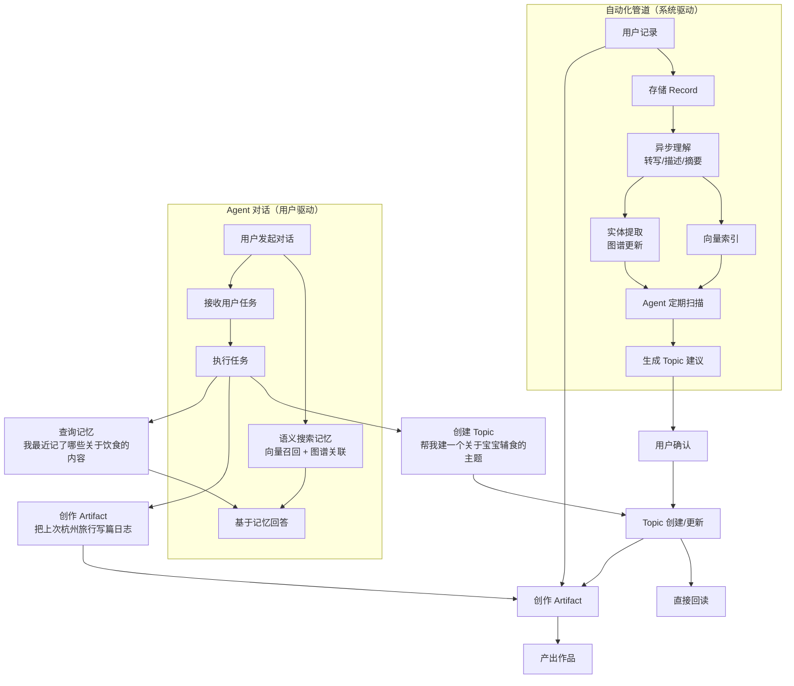
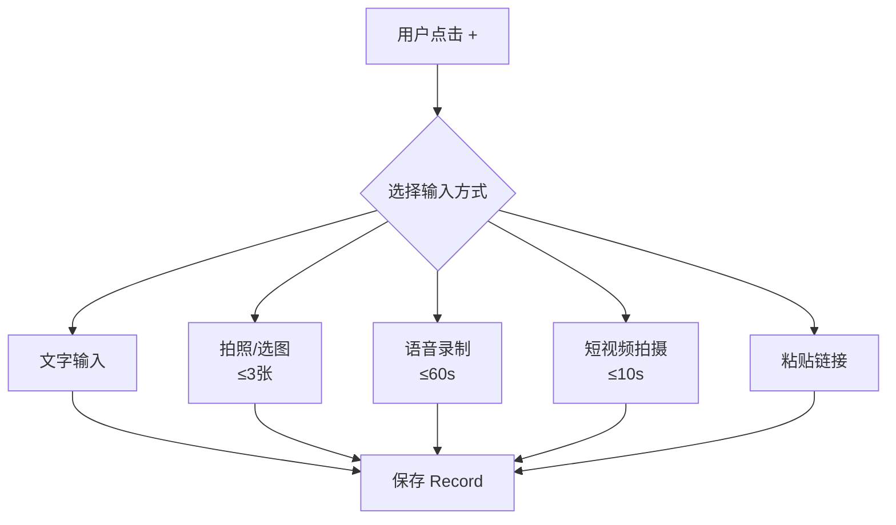
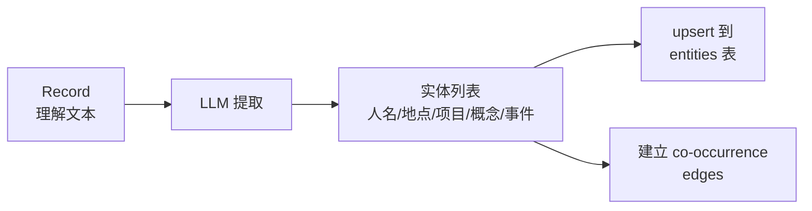
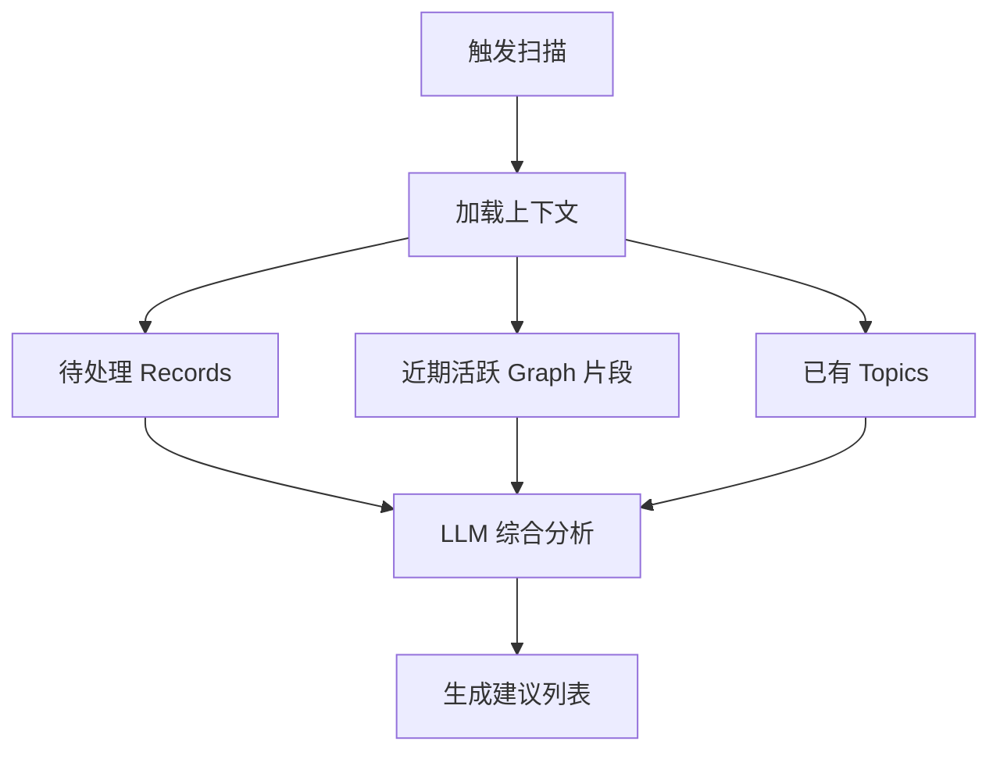
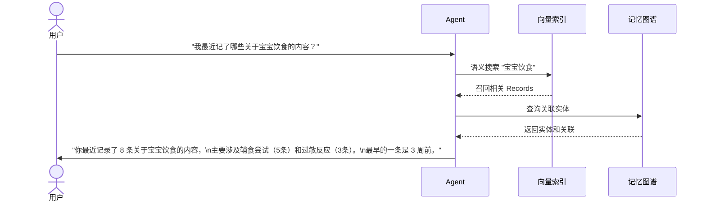
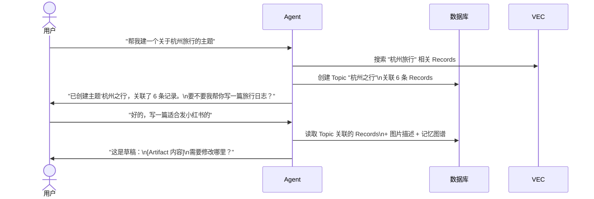
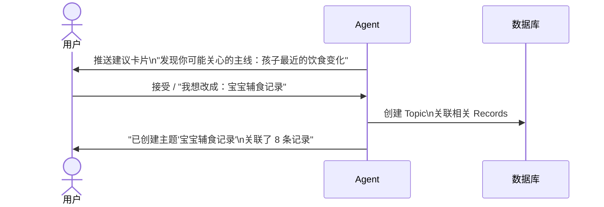

# Fanto 产品规划：个人记录 → 长期记忆 → 内容创作

> 版本：1.0
> 状态：规划中

---

## 一、产品定位转变

### 从"AI 碎片思考助手"到"AI 个人记忆引擎"

**旧定位**：用户记录碎片想法 → AI 自动整理成 Topic。核心假设是 AI 能替代用户完成"理解和结构化"。经过 MVP 验证，该假设不成立——Topic 粒度过细、合并判断不准、增量价值低。

**新定位**：用户随手记录一切（Records）→ AI 从散落记录中识别脉络，用户确认后汇聚为主题（Topics）→ 基于记忆和脉络，Agent 辅助内容创作（Artifacts）。

核心变化：

| 维度 | 旧模式 | 新模式 |
|---|---|---|
| AI 角色 | 自动归类、自动写作 | 识别脉络、建议主题、辅助创作 |
| 记录形态 | 纯文本 | 多模态（文字、图片、语音、短视频、链接） |
| 整理方式 | AI 自动创建/合并 Topic | AI 识别脉络 + 用户确认 |
| 核心概念 | Record → Topic（自动生成） | Records → Topics → Artifacts |
| 产出价值 | 整理后的文章 | 长期记忆 + 脉络汇聚 + 内容创作 |
| 扩展方式 | 封闭 | 通过 CLI / MCP / Skills 开放 |

### 设计原则

1. **记录先于一切。** 多模态、低门槛、快进快出，不要求用户分类、标签或结构化。
2. **记忆是资产，不是中间产物。** 原始记录永远保留，所有后续处理都是附加层。
3. **AI 提议，用户决定。** 系统识别连接、建议主线、生成内容草稿，但关键决策由用户确认。
4. **Agent 原生操作。** 所有复杂操作（关联、编辑、创作）以 Agent 为中心执行，不要求用户进行手动拖拽或多步 UI 操作。
5. **能力可扩展。** 基础为文本创作，未来通过 CLI、MCP、Skills 扩展创作边界。

---

## 二、核心概念

Fanto 的数据与价值模型由三个核心概念构成，层层递进：

| 概念 | 本质 | 类比 |
|---|---|---|
| **Record** | 用户在某个时刻的原始表达，零散、多模态、未经组织 | 散落的线索 |
| **Topic** | AI 识别 + 用户确认后，从零散记录中汇聚出的脉络 | 被编织的线索网络 |
| **Artifact** | 基于 Records 和 Topic，面向特定场景的内容创作产出 | 最终的作品 |

### 2.1 Record（原始记录）

Record 是用户在某个时刻的原始表达，支持多模态输入。它是系统中唯一的"事实来源"，是零散的、未经处理的原始素材。

**输入边界：**

| 模态 | 边界 | 处理方式 |
|---|---|---|
| 文字 | 无硬限制 | 直接存储 |
| 图片 | 单条 Record ≤ 3 张 | 存储原图 + 生成 AI 描述文本 |
| 语音 | 单条 Record ≤ 60 秒 | 存储音频 + Whisper 转写文本 |
| 短视频 | 单条 Record ≤ 10 秒 | 存储视频 + 抽取 10 帧 + AI 分析描述 |
| 社交链接 | 仅公网可直接访问的 URL | 抓取 title / description / og:image，保存为结构化卡片 |

一条 Record 可以同时包含文字和多种附件。所有模态最终都会产生一段**可检索的理解文本**（转写、描述、摘要），用于向量索引和后续 AI 处理。

### 2.2 Memory（长期记忆）

Memory 是系统从 Record 中沉淀出的结构化知识层，分为两部分：

**向量记忆（Vector Memory）**
- 每条 Record 的理解文本生成 embedding，存入 sqlite-vec
- 用于语义召回、相似性搜索
- 已有基础，需扩展覆盖多模态内容

**记忆图谱（Memory Graph）**
- 从 Record 中提取实体（人物、地点、项目、概念、事件等）
- 建立实体间的轻量关联（共现、因果、从属）
- 不做重图谱（不需要属性推理、图数据库）
- 存储在 SQLite 中，使用 `records` + `entities` + `entity_edges` 三表结构
- 目的是让 AI 在建议时能发现跨时间、跨模态的隐含连接

### 2.3 Topic（汇聚的脉络）

Records 是零散的。Topic 是 AI 从散落的记录中识别出、经用户确认后汇聚而成的**脉络**。

**Topic 不是文件夹**——它不只是一个分组标签。Topic 有自己的标题、叙事结构和按方面（Facet）组织的上下文，可以被直接回读和消费。

**Topic 也不是最终作品**——它是一个活的、持续生长的上下文。它可以随着新记录的加入而演化，也可以在任何时刻被转化为具体的创作产出。

**Topic 的来源：**
- AI 扫描记录后建议，用户确认
- 用户在 Agent 对话中主动提出
- 交互过程中自然产生

**Topic 的形态可以多样：**
- 一段长期叙事（"我的 AI 工程实践"）
- 一次临时起意的分享（"上周的杭州之行"）
- 一个项目的思考和待办（"Fanto 产品转型"）
- 一个生活观察（"宝宝最近的变化"）

**Topic 的消费方式：**
- **直接回读**：打开 Topic 阅读当前的叙事和关联记录，这本身就有回顾和理解的价值
- **转化为 Artifact**：基于 Topic 的上下文，进一步加工为面向特定场景的创作产出

### 2.4 Artifact（内容创作）

Artifact 是基于 Records 和 Topic 上下文，面向特定场景和格式的内容创作产出。

**与 Topic 的区别：**
- Topic 的叙事是**对用户自己的**——帮助理解散落的记录之间的关系，形成脉络
- Artifact 的产出是**面向特定场景的**——有明确的目标受众、格式要求和风格适配

**创作模式：**
- 用户选择一个 Topic 或直接描述创作意图
- Agent 基于关联的 Records + Topic 上下文 + Memory Graph 生成草稿
- 用户在对话中迭代、修改、确认

**能力边界与扩展：**
- 基础能力为**文本创作**（Agent 原生能力）
- 通过 CLI、MCP Server、Skills 进行能力扩展，由用户决定启用哪些能力
- 例如：图片生成 Skill、HTML 页面发布 CLI、社交平台 API、PDF 导出等
- Agent 的角色类似通用云端 Agent——理解意图、调度工具、辅助创作，用户把控方向

**创作场景示例：**

| 场景 | 输入 | Artifact 产出 |
|---|---|---|
| 旅行日志 | Topic "杭州之行" + 图文记录 | 结构化旅行日志文档 |
| 小红书发帖 | Topic "宝宝辅食" + 用户指定风格 | 适配平台风格的图文帖子 |
| 周报/月回顾 | 近期 Records + 活跃 Topics | 个人回顾总结 |
| 项目思考 | Topic "Fanto 产品转型" | 产品思考文档 |
| HTML 分享站 | Topic + 旅行记录 + HTML 生成 Skill | 可视化分享页面 |
| 个人饮食规划 | Topic "饮食记录" + 近期记录 | 周度饮食分析与建议 |

---

## 三、系统架构

### 3.1 三层架构

### 3.2 数据流

系统存在两条并行的交互路径：**自动化管道**（系统驱动）和**Agent 对话**（用户驱动）。

**两条路径的关系：**
- **自动化管道**负责"沉默积累"：用户只管记录，系统在后台理解、索引、发现连接、提出建议
- **Agent 对话**负责"主动交互"：用户可以随时与 Agent 对话，查询记忆、下达任务、驱动创作
- 两条路径共享同一套记忆基座（向量索引 + 记忆图谱），Agent 对话可以触发自动化管道的操作（如创建 Topic）

---

## 四、分阶段实施计划

### 阶段一：多模态记录 + 记忆基座

**目标**：让 Fanto 成为用户最愿意"随手扔东西进去"的个人记录工具。

**核心交付：**

#### 4.1 Record 多模态输入

#### 4.2 记忆基座

**向量记忆扩展：**
- 当前 `vec_records` 仅索引文字 → 扩展为索引 Record 的完整理解文本（含转写、图像描述、视频分析）
- 保持现有 sqlite-vec 架构不变

**实体提取（轻量版记忆图谱）：**

### 阶段二：智能记忆 + AI 建议

**目标**：让积累的记录开始产生连接，AI 主动发现有价值的模式并建议给用户。

#### 4.4 定期扫描 Agent

**扫描范围：**
- 待处理 Record（`status = pending`）的原始记录
- 记忆图谱中的 Graph 片段（近期活跃的实体和关联）
- 可能与新记录相关的已有 Topic

**扫描触发：**
- 定时触发（如每日一次）
- 用户手动触发
- 累积 N 条新 Record 后触发

#### 4.5 Agent 对话

Agent 是 Fanto 的智能中枢。用户不仅可以被动接收 AI 建议，还可以**主动与 Agent 对话**，驱动记忆查询、Topic 管理和内容创作。

**Agent 对话的三种模式：**

##### 模式一：记忆查询

用户用自然语言提问，Agent 语义搜索记忆层并回答。

##### 模式二：任务执行

用户下达明确指令，Agent 执行操作（创建 Topic、创作 Artifact 等）。

##### 模式三：建议确认

Agent 主动推送的建议，用户通过对话确认或修改（延续原有设计）。

**Agent 能力总览：**

| 能力 | 用户意图示例 | Agent 行为 |
|---|---|---|
| **记忆查询** | "我上周记了什么？""有没有关于饮食的记录？" | 语义搜索向量索引 + 图谱关联，返回结果 |
| **创建 Topic** | "帮我建一个关于 X 的主题" | 搜索相关 Records，创建 Topic 并关联 |
| **创作 Artifact** | "把杭州旅行写成一篇日志""帮我写个小红书帖子" | 基于 Topic/Records 上下文生成草稿 |
| **确认建议** | 接受/修改/忽略 AI 推送的建议卡片 | 执行对应操作 |
| **自由对话** | "你觉得我最近在关注什么？" | 基于记忆图谱分析回答 |
| **任务组合** | "帮我整理一下最近的项目笔记，然后写个周报" | 先创建 Topic，再基于 Topic 创作 Artifact |

Agent 的角色类似通用云端 Agent——理解意图、调度工具、执行任务，用户把控方向。所有复杂操作通过对话完成，不要求用户进行手动拖拽或多步 UI 操作。

#### 4.6 Topic 的脉络表达

Topic 不是文件夹，也不是 AI 自动生成的文章。它是从零散记录中汇聚出的**脉络**：

- 有标题、有叙事结构、有按方面（Facet）组织的上下文
- 可以被直接回读——打开 Topic 就能回顾和理解散落的记录之间的关系
- 是活的、持续生长的，随着新记录加入而演化
- 可以在任何时刻被转化为 Artifact（内容创作产出）

---

### 阶段三：Artifact 创作引擎 + 开放能力

**目标**：基于 Records 和 Topic 脉络，释放内容创作的无限可能。

#### 4.7 Artifact 创作

Artifact 是面向特定场景的内容创作产出。与 Topic 的区别：

- **Topic** 是对用户自己的脉络梳理——帮助理解散落的记录之间有什么关系
- **Artifact** 是面向特定场景的作品——有目标受众、格式要求和风格适配

**创作模式：**
- 用户选择一个 Topic 或直接描述创作意图
- Agent 基于关联的 Records + Topic 上下文 + Memory Graph 生成草稿
- 用户在对话中迭代、修改、确认
- Agent 的角色类似通用云端 Agent——理解意图、调度工具、辅助创作，用户把控方向

**创作场景示例：**

| 场景 | 输入 | Artifact 产出 |
|---|---|---|
| 旅行日志 | Topic "杭州之行" + 图文记录 | 结构化旅行日志文档 |
| 小红书发帖 | Topic "宝宝辅食" + 用户指定风格 | 适配平台风格的图文帖子 |
| 周报/月回顾 | 近期 Records + 活跃 Topics | 个人回顾总结 |
| 项目思考 | Topic "Fanto 产品转型" | 产品思考文档 |
| HTML 分享站 | Topic + 旅行记录 + HTML 生成 Skill | 可视化分享页面 |
| 个人饮食规划 | Topic "饮食记录" + 近期记录 | 周度饮食分析与建议 |

#### 4.8 开放能力

- 基础创作能力为**文本创作**（Agent 原生能力）
- 通过 **CLI 工具**、**MCP Server**、**Skills** 进行能力扩展，由用户决定启用哪些
- 例如：图片生成 Skill、HTML 页面发布 CLI、社交平台 API、PDF 导出等
- 扩展机制不在本规划范围内深入，但架构需预留接口